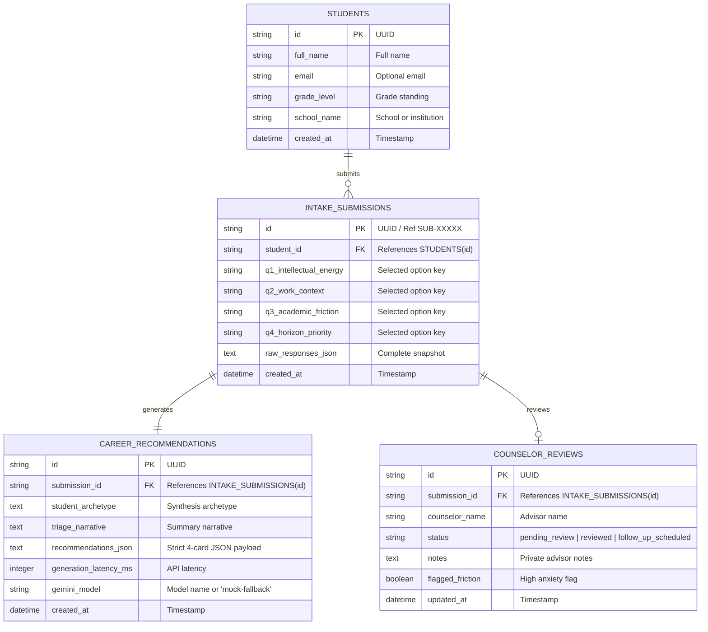

> **Note:** This specification describes the legacy PathwayAI (v1) architecture and has been replaced by PathLess Framework v2.
---
doc: spec
feature: 1-contract-and-specs
project: PathwayAI - College Major and Career Triage MVP
status: draft
gate: PASS
---

# PathwayAI: College Major and Career Triage MVP — Technical Specification

## 1. Executive Summary & Project Framework

PathwayAI is an empathetic, AI-driven triage platform designed to resolve the paralyzing indecision experienced by high school juniors/seniors and early college undergraduates when choosing college majors and career paths. Rather than subjecting students to grueling 100-question psychometric tests or generic search directories, PathwayAI employs a **4-Question High-Yield Intake** protocol.

This protocol captures student energy drivers, preferred work contexts, acute academic fears/frictions, and primary post-college horizon priorities. Through a single structured call to Google Gemini 1.5 Flash (operating strictly under the zero-cost free tier), the system synthesizes these inputs into **4 Distinct Career Cards** featuring actionable major pathways, day-to-day realities, course friction mitigation, psychological reassurance, and zero-risk "trial courses."

Simultaneously, student submissions automatically populate a **Counselor Triage Dashboard**, equipping high school and collegiate academic advisors with structured insights, flagged academic anxieties, and direct intervention tools before 1-on-1 counseling sessions.

---

## 2. Plain Language System Architecture

### How This Works (In Plain Language)
1. **The Student Interface**: The student opens a lightweight web app on their phone or laptop. They enter their name and grade, then answer four targeted, non-intimidating multiple-choice/short-prompt questions about what energizes them, the kind of problems they want to solve, what academic subjects terrify them, and what they value most after graduation.
2. **The Triage Engine**: When submitted, the application packages the student's four answers and queries the Google Gemini 1.5 Flash API with a constrained JSON schema. Gemini acts as an expert educational triage counselor, generating four tailored career trajectories.
3. **The 4-Card Presentation**: The student is immediately presented with four distinct pathways:
   - *Card 1: Primary Direct Match* (High energetic and skill alignment)
   - *Card 2: High-Growth Pathway* (Strong labor market demand and economic resilience)
   - *Card 3: Interdisciplinary Pivot* (Creative bridge connecting diverse interests)
   - *Card 4: Moonshot Trajectory* (High-aspiration, high-impact career direction)
   Each card directly addresses the student's stated academic anxiety with empathetic reassurance and provides two low-stakes trial courses they can try immediately.
4. **The Local Database**: The submission and its generated recommendations are saved to a zero-infrastructure local SQLite database (`pathway.db`).
5. **The Counselor Dashboard**: An academic advisor opens the counselor view to see incoming student submissions ranked by triage priority. Students with high academic anxiety or friction are highlighted, allowing the counselor to review their AI recommendations, take notes, and schedule focused 1-on-1 advising.

```
┌────────────────────────────────────────────────────────────────────────┐
│                          Student Browser                               │
│     [4-Question Intake UI]  ───────────►  [4 Career Cards Grid]        │
└──────────────────┬─────────────────────────────────────▲───────────────┘
                   │ POST /api/intake/submit             │ JSON Results
                   ▼                                     │
┌────────────────────────────────────────────────────────┴───────────────┐
│                    PathwayAI Backend / API Layer                       │
│  - Input Validation & Rate Limiter (Token Bucket / 15 RPM guard)       │
│  - SQLite Data Access Layer                                            │
│  - Gemini Prompt Orchestrator & Strict Schema Validator                │
└──────────┬─────────────────────────────┬───────────────────────────────┘
           │ Gemini 1.5 Flash (Zero-Cost)│ Read/Write Queries
           ▼                             ▼
┌─────────────────────────┐  ┌───────────────────────────────────────────┐
│ Google Gemini API       │  │ Local SQLite Database (pathway.db)         │
│ Free-tier Structured    │  │ - students                                 │
│ JSON Output Engine      │  │ - intake_submissions                      │
└─────────────────────────┘  │ - career_recommendations                 │
                             │ - counselor_reviews                        │
                             └───────────────────▲───────────────────────┘
                                                 │
                                                 │ Counselor REST APIs
                                                 ▼
                             ┌───────────────────────────────────────────┐
                             │       Counselor Triage Dashboard          │
                             │  - Student triage list & friction tags    │
                             │  - 4-Card deep inspection & review notes  │
                             └───────────────────────────────────────────┘
```

---

## 3. The Core User Journeys

### Journey A: The Student Triage Journey
1. **Landing & Identity**: The student visits `/` and sees a calm, high-contrast, anxiety-reducing interface. They provide their name (`Student Name`) and academic standing (`Grade Level`: High School Junior/Senior or College Freshman/Sophomore).
2. **Step-by-Step 4-Question Intake**:
   - *Step 1 (Energy)*: Student selects what intellectual challenges energize them.
   - *Step 2 (Context)*: Student selects the real-world environment and problem space they gravitate toward.
   - *Step 3 (Friction/Fear)*: Student identifies the academic subject or requirement that makes them nervous (e.g., advanced calculus, public speaking, laboratory science).
   - *Step 4 (Priority)*: Student selects their post-college horizon priority (e.g., earning potential, mission-driven impact, creative independence).
3. **Instant Triage Generation**: Student hits "Analyze My Pathway". A loading indicator displays progressive reassurance copy (e.g., *"Synthesizing career trajectories...", "Evaluating anxiety-reducing pathways..."*).
4. **4-Card Career Exploration**: The results view renders four distinct cards. The student compares them, reviews the "Why this fits" rationale, reads the reassurance addressing their specific academic fear, and views two trial courses to test the waters.
5. **Session Confirmation**: The student receives a confirmation reference code (`SUB-XXXXX`) and is informed that their academic counselor has received their triage profile.

### Journey B: The Academic Counselor Journey
1. **Dashboard Access**: The counselor opens `/counselor` to view the **Counselor Triage Dashboard**.
2. **Triage List Review**: The counselor sees a tabular feed of all student submissions containing:
   - Student Name, Grade Level, and Submission Timestamp.
   - Top Recommended Roles (tags).
   - Primary Academic Fear / Friction Tag (e.g., `Math Anxiety`, `Public Speaking Fear`).
   - Triage Status Badge (`pending_review`, `reviewed`, `follow_up_scheduled`).
3. **Deep-Dive Drawer/Modal**: The counselor clicks a student row to inspect their 4 intake answers, the exact 4 career cards generated, and the recommended trial courses.
4. **Counselor Intervention & Notes**: The counselor adds internal notes (e.g., *"Recommend starting with intro statistics instead of theoretical calculus"*), toggles status to `reviewed` or `follow_up_scheduled`, and prints/exports an advising summary sheet.

---

## 4. Stack & Zero-Cost Constraints

### Technical Stack
- **Frontend & App Framework**: Next.js 14+ (App Router) or Vite + React with TypeScript, styled using pure modern Vanilla CSS / CSS Modules with glassmorphism, fluid typography, and accessible micro-animations.
- **Backend / API**: Next.js Route Handlers (`/api/*`) or Express.js (Node.js LTS), using TypeScript.
- **Database**: SQLite3 via Better-SQLite3 or Prisma/Drizzle ORM storing local data in `data/pathway.db`. Zero external infrastructure, zero subscription cost.
- **AI Intelligence**: Google Gemini 1.5 Flash via `@google/generative-ai` SDK (`gemini-1.5-flash`).
- **Validation**: Zod for client/server schema validation and strict JSON structure verification.

### Zero-Cost Gemini API Constraints
1. **Target Model**: `gemini-1.5-flash` (or `gemini-2.0-flash` on Google AI Studio).
2. **Free-Tier Limits**:
   - **Rate Limit**: 15 Requests Per Minute (RPM).
   - **Daily Limit**: 1,500 Requests Per Day (RPD).
   - **Token Limit**: 1,000,000 Tokens Per Minute (TPM).
3. **Cost Ceiling**: $0.00 (Zero billing accounts, zero credit cards required).
4. **Deterministic Token Budget**:
   - Single-turn prompt design: System prompt + User intake answers ≈ 450-600 prompt tokens.
   - Constrained JSON output schema ≈ 1,000-1,400 output tokens.
   - Total tokens per triage session ≈ 1,500-2,000 tokens (well below the 1M TPM threshold).
5. **Protective Mechanisms**:
   - In-memory rate limiting / queue to prevent exceeding 15 RPM.
   - Strict `response_schema` and `response_mime_type: "application/json"` enforced at the API call level to eliminate formatting retries.
   - Temperature set to `0.2` for deterministic, grounded outputs without hallucinated courses.
   - Built-in Mock Fallback Mode: If the `GEMINI_API_KEY` is omitted, invalid, or hits HTTP 429 quota exhaustion, the system automatically falls back to curated, realistic triage payloads so the application remains 100% demo-ready.

---

## 5. Confirmed 4-Question Intake Schema & Psychometrics

The intake is intentionally limited to four high-yield questions to prevent cognitive fatigue and decision paralysis.

```json
{
  "student_info": {
    "full_name": "string (min 2, max 100 chars)",
    "email": "string (optional valid email)",
    "grade_level": "enum ['high_school_junior', 'high_school_senior', 'college_freshman', 'college_sophomore']",
    "school_name": "string (optional, max 100 chars)"
  },
  "answers": {
    "q1_intellectual_energy": "string (enum key)",
    "q2_work_context": "string (enum key)",
    "q3_academic_friction": "string (enum key)",
    "q4_horizon_priority": "string (enum key)"
  }
}
```

### Question 1: Intellectual Energy (What activates your focus?)
- **ID**: `q1_intellectual_energy`
- **Question Prompt**: *"When you lose track of time working on something, what are you usually doing?"*
- **Psychometric Intent**: Identifies intrinsic motivation and cognitive affinity.
- **Options**:
  1. `BUILD_SYSTEMS`: *"Designing, building, coding, or fixing tangible things and logical systems."*
  2. `ANALYZE_PATTERNS`: *"Investigating complex puzzles, crunching numbers, researching facts, and uncovering trends."*
  3. `HELP_HUMANS`: *"Listening to people, teaching, resolving conflicts, or caring for individuals."*
  4. `CREATE_EXPRESS`: *"Writing, storytelling, visual arts, performing, or designing media experiences."*
  5. `LEAD_ORGANIZING`: *"Leading groups, organizing projects, debating ideas, or launching initiatives."*

### Question 2: Real-World Work Context (Where do you want to apply yourself?)
- **ID**: `q2_work_context`
- **Question Prompt**: *"Which problem space feels most worth dedicating your working hours to?"*
- **Psychometric Intent**: Identifies domain interest and real-world mission orientation.
- **Options**:
  1. `TECH_INNOVATION`: *"Software, artificial intelligence, robotics, and future digital technology."*
  2. `HEALTH_BIO`: *"Healthcare, biological sciences, medicine, mental wellness, and saving lives."*
  3. `BUSINESS_FINANCE`: *"Entrepreneurship, market strategy, investments, and organizational operations."*
  4. `SOCIAL_CIVIC`: *"Public policy, education, environmental conservation, social justice, and law."*
  5. `MEDIA_CULTURE`: *"Entertainment, journalism, interactive gaming, creative arts, and communication."*

### Question 3: Academic Friction & Anxiety (What creates dread or hesitation?)
- **ID**: `q3_academic_friction`
- **Question Prompt**: *"What academic requirement or subject gives you the greatest anxiety or hesitation?"*
- **Psychometric Intent**: Diagnoses perceived barriers, imposter syndrome, and course-level risk factors.
- **Options**:
  1. `HARD_MATH`: *"Theoretical higher mathematics (Calculus, Linear Algebra, abstract equations)."*
  2. `PUBLIC_SPEAKING`: *"Oral presentations, high-stakes public debates, and intense group pitching."*
  3. `HEAVY_MEMORIZATION`: *"Massive rote memorization (Organic Chemistry pathways, anatomical terms)."*
  4. `ABSTRACT_WRITING`: *"Long 20-page research essays, critical literary theory, and philosophical papers."*
  5. `ISOLATED_DESKWORK`: *"Sitting completely alone in front of a screen for 8+ hours with minimal human contact."*

### Question 4: Post-College Horizon Priority (What matters most for your future?)
- **ID**: `q4_horizon_priority`
- **Question Prompt**: *"When you envision life 1–2 years after college graduation, what is your top priority?"*
- **Psychometric Intent**: Maps personal values, economic urgency, and work-life balance requirements.
- **Options**:
  1. `HIGH_EARNING_SECURITY`: *"Rapid financial stability, high starting compensation, and market demand."*
  2. `PURPOSE_IMPACT`: *"Doing work that measurably helps people or betters the world, even at modest pay."*
  3. `CREATIVE_AUTONOMY`: *"Freedom, flexibility, creative expression, and avoiding rigid corporate bureaucracy."*
  4. `INTELLECTUAL_DEPTH`: *"Continuous learning, research, mastery, and potential graduate school prep."*
  5. `WORK_LIFE_BALANCE`: *"Predictable hours, low burnout, and ample personal time outside of work."*

---

## 6. Strict 4-Career Recommendation Structure

Every triage query MUST return an array of **exactly 4 career recommendation cards**, each mapped to a specific triage archetype:

1. **Card 1: Primary Direct Match** — Direct convergence of Q1 energy and Q2 context.
2. **Card 2: High-Growth Pathway** — High labor market demand, durable starting salaries, strong employer hiring.
3. **Card 3: Interdisciplinary Pivot** — Creative bridge combining secondary strengths with reduced exposure to Q3 friction.
4. **Card 4: Moonshot Trajectory** — High-impact, aspirational career path that stretches the student's vision.

### Strict JSON Output Schema
```json
{
  "summary": {
    "student_archetype": "string (e.g., 'The Empathetic Systems Architect')",
    "triage_narrative": "string (2-3 sentences synthesizing the student's profile)"
  },
  "careers": [
    {
      "id": "career_1",
      "role_title": "string (e.g., 'Health Informatics Specialist')",
      "match_tier": "Primary Direct Match",
      "fit_score": 95,
      "fit_rationale": "string (1-2 sentences tying back to Q1 and Q2)",
      "majors": [
        "Health Information Management",
        "Bioinformatics",
        "Applied Data Science"
      ],
      "daily_tasks": [
        "Analyze electronic health record (EHR) workflows to reduce clinical documentation bottlenecks",
        "Collaborate with medical teams to translate clinical protocols into automated alerts",
        "Audit patient data pipelines for security compliance and statistical integrity"
      ],
      "course_challenges": "Biostatistics and Database Querying (SQL/Data Architecture)",
      "reassurance": "Unlike abstract theoretical calculus, Biostatistics is applied directly to real-world healthcare case studies, making the quantitative concepts intuitive and purposeful rather than purely formulaic.",
      "trial_courses": [
        {
          "title": "Introduction to Health Informatics & Data Systems",
          "provider": "Coursera (Johns Hopkins / Free Audit)",
          "description": "A self-paced, zero-cost overview of how digital data impacts patient care delivery.",
          "estimated_hours": 8
        },
        {
          "title": "Healthcare Data Exploration with Google Sheets",
          "provider": "YouTube / freeCodeCamp",
          "description": "Hands-on, non-intimidating tutorial analyzing sample patient metrics without writing code.",
          "estimated_hours": 3
        }
      ]
    },
    {
      "id": "career_2",
      "role_title": "string",
      "match_tier": "High-Growth Pathway",
      "fit_score": 90,
      "fit_rationale": "string",
      "majors": ["string", "string"],
      "daily_tasks": ["string", "string", "string"],
      "course_challenges": "string",
      "reassurance": "string",
      "trial_courses": [
        {
          "title": "string",
          "provider": "string",
          "description": "string",
          "estimated_hours": 6
        },
        {
          "title": "string",
          "provider": "string",
          "description": "string",
          "estimated_hours": 4
        }
      ]
    },
    {
      "id": "career_3",
      "role_title": "string",
      "match_tier": "Interdisciplinary Pivot",
      "fit_score": 86,
      "fit_rationale": "string",
      "majors": ["string", "string"],
      "daily_tasks": ["string", "string", "string"],
      "course_challenges": "string",
      "reassurance": "string",
      "trial_courses": [
        {
          "title": "string",
          "provider": "string",
          "description": "string",
          "estimated_hours": 5
        },
        {
          "title": "string",
          "provider": "string",
          "description": "string",
          "estimated_hours": 4
        }
      ]
    },
    {
      "id": "career_4",
      "role_title": "string",
      "match_tier": "Moonshot Trajectory",
      "fit_score": 82,
      "fit_rationale": "string",
      "majors": ["string", "string"],
      "daily_tasks": ["string", "string", "string"],
      "course_challenges": "string",
      "reassurance": "string",
      "trial_courses": [
        {
          "title": "string",
          "provider": "string",
          "description": "string",
          "estimated_hours": 10
        },
        {
          "title": "string",
          "provider": "string",
          "description": "string",
          "estimated_hours": 5
        }
      ]
    }
  ]
}
```

---

## 7. Counselor Dashboard Architecture

The Counselor Dashboard enables academic advisors to review, triage, and annotate student submissions.

### Dashboard Layout & Components
1. **Triage Metrics Header**:
   - Total Submissions
   - High-Anxiety / Friction Count (e.g., students flagged with `HARD_MATH` or `PUBLIC_SPEAKING`)
   - Pending Counselor Review Count
2. **Filter & Search Bar**:
   - Filter by Grade Level (`All`, `HS Junior`, `HS Senior`, `College Freshman`, `College Sophomore`)
   - Filter by Review Status (`All`, `pending_review`, `reviewed`, `follow_up_scheduled`)
   - Filter by Academic Friction (`All`, `Math Friction`, `Writing Friction`, etc.)
   - Search by Student Name or Reference ID
3. **Submissions Table**:
   - Columns: Student Name, Grade, Submission Date, Top Career Match, Primary Friction, Status Badge, Quick Actions.
4. **Student Detail Drawer / View**:
   - Complete 4-question intake breakdown.
   - Expandable view of the 4 generated career cards.
   - Direct view of the student's stated friction vs. AI reassurance.
   - **Counselor Action Panel**:
     - Status selector: `pending_review` | `reviewed` | `follow_up_scheduled`
     - Counselor Notes textarea (auto-saved or manual submit)
     - Flag for Immediate Follow-Up toggle
     - Export / Print Advising Briefing PDF/HTML

---

## 8. Database Architecture & SQLite Data Model

The data layer uses a persistent local SQLite database file at `data/pathway.db`.



### SQL DDL Schema (`schema.sql`)
```sql
-- Students Table
CREATE TABLE IF NOT EXISTS students (
    id TEXT PRIMARY KEY,
    full_name TEXT NOT NULL,
    email TEXT,
    grade_level TEXT NOT NULL CHECK(grade_level IN ('high_school_junior', 'high_school_senior', 'college_freshman', 'college_sophomore')),
    school_name TEXT,
    created_at DATETIME DEFAULT CURRENT_TIMESTAMP
);

-- Intake Submissions Table
CREATE TABLE IF NOT EXISTS intake_submissions (
    id TEXT PRIMARY KEY,
    student_id TEXT NOT NULL,
    q1_intellectual_energy TEXT NOT NULL,
    q2_work_context TEXT NOT NULL,
    q3_academic_friction TEXT NOT NULL,
    q4_horizon_priority TEXT NOT NULL,
    raw_responses_json TEXT NOT NULL,
    created_at DATETIME DEFAULT CURRENT_TIMESTAMP,
    FOREIGN KEY(student_id) REFERENCES students(id) ON DELETE CASCADE
);

-- Career Recommendations Table
CREATE TABLE IF NOT EXISTS career_recommendations (
    id TEXT PRIMARY KEY,
    submission_id TEXT NOT NULL UNIQUE,
    student_archetype TEXT NOT NULL,
    triage_narrative TEXT NOT NULL,
    recommendations_json TEXT NOT NULL,
    generation_latency_ms INTEGER DEFAULT 0,
    gemini_model TEXT NOT NULL,
    created_at DATETIME DEFAULT CURRENT_TIMESTAMP,
    FOREIGN KEY(submission_id) REFERENCES intake_submissions(id) ON DELETE CASCADE
);

-- Counselor Reviews Table
CREATE TABLE IF NOT EXISTS counselor_reviews (
    id TEXT PRIMARY KEY,
    submission_id TEXT NOT NULL UNIQUE,
    counselor_name TEXT DEFAULT 'Counselor',
    status TEXT NOT NULL DEFAULT 'pending_review' CHECK(status IN ('pending_review', 'reviewed', 'follow_up_scheduled')),
    notes TEXT DEFAULT '',
    flagged_friction INTEGER DEFAULT 0 CHECK(flagged_friction IN (0, 1)),
    updated_at DATETIME DEFAULT CURRENT_TIMESTAMP,
    FOREIGN KEY(submission_id) REFERENCES intake_submissions(id) ON DELETE CASCADE
);

-- Indexes for performance
CREATE INDEX IF NOT EXISTS idx_submissions_created ON intake_submissions(created_at DESC);
CREATE INDEX IF NOT EXISTS idx_reviews_status ON counselor_reviews(status);
CREATE INDEX IF NOT EXISTS idx_submissions_friction ON intake_submissions(q3_academic_friction);
```

---

## 9. Failure Modes, Rate Limiting & Resilience

| Failure Scenario | Root Cause | System Response & User Experience | Fallback Mechanism |
|---|---|---|---|
| **Gemini Rate Limit (429 Too Many Requests)** | More than 15 requests in 60s under free tier | User sees polite notification: *"High triage demand. Generating recommendations with cached pathways..."* | Fallback engine matches Q1+Q2+Q3 to pre-verified realistic curated triage payloads in `data/fallback-careers.json`. Submission is fully saved. |
| **Missing or Invalid `GEMINI_API_KEY`** | Environment unconfigured or bad key | System logs warning to console but **does not crash**. | App transparently switches to Mock Simulation Mode, outputting high-fidelity triage cards so local testing/demoing never fails. |
| **Gemini Output Schema Deviation** | Model returns malformed JSON or markdown fences | Server parser safely extracts JSON substring and runs Zod validation. | If validation fails, server retries once with temperature 0.0 or seamlessly falls back to curated mock payload. User never sees raw stack traces. |
| **Network Disconnection / Offline Mode** | Student submits while offline | Client detects offline state and notifies student before network failure. | Local storage caches draft responses; submits automatically when connectivity is restored. |

---

## 10. Explicit Acceptance Criteria (AC-01 through AC-08)

### AC-01: 4-Question Intake Schema & Validation
- **Given** a student navigating to the triage intake page (`/`),
- **When** they fill out their name, select their grade level, and answer all four intake questions (`q1_intellectual_energy`, `q2_work_context`, `q3_academic_friction`, `q4_horizon_priority`),
- **Then** the client validates all fields via Zod, enables the submission action, and sends a valid structured payload to `POST /api/intake/submit`. If any field is missing, clear inline validation errors appear and submission is blocked.

### AC-02: Zero-Cost Gemini 1.5 Flash Prompt & Structured Output
- **Given** a valid intake submission payload on the backend,
- **When** the server queries the Google Gemini API,
- **Then** it must use model `gemini-1.5-flash`, enforce `response_mime_type: "application/json"`, supply the exact JSON schema, and complete within standard timeout (< 10 seconds) with zero paid API features.

### AC-03: Strict 4-Career Recommendation Card Structure
- **Given** a successful AI generation response,
- **When** the payload is parsed and returned to the client,
- **Then** it MUST contain an array of **exactly 4 career cards** corresponding to:
  1. Primary Direct Match
  2. High-Growth Pathway
  3. Interdisciplinary Pivot
  4. Moonshot Trajectory
- **And** each card MUST strictly include: `id`, `role_title`, `match_tier`, `fit_score` (number), `fit_rationale`, `majors` (array of >=2 strings), `daily_tasks` (array of >=3 strings), `course_challenges` (string), `reassurance` (string explicitly addressing the Q3 friction), and `trial_courses` (array of exactly 2 items with `title`, `provider`, `description`, `estimated_hours`).

### AC-04: Student Submission Database Persistence
- **Given** a successful triage generation,
- **When** the API finishes processing,
- **Then** a new record is created in `students`, a linked record in `intake_submissions`, a linked record in `career_recommendations` storing the complete JSON, and an initial record in `counselor_reviews` with status `pending_review` in the local SQLite database.

### AC-05: Counselor Dashboard Triage Table & Metrics
- **Given** an advisor visiting `/counselor`,
- **When** the page loads,
- **Then** the dashboard displays total submission counts, pending review counts, and a table of student submissions showing student names, grade, submission time, top career recommendation, academic friction tag, and review status badge.

### AC-06: Counselor Deep Inspection & Review Workflow
- **Given** an advisor reviewing a student entry on the dashboard,
- **When** they click on the student row,
- **Then** a detail panel displays the student's 4 answers, all 4 generated career cards, and an editable notes/status form. When the counselor updates status (`pending_review` -> `reviewed` or `follow_up_scheduled`) or enters notes, `PATCH /api/counselor/submissions/:id/review` persists the changes to SQLite.

### AC-07: Rate Limiting (15 RPM) & Offline Mock Fallback
- **Given** multiple rapid requests or an unavailable/invalid `GEMINI_API_KEY`,
- **When** an intake submission occurs,
- **Then** the application does not return an HTTP 500 error; instead, it gracefully activates the curated mock triage fallback, returns high-fidelity 4-career results, records the model as `mock-fallback`, and informs the client.

### AC-08: Zero-Cost Environment Architecture & Local Demo Readiness
- **Given** a clean clone of the repository,
- **When** running the startup script (`npm run dev`),
- **Then** the application initializes SQLite automatically, runs completely on local hardware without paid cloud services, and permits full end-to-end recording of the intake flow, 4-career cards, and counselor dashboard for Devpost submission.

---

## 11. Decisions, Simplifications & Tradeoffs

1. **SQLite over PostgreSQL/Supabase**:
   - *Decision*: Use local file-based SQLite (`data/pathway.db`).
   - *Tradeoff*: SQLite cannot handle massive multi-tenant distributed cloud writes, but eliminates cloud database costs, database provisioning delay, credentials configuration, and network latency for the hackathon proof-of-concept.
2. **Fixed 4-Question Intake over Dynamic Chatbot**:
   - *Decision*: A fixed 4-question intake wizard rather than an open-ended multi-turn conversational chat.
   - *Tradeoff*: Reduces conversational open-endedness, but guarantees deterministic completion in under 2 minutes, prevents user prompt fatigue, ensures predictable token consumption, and protects the 15 RPM free-tier quota.
3. **Counselor Authentication Simplified for POC**:
   - *Decision*: Counselor dashboard is accessible directly at `/counselor` with role simulation rather than complex multi-tenant OAuth/JWT authentication.
   - *Tradeoff*: Not secure for public internet production, but eliminates auth setup friction and allows hackathon judges and video reviewers to inspect the counselor experience instantly.

---

## 12. Specification Gate Assessment

### Gate Status: **SPECIFICATION GATE: PASS**

**Rationale**:
- All requirements for Feature 1 (Contract & Specs) are fully defined and internally consistent.
- The 4-question intake mechanics, psychometric logic, and validation schema are specified with exact field keys and enum values.
- The 4-career recommendation structure contains all required components: role title, majors, daily tasks, course challenges, psychological reassurance, and exactly 2 trial courses.
- The Counselor Dashboard architecture, data flow, metrics, and review statuses are fully articulated.
- The database schema is defined with strict SQLite DDL, relational constraints, foreign keys, and indexes.
- Zero-cost Gemini 1.5 Flash constraints, rate limits (15 RPM), prompt token budgets, and seamless mock fallbacks are comprehensively addressed.
- Explicit, verifiable Acceptance Criteria AC-01 through AC-08 are established.
- Ready for immediate downstream implementation and project scaffolding.

