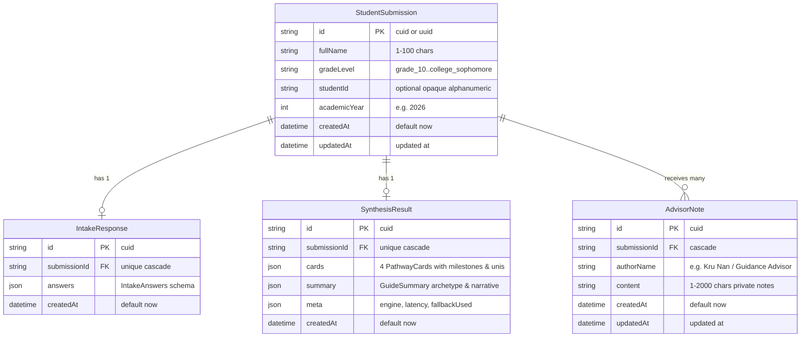
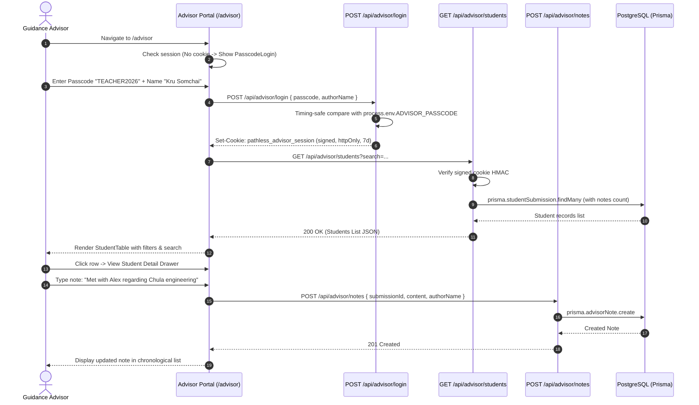
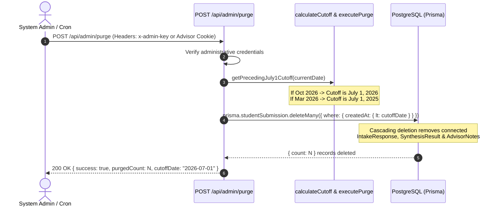

# Feature 10: Advisor Dashboard and Database Persistence — Technical Contract & Specification

## 1. Executive Summary & Objective

This specification establishes the technical, architectural, behavioral, and accessibility contract for **Feature 10: Advisor Dashboard and Database Persistence** of the **PathLess Framework v2** on branch `feature/10-advisor-dashboard-db`.

In prior releases (Features 1 through 9 and Feature 14), PathLess established a zero-pressure student intake flow, defensive AI synthesis with catalog whitelisting, locked qualitative badges, and a curated Thai university scaffold. However, all student submissions and pathway recommendations existed transiently in browser session memory. Once a student closed their browser tab, their personalized exploration was lost unless printed, and school guidance advisors had no collaborative visibility into student interests, academic hesitations, or recommended degrees.

Feature 10 implements **database persistence** and **educator review tools** for PathLess using a zero-cost serverless PostgreSQL database (via Prisma ORM) and lightweight passcode gatekeeping (`TEACHER2026`).

```
┌──────────────────────────────────────────────────────────────────────────────────────────────────┐
│                                FEATURE BASELINE vs FEATURE 10 PERSISTENCE                        │
├─────────────────────────────────────────────────┬────────────────────────────────────────────────┤
│           Prior Features (In-Memory Only)       │         Feature 10 (Advisor & Database)        │
├─────────────────────────────────────────────────┼────────────────────────────────────────────────┤
│ • Transient state in client memory/session      │ • Serverless PostgreSQL persistence via Prisma │
│ • Disappears upon browser tab close             │ • StudentSubmission, IntakeResponse,           │
│ • No advisor collaboration or history           │   SynthesisResult & AdvisorNote tables         │
│ • No student record lookup by school mentor     │ • Advisor portal at /advisor with passcode gate│
│ • Student ID entered but never saved            │ • Searchable student directory (name, grade)   │
│ • No educator note-taking for follow-up talks   │ • Detailed card & university inspection drawer │
│ • Unbounded data retention (risk of stale PII)  │ • Private advisor notes appended to records    │
│ • No automated academic year data turnover      │ • Automated annual July 1 academic purge logic │
│                                                 │ • 100% zero-database jargon on educator screens│
└─────────────────────────────────────────────────┴────────────────────────────────────────────────┘
```

### Primary Objectives

1. **Serverless PostgreSQL Schema via Prisma (`prisma/schema.prisma`, `src/lib/prisma.ts`)**:
   Model student submissions, intake responses, synthesized pathway cards with milestone progressions and matched Thai universities, and private advisor session notes using clean relational schema with cascading deletions and non-blocking Prisma client connection handling.
2. **Asynchronous Submission Persistence (`src/app/api/guide/route.ts`)**:
   Automatically record student intake answers and generated pathway recommendations in the database upon intake completion. Guarantee that database latency or temporary connection dips never block or fail the student's synthesis response.
3. **Passcode-Gated Educator Authentication (`src/lib/auth.ts`, `src/app/api/advisor/login/route.ts`)**:
   Implement friction-free educator access using a shared passcode (`TEACHER2026` / `ADVISOR_PASSCODE`). Authenticate advisors via cryptographically signed `httpOnly` session cookies without requiring complex user account creation, forgotten-password loops, or student tracking accounts.
4. **Advisor Dashboard Portal (`src/app/advisor/page.tsx`, `src/components/advisor/*`)**:
   Deliver a responsive, educator-friendly portal featuring passcode login gating, searchable student directory (by student name or grade), submission date filtering, full pathway inspection modal/drawer, and a private advisor note editor.
5. **Annual Data Purge Utility (`src/lib/purge.ts`, `src/app/api/admin/purge/route.ts`)**:
   Enforce educational data minimization by calculating the preceding July 1 academic cut-off date and purging student records older than the active academic cycle, protected by administrative verification.
6. **Privacy Guard & Opaque Student ID**:
   Treat Student ID as strictly optional and opaque (`STU-XXXXX`). Never enforce student ID formatting as a primary identifier, and omit it from public-facing views.
7. **Zero Technical Database Jargon**:
   Strictly prevent raw database terminology (e.g., `FOREIGN KEY`, `NULL`, `table row ID`, `schema error`, `SQL query`) from surfacing in the advisor UI or client error states. Use familiar educator language: *Student Record*, *Guide Submission*, *Academic Year*, *Advisor Note*.
8. **Accessibility & WCAG 2.1 AA Compliance**:
   Ensure all form fields have associated labels (`<label for="...">`), table headers use `scope="col"`, interactive rows/cards support keyboard focus and Enter key activation, and all touch targets satisfy the $44 \times 44$ pixel minimum.

---

## 2. Scope & Boundary Clarifications

```
┌──────────────────────────────────────────────────────────────────────────────────────────────────┐
│                                      FEATURE 10 BOUNDARY MAP                                     │
├──────────────────────────────────────┬───────────────────────────────────────────────────────────┤
│          IN SCOPE (Feature 10)       │               DEFERRED (Downstream Features)              │
├──────────────────────────────────────┼───────────────────────────────────────────────────────────┤
│ • Prisma PostgreSQL schema modeling  │ • Global plain-language UI copy rewrites across the       │
│   submissions, responses, results,   │   entire student intake wizard                            │
│   and advisor notes                  │   --> Deferred to feature/11-ux-copy-and-simplification   │
│ • Prisma client singleton with       │ • Rate limiting hardening, request replay defense,        │
│   graceful error masking             │   and complex input sanitization                          │
│ • Asynchronous database persistence  │   --> Deferred to feature/12-safety-and-guardrails        │
│   hook in POST /api/guide            │ • Multi-tenant school domain partitioning or SAML/SSO     │
│ • Shared passcode educator auth      │   --> Out of scope (lightweight passcode per spec)        │
│   (TEACHER2026 -> signed httpOnly)   │ • Real-time WebSocket push updates for advisor table      │
│ • Advisor portal (/advisor) with     │   --> Out of scope (HTTP polling/revalidation is plenty)  │
│   directory, filters, and notes      │ • Bulk CSV export / import of student records             │
│ • Annual July 1 data purge utility   │   --> Out of scope for v2 proof-of-concept                │
│ • Protected POST /api/admin/purge    │ • Modifying core career synthesis algorithm or prompt     │
│ • Centralized copy in advisorCopy.ts │   --> Preserved from Features 8, 9, and 14                │
│ • Unit & integration test suites     │                                                           │
└──────────────────────────────────────┴───────────────────────────────────────────────────────────┘
```

### Explicitly In Scope
- **Data Modeling (`prisma/schema.prisma`)**: `StudentSubmission`, `IntakeResponse`, `SynthesisResult`, and `AdvisorNote` models with proper constraints, relations, indexes, and cascading deletes.
- **Client Singleton (`src/lib/prisma.ts`)**: Serverless-safe Prisma client instantiation preventing connection pool exhaustion in Next.js development and serverless runtimes.
- **Persistence Hook (`src/app/api/guide/route.ts`)**: Linking synthesis output to persistent database records with non-blocking error handling.
- **Authentication Service (`src/lib/auth.ts`)**: Shared passcode validation, timing-safe comparison, HMAC-SHA256 session token generation, verification, and cookie serialization.
- **Auth Routes**: `POST /api/advisor/login` and `POST /api/advisor/logout`.
- **Advisor Data Routes**: `GET /api/advisor/students` (directory lookup with search and date filters) and `POST /api/advisor/notes` (appending notes).
- **Admin Purge Route**: `POST /api/admin/purge` (administrative data minimization with preceding July 1 cutoff).
- **Advisor UI Suite**:
  - `src/app/advisor/page.tsx`: Top-level page container with session check.
  - `src/components/advisor/AdvisorDashboard.tsx`: Main educator workspace.
  - `src/components/advisor/PasscodeLogin.tsx`: Accessible passcode modal/form.
  - `src/components/advisor/StudentTable.tsx`: Accessible table with search, grade filter, and row selection.
  - `src/components/advisor/StudentDetailModal.tsx`: Comprehensive drawer displaying student answers, 4 pathway cards, and university matches.
  - `src/components/advisor/AdvisorNotesEditor.tsx`: Private advisor note composer and chronological history list.
- **Centralized Copy (`src/content/advisorCopy.ts`)**: 100% of educator-facing strings.
- **Automated Test Suites**:
  - `tests/unit/auth.test.ts`: Unit tests for passcode validation, HMAC signing, tampering defense, and cookie options.
  - `tests/unit/purge.test.ts`: Unit tests for preceding July 1 cutoff calculations across various calendar dates.
  - `tests/integration/advisorRoutes.test.ts`: Integration tests for auth flow, student list retrieval, note appending, and purge endpoints.

### Explicitly Out of Scope
- **Global Student Intake Copy Rewrites**: Flesch-Kincaid readability scoring and intake question simplification across the student wizard are deferred to `feature/11-ux-copy-and-simplification`.
- **Advanced Rate Limiting & Anti-Abuse**: IP reputation scoring, distributed token buckets, and payload sanitization hardening are deferred to `feature/12-safety-and-guardrails`.
- **Individual User Accounts**: No multi-user username/password registrations, password recovery emails, or OAuth providers. PathLess intentionally uses lightweight shared passcode gating for school educators.

---

## 3. Forbidden Terminology & Non-Technical Educator Copy Matrix

To honor the PathLess calm, non-technical educational philosophy, all technical database jargon, developer error messages, and clinical triage terminology are strictly prohibited from educator screens, modal dialogues, table empty states, and notifications:

```
┌──────────────────────────────────────┬──────────────────────────────────┬────────────────────────────────────────────────────────┐
│ Prohibited Technical / Jargon Term   │ Approved Educator Replacement    │ Educational & Cognitive Justification                  │
├──────────────────────────────────────┼──────────────────────────────────┼────────────────────────────────────────────────────────┤
│ Database / Database Record / Row     │ Student Record / Submission      │ Teachers think in terms of students and submissions,   │
│ (e.g. "Row inserted into DB")        │ (e.g. "Record saved")            │ not relational storage rows or table records.          │
├──────────────────────────────────────┼──────────────────────────────────┼────────────────────────────────────────────────────────┤
│ SQL / Query / Foreign Key / Cascade  │ Connected Information / Details  │ Relational implementation details create confusion     │
│ (e.g. "Foreign key constraint fail") │ (e.g. "Connected answers")       │ and anxiety for non-technical school staff.            │
├──────────────────────────────────────┼──────────────────────────────────┼────────────────────────────────────────────────────────┤
│ Authentication Failed / 401 Unauth   │ Incorrect School Passcode        │ Straightforward explanation of what went wrong without │
│ (e.g. "Invalid JWT signature / 401") │ (e.g. "Please check the code")   │ exposing HTTP status codes or security mechanics.      │
├──────────────────────────────────────┼──────────────────────────────────┼────────────────────────────────────────────────────────┤
│ Schema / Entity / Migration          │ Student Profile / Guide Answers  │ Replaces technical Prisma terms with educational       │
│ (e.g. "Schema validation error")     │ (e.g. "Incomplete submission")   │ terminology familiar to counselors and mentors.        │
├──────────────────────────────────────┼──────────────────────────────────┼────────────────────────────────────────────────────────┤
│ Purge / DROP TABLE / Truncate        │ Annual Academic Archive & Clean  │ "Purge" sounds destructive and scary; "Annual Clean"   │
│ (e.g. "Pruned 42 rows from Postgres")│ (e.g. "Previous cycle archived") │ reinforces healthy student privacy compliance.         │
├──────────────────────────────────────┼──────────────────────────────────┼────────────────────────────────────────────────────────┤
│ UUID / CUID / Primary Key            │ Submission Reference             │ Internal identifiers must remain hidden from teachers; │
│ (e.g. "clx9102ks000109...")          │ (Omitted or formatted cleanly)   │ use student name, grade, and date for reference.       │
├──────────────────────────────────────┼──────────────────────────────────┼────────────────────────────────────────────────────────┤
│ Triage / Clinical Dossier            │ PathLess Guide / Student Summary │ Preserves the global zero-jargon rule from Feature 14. │
├──────────────────────────────────────┼──────────────────────────────────┼────────────────────────────────────────────────────────┤
│ Error Stack Trace / Exception        │ Temporary Service Notice         │ Never leak server internals, Prisma errors, or vendor  │
│ (e.g. "PrismaClientInitialization")  │ ("Unable to load student list")  │ connection strings into UI alert banners.              │
└──────────────────────────────────────┴──────────────────────────────────┴────────────────────────────────────────────────────────┘
```

---

## 4. Architecture & Data Flow Diagrams

### 4.1 System Relational Entity Diagram (Prisma PostgreSQL)



### 4.2 End-to-End Submission Persistence Flow

```mermaid
sequenceDiagram
  autonumber
  actor Student as Student (Browser)
  participant GuideRoute as POST /api/guide
  participant Gemini as Gemini AI / Mock Fallback
  participant Validator as Catalog Validator
  participant DB as PostgreSQL (Prisma)

  Student->>GuideRoute: POST /api/guide (StudentProfile + IntakeAnswers)
  GuideRoute->>Gemini: Synthesize recommendations
  Gemini-->>GuideRoute: Return 4 Pathway Cards & Summary
  GuideRoute->>Validator: Verify catalog whitelist & 2+2 spread
  Validator-->>GuideRoute: Validated GuideResult

  critical Asynchronous Persistence (Non-Blocking)
    GuideRoute->>DB: prisma.studentSubmission.create (with IntakeResponse & SynthesisResult)
    DB-->>GuideRoute: Created submission record (id, createdAt)
  option DB Connection Unavailable
    GuideRoute->>GuideRoute: Log warning; do not fail student request
  end

  GuideRoute-->>Student: 200 OK (GuideResult + submissionId)
```

### 4.3 Advisor Authentication & Dashboard Access Flow



### 4.4 Annual July 1 Purge Cycle Flow



---

## 5. Detailed Module Specifications

### Module 1: Prisma Database Schema & Client Singleton

#### 1.1 `prisma/schema.prisma`
The schema targets PostgreSQL (`provider = "postgresql"`). Environment variable `DATABASE_URL` provides the serverless pooled connection string, while `DIRECT_URL` (optional) provides a direct migration connection string.

```prisma
datasource db {
  provider  = "postgresql"
  url       = env("DATABASE_URL")
  directUrl = env("DIRECT_URL")
}

generator client {
  provider = "prisma-client-js"
}

model StudentSubmission {
  id           String           @id @default(cuid())
  fullName     String
  gradeLevel   String
  studentId    String?          // Strictly optional, opaque student code
  academicYear Int              // e.g., 2026
  createdAt    DateTime         @default(now())
  updatedAt    DateTime         @updatedAt

  intakeResponse  IntakeResponse?
  synthesisResult SynthesisResult?
  advisorNotes    AdvisorNote[]

  @@index([createdAt])
  @@index([gradeLevel])
  @@index([academicYear])
  @@index([studentId])
  @@map("student_submissions")
}

model IntakeResponse {
  id           String            @id @default(cuid())
  submissionId String            @unique
  submission   StudentSubmission @relation(fields: [submissionId], references: [id], onDelete: Cascade)
  answers      Json              // Stores IntakeAnswers
  createdAt    DateTime          @default(now())

  @@map("intake_responses")
}

model SynthesisResult {
  id           String            @id @default(cuid())
  submissionId String            @unique
  submission   StudentSubmission @relation(fields: [submissionId], references: [id], onDelete: Cascade)
  cards        Json              // Array of 4 PathwayCards with milestones & unis
  summary      Json?             // GuideSummary narrative
  meta         Json?             // GuideMeta (engine, latency, fallbackUsed)
  createdAt    DateTime          @default(now())

  @@map("synthesis_results")
}

model AdvisorNote {
  id           String            @id @default(cuid())
  submissionId String
  submission   StudentSubmission @relation(fields: [submissionId], references: [id], onDelete: Cascade)
  authorName   String            @default("Advisor")
  content      String
  createdAt    DateTime          @default(now())
  updatedAt    DateTime          @updatedAt

  @@index([submissionId])
  @@index([createdAt])
  @@map("advisor_notes")
}
```

#### 1.2 `src/lib/prisma.ts` (Prisma Client Singleton)
In Next.js development, hot-reloading frequently instantiates new `PrismaClient` instances, quickly exhausting serverless connection pools. The singleton stores the active client on `globalThis`:

```typescript
import { PrismaClient } from '@prisma/client';

const prismaClientSingleton = () => {
  return new PrismaClient({
    log: process.env.NODE_ENV === 'development' ? ['warn', 'error'] : ['error'],
  });
};

type PrismaClientSingleton = ReturnType<typeof prismaClientSingleton>;

const globalForPrisma = globalThis as unknown as {
  prismaGlobal: PrismaClientSingleton | undefined;
};

export const prisma = globalForPrisma.prismaGlobal ?? prismaClientSingleton();

if (process.env.NODE_ENV !== 'production') {
  globalForPrisma.prismaGlobal = prisma;
}
```

---

### Module 2: Submission Persistence Hook/API (`src/app/api/guide/route.ts`)

#### 2.1 Persistence Integration Requirements
1. **Academic Year Calculation**:
   Calculated dynamically from submission date:
   - If submission date is >= July 1 of Year Y, `academicYear = Y`.
   - If submission date is < July 1 of Year Y, `academicYear = Y - 1`.
2. **Defensive Non-Blocking Persistence**:
   Persistence is wrapped in a guarded `try/catch`. If `DATABASE_URL` is unconfigured (e.g. during standalone frontend testing or offline demo) or if PostgreSQL connection times out, the route logs a warning and still returns the synthesized recommendations to the student with HTTP 200:

```typescript
// Persistence helper inside guide route
async function persistSubmissionSafely(
  payload: SubmissionPayload,
  result: GuideResult
): Promise<string | null> {
  if (!process.env.DATABASE_URL) {
    return null;
  }
  try {
    const now = new Date();
    const currentYear = now.getFullYear();
    const cutoffThisYear = new Date(currentYear, 6, 1); // July 1
    const academicYear = now >= cutoffThisYear ? currentYear : currentYear - 1;

    const submission = await prisma.studentSubmission.create({
      data: {
        fullName: payload.studentProfile.fullName.trim(),
        gradeLevel: payload.studentProfile.gradeLevel,
        studentId: payload.studentProfile.studentId?.trim() || null,
        academicYear,
        intakeResponse: {
          create: {
            answers: payload.intakeAnswers as any,
          },
        },
        synthesisResult: {
          create: {
            cards: result.pathways as any,
            summary: result.summary as any,
            meta: result.meta as any,
          },
        },
      },
    });
    return submission.id;
  } catch (error) {
    console.warn('[PathLess Persistence] Safe persistence fallback triggered:', error);
    return null;
  }
}
```

3. **Response Enrichment**:
   If persistence succeeds, the generated `submission.id` is attached to `result.submissionId` and returned in the JSON payload, allowing the student or browser to reference their saved record.

---

### Module 3: Advisor Auth Service & Session Middleware

#### 3.1 Security Invariants
- **Default Passcode**: `TEACHER2026`. Can be overridden via `process.env.ADVISOR_PASSCODE`.
- **Timing-Safe Evaluation**: Comparison must use `crypto.timingSafeEqual` over SHA-256 digests to prevent timing analysis attacks.
- **Signed Session Token**:
  Token structure: `<base64UrlPayload>.<base64UrlSignature>`
  - Payload: `{ role: 'advisor', authorName: string, iat: number, exp: number }`
  - Signature: `HMAC-SHA256(payload, SESSION_SECRET ?? ADVISOR_PASSCODE ?? 'pathless-session-salt-2026')`
  - Lifetime: 7 days (`60 * 60 * 24 * 7` seconds).
- **Cookie Attributes**:
  - Name: `pathless_advisor_session`
  - `httpOnly: true` (inaccessible to client JavaScript / XSS protection)
  - `secure: process.env.NODE_ENV === 'production'`
  - `sameSite: 'lax'`
  - `path: '/'`
  - `maxAge: 604800`

#### 3.2 Service Functions (`src/lib/auth.ts`)
```typescript
export interface AdvisorSessionPayload {
  role: 'advisor';
  authorName: string;
  iat: number;
  exp: number;
}

export function verifyAdvisorPasscode(candidatePasscode: string): boolean;
export function createAdvisorSessionToken(authorName?: string): string;
export function verifyAdvisorSessionToken(token: string): AdvisorSessionPayload | null;
export function getAdvisorSessionFromRequest(request: Request): AdvisorSessionPayload | null;
export function getAdvisorCookieHeader(token: string): string;
export function getAdvisorLogoutCookieHeader(): string;
```

#### 3.3 Auth Routes
1. **`POST /api/advisor/login`**:
   - Request Body: `{ passcode: string, authorName?: string }`
   - Validates passcode. If invalid: returns HTTP 401 with educator copy: *"The passcode entered does not match our school records. Please check with your lead counselor."*
   - If valid: sets `pathless_advisor_session` cookie; returns HTTP 200 `{ success: true, authorName: string }`.
2. **`POST /api/advisor/logout`**:
   - Clears session cookie by setting `maxAge: 0`. Returns HTTP 200 `{ success: true }`.

---

### Module 4: Advisor Dashboard UI Components & API Routes

#### 4.1 Route Handlers
1. **`GET /api/advisor/students`**:
   - Security: Requires valid advisor session cookie. Returns 401 Problem Details if missing/tampered.
   - Query Parameters:
     - `search`: Case-insensitive search on `fullName` or `studentId`.
     - `grade`: Filter by `gradeLevel` enum (e.g. `grade_12`).
     - `dateRange`: Filter by `7d`, `30d`, `current_year`, or `all`.
   - Returns:
     ```typescript
     export interface StudentDirectoryItem {
       id: string;
       fullName: string;
       gradeLevel: string;
       studentId: string | null;
       academicYear: number;
       createdAt: string;
       topMatchRole: string;
       topMatchField: string;
       notesCount: number;
     }
     ```
2. **`GET /api/advisor/students/[id]`**:
   - Returns complete `SubmissionDetailResponse` including student profile, full intake answers, 4 pathway cards with milestones and matched Thai university programs, and chronological `AdvisorNote[]`.
3. **`POST /api/advisor/notes`**:
   - Security: Requires valid advisor session cookie.
   - Request Body: `{ submissionId: string, content: string, authorName?: string }`
   - Validations:
     - `submissionId`: Required, must correspond to existing `StudentSubmission`.
     - `content`: Required, trimmed length between 1 and 2,000 characters.
   - Returns: HTTP 201 with created note `{ id, submissionId, authorName, content, createdAt }`.

#### 4.2 Component Architecture

```
src/app/advisor/page.tsx (Page Shell & Session Gate)
 └── src/components/advisor/AdvisorDashboard.tsx (State & Layout Coordinator)
      ├── src/components/advisor/PasscodeLogin.tsx (Auth Modal / View)
      ├── Header: Advisor Welcome, Search, Grade Filter, Date Range & Logout Button
      ├── src/components/advisor/StudentTable.tsx (Accessible Directory Table)
      └── src/components/advisor/StudentDetailModal.tsx (Detailed Inspection Drawer)
           ├── Student Profile & Intake Hesitation Summary
           ├── 4 Pathway Cards (Milestones & Thai University Matches)
           └── src/components/advisor/AdvisorNotesEditor.tsx (Private Notes History & Composer)
```

#### 4.3 Component Accessibility Invariants
- **`PasscodeLogin`**:
  - Distinct `<label htmlFor="advisor-passcode">School Advisor Passcode</label>`.
  - Visible focus ring on input (`focus:ring-2 focus:ring-primary-500`).
  - Error banner uses `role="alert"` and `aria-live="assertive"`.
  - Submit button min-height 44px.
- **`StudentTable`**:
  - `<table>` with `<caption>Student Discovery Submissions Directory</caption>`.
  - Column headers: `<th scope="col">Student</th>`, `<th scope="col">Grade</th>`, `<th scope="col">Top Direction</th>`, `<th scope="col">Submitted</th>`, `<th scope="col">Notes</th>`, `<th scope="col">Actions</th>`.
  - Interactive rows have `tabIndex={0}` and keyboard listener for `Enter` and `Space`.
  - Visual hover and focus states with clear contrast (> 4.5:1).
- **`StudentDetailModal`**:
  - Dialog semantics: `role="dialog"`, `aria-modal="true"`, `aria-labelledby="student-detail-title"`.
  - Close button has `aria-label="Close student details"` and 44 x 44px touch target.
  - Traps keyboard focus while open; closes cleanly on `Escape` key press.
- **`AdvisorNotesEditor`**:
  - Textarea has associated label: `<label htmlFor="advisor-note-input">Add Private Advisor Note</label>`.
  - Real-time character counter announces remaining length (`aria-live="polite"`).
  - Submit button has accessible loading and completed states.

---

### Module 5: Annual Data Purge Utility (`src/lib/purge.ts`, `src/app/api/admin/purge/route.ts`)

#### 5.1 Preceding July 1 Cut-Off Algorithm
In secondary and higher education across Thailand and international schooling cycles, the academic calendar advances in July. To prevent stale student records from accumulating while respecting privacy:

```typescript
/**
 * Calculates the preceding July 1 cut-off timestamp.
 * - If current date is >= July 1 of Year Y, preceding July 1 is Year Y-07-01.
 * - If current date is < July 1 of Year Y, preceding July 1 is Year (Y-1)-07-01.
 */
export function getPrecedingJuly1Cutoff(referenceDate: Date = new Date()): Date {
  const year = referenceDate.getFullYear();
  const julyFirstThisYear = new Date(Date.UTC(year, 6, 1, 0, 0, 0, 0)); // Month index 6 = July

  if (referenceDate.getTime() >= julyFirstThisYear.getTime()) {
    return julyFirstThisYear;
  }
  return new Date(Date.UTC(year - 1, 6, 1, 0, 0, 0, 0));
}
```

*Example Cutoff Calculations:*
- Reference: `2026-10-06` -> Cutoff: `2026-07-01 00:00:00 UTC` (Purges records prior to 2026-2027 school year).
- Reference: `2026-03-15` -> Cutoff: `2025-07-01 00:00:00 UTC` (Retains current 2025-2026 school year).
- Reference: `2026-07-01` -> Cutoff: `2026-07-01 00:00:00 UTC`.

#### 5.2 Execution Functions (`src/lib/purge.ts`)
```typescript
export interface PurgePreviewResult {
  cutoffDate: Date;
  candidatesCount: number;
}

export interface PurgeExecutionResult {
  cutoffDate: Date;
  purgedCount: number;
  dryRun: boolean;
}

export async function previewAnnualPurge(cutoffDate?: Date): Promise<PurgePreviewResult>;
export async function executeAnnualPurge(options?: { cutoffDate?: Date; dryRun?: boolean }): Promise<PurgeExecutionResult>;
```

#### 5.3 Administrative Endpoint (`POST /api/admin/purge`)
- **Authorization**:
  - Request must provide either:
    1. Header `x-admin-key: <ADMIN_SECRET>` matching `process.env.ADMIN_SECRET`.
    2. Valid advisor session cookie (`pathless_advisor_session`) with `confirmPurge: true` in body.
- **Request Parameters**:
  - Query parameter `?dryRun=true` or JSON body `{ dryRun: true }` returns candidate counts without deleting.
  - Query parameter `?dryRun=false` or `{ confirmPurge: true }` executes deletion.
- **Response**:
  ```json
  {
    "success": true,
    "dryRun": false,
    "purgedCount": 142,
    "cutoffDate": "2026-07-01T00:00:00.000Z",
    "message": "Successfully archived 142 student submissions created prior to July 1, 2026."
  }
  ```

---

## 6. Centralized Copy Dictionary (`src/content/advisorCopy.ts`)

All user-facing strings for the advisor portal live in `src/content/advisorCopy.ts`:

```typescript
export const ADVISOR_COPY = {
  portal: {
    brandName: 'PathLess for Advisors',
    pageTitle: 'School Advisor & Mentor Directory',
    tagline: 'Review student career reflections, exploratory majors, and notes with zero pressure.',
    logoutButton: 'Sign Out',
    logoutAriaLabel: 'Sign out of the Advisor Portal',
  },

  login: {
    title: 'School Advisor Access',
    subtitle: 'Enter your school passcode to access your students’ pathway reflections and session notes.',
    passcodeLabel: 'Advisor Passcode',
    passcodePlaceholder: 'e.g., TEACHER2026',
    passcodeHelper: 'Ask your school head counselor if you do not know your school passcode.',
    authorNameLabel: 'Your Name or Advisor Title (Optional)',
    authorNamePlaceholder: 'e.g., Kru Nan / Counselor Davis',
    authorNameHelper: 'This will be attached to any private notes you write during student meetings.',
    submitButton: 'Open Advisor Directory',
    authenticatingButton: 'Verifying Passcode...',
    errorMessage: 'The passcode entered does not match our school records. Please check the code and try again.',
    privacyNote: 'Student submissions are kept private to your school community and auto-archived annually.',
  },

  directory: {
    searchPlaceholder: 'Search by student name or student ID...',
    searchLabel: 'Search students',
    gradeFilterLabel: 'Filter by grade level',
    allGradesOption: 'All Grades & Years',
    dateFilterLabel: 'Filter by date',
    dateOptions: {
      all: 'All Time',
      past7Days: 'Past 7 Days',
      past30Days: 'Past 30 Days',
      currentYear: 'Current Academic Year',
    },
    tableCaption: 'Student Discovery Submissions Directory',
    tableHeaders: {
      student: 'Student',
      grade: 'Grade Level',
      topDirection: 'Top Pathway',
      submittedDate: 'Submission Date',
      notesCount: 'Advisor Notes',
      actions: 'Actions',
    },
    viewDetailCta: 'View Full Guide',
    viewDetailAria: (name: string) => `View full pathway discovery details for ${name}`,
    emptyStateTitle: 'No Student Submissions Found',
    emptyStateDescription: 'No student guides match your current search or filter. Submissions will appear here once students complete their intake.',
    loadingText: 'Loading student directory...',
    recordsCount: (count: number) => `${count} student ${count === 1 ? 'record' : 'records'} found`,
  },

  drawer: {
    closeButtonAria: 'Close student details',
    profileSectionTitle: 'Student Profile & Context',
    intakeAnswersTitle: 'What Naturally Energizes Them',
    hesitationSectionTitle: 'Academic Worry & Hesitation',
    pathwaysSectionTitle: 'Synthesized Pathway Recommendations',
    matchedUnisTitle: 'Verified Regional Higher Education Programs',
    notesSectionTitle: 'Private Advisor Session Notes',
    noNotesNotice: 'No notes have been recorded for this student yet. Use the form below to record notes from your advising conversation.',
    studentIdLabel: 'Student ID',
    notProvided: 'Not provided',
  },

  notes: {
    composerLabel: 'New Advisor Note',
    composerPlaceholder: 'Record discussion points, university preferences, or follow-up milestones for this student...',
    authorLabel: 'Author',
    authorDefault: 'Advisor',
    saveButton: 'Save Note',
    savingButton: 'Saving Note...',
    savedNotice: 'Note saved successfully to student record.',
    charCount: (current: number, max: number) => `${current}/${max} characters`,
    errorMessage: 'Unable to save your note right now. Please try again.',
  },

  purgeNotice: {
    title: 'Annual Academic Archive',
    description: 'PathLess automatically removes student submissions created prior to July 1 of the active school year to safeguard student privacy.',
    statusMessage: (count: number, date: string) =>
      `Archived ${count} submissions from prior academic cycles (cut-off: ${date}).`,
  },

  errors: {
    sessionExpired: 'Your advisor session has expired. Please enter your school passcode again.',
    networkError: 'We could not reach the school server. Please verify your connection.',
    unauthorized: 'Advisor authentication required.',
  },
} as const;
```

---

## 7. Accessibility (WCAG 2.1 AA) & Responsive Design Contract

| Guideline | Implementation Invariant in Feature 10 Components | Verification Method |
| :--- | :--- | :--- |
| **Label Associations** | Every `<input>`, `<textarea>`, and `<select>` across `PasscodeLogin`, `StudentTable`, and `AdvisorNotesEditor` must have an explicit `id` matched to a `<label htmlFor="...">`. | DOM audit; axe-core test |
| **Table Semantics** | `StudentTable` renders standard `<table>`, `<caption>`, `<th scope="col">`, and descriptive `<td>` elements. | Screen reader audit (NVDA/VoiceOver) |
| **Keyboard Navigation** | Table rows have `tabIndex={0}` and respond to `Enter` and `Space`. Modals trap focus and close on `Escape`. | Unit test with simulated keyboard events |
| **Touch Targets** | All interactive buttons, inputs, filter selects, and action links must have a minimum bounding box of $44 \times 44\text{px}$ (`min-h-[44px] min-w-[44px]`). | CSS computed style verification |
| **Color Contrast** | All text and badges against backgrounds must meet or exceed WCAG 2.1 AA contrast ratio ($4.5:1$ for normal text, $3:1$ for large text/icons). | Automated contrast inspection |
| **Screen Reader Alerts** | Submission errors, note save feedback, and filter updates use `aria-live="polite"` or `role="status"` without stealing user focus. | Manual screen reader testing |

---

## 8. Acceptance Criteria & Verification Matrix

```
┌──────────┬─────────────────────────────────────────────────┬────────────────────────────────────────────────────────┐
│ ID       │ Acceptance Criterion Summary                    │ Contract Test Verification                             │
├──────────┼─────────────────────────────────────────────────┼────────────────────────────────────────────────────────┤
│ AC-DB-01 │ Prisma schema models submissions, responses,    │ prisma validate passes; PrismaClient TypeScript types  │
│          │ results, and notes with PostgreSQL support,     │ match StudentSubmission, IntakeResponse,               │
│          │ generating migrations cleanly.                  │ SynthesisResult, and AdvisorNote.                      │
├──────────┼─────────────────────────────────────────────────┼────────────────────────────────────────────────────────┤
│ AC-DB-02 │ Completing the intake flow persists the student │ POST /api/guide creates StudentSubmission record with  │
│          │ record (name, grade, optional studentId) and    │ nested IntakeResponse & SynthesisResult in DB.         │
│          │ full synthesis cards to the database.           │ Returned payload includes valid submissionId.          │
├──────────┼─────────────────────────────────────────────────┼────────────────────────────────────────────────────────┤
│ AC-DB-03 │ Accessing /advisor requires authentication via  │ POST /api/advisor/login verifies TEACHER2026; sets     │
│          │ TEACHER2026, granting access via a signed       │ signed httpOnly cookie. Requests lacking cookie are    │
│          │ httpOnly cookie without accounts/passwords.     │ rejected with HTTP 401.                                │
├──────────┼─────────────────────────────────────────────────┼────────────────────────────────────────────────────────┤
│ AC-DB-04 │ Advisor dashboard renders responsive student    │ GET /api/advisor/students returns directory items;     │
│          │ directory with search by name/grade, date       │ search filters by name/studentId; POST notes creates   │
│          │ filtering, and private advisor note-taking.     │ AdvisorNote and associates with submission.            │
├──────────┼─────────────────────────────────────────────────┼────────────────────────────────────────────────────────┤
│ AC-DB-05 │ Annual data purge utility correctly identifies  │ getPrecedingJuly1Cutoff returns exact preceding July 1;│
│          │ and deletes submissions created prior to the    │ POST /api/admin/purge deletes records older than       │
│          │ preceding July 1 date.                          │ cutoff with cascading relation cleanup.                │
├──────────┼─────────────────────────────────────────────────┼────────────────────────────────────────────────────────┤
│ AC-DB-06 │ 100% of user-facing dashboard text uses clear,  │ advisorCopy.ts contains all educator strings; zero     │
│          │ non-technical educator language without raw     │ SQL/Prisma terms or stack traces exposed in UI.        │
│          │ database column names or error traces.          │                                                        │
└──────────┴─────────────────────────────────────────────────┴────────────────────────────────────────────────────────┘
```

---

## 9. Comprehensive Test Plan

### 9.1 Unit Test Suite: `tests/unit/auth.test.ts`
- **`UT-AUTH-01`**: Validates correct default passcode (`TEACHER2026`) and respects custom `ADVISOR_PASSCODE` env var.
- **`UT-AUTH-02`**: Rejects incorrect, empty, or whitespace-only passcodes.
- **`UT-AUTH-03`**: Enforces timing-safe passcode evaluation using cryptographic digest comparison.
- **`UT-AUTH-04`**: Generates HMAC-SHA256 signed session token with valid 7-day expiration timestamp.
- **`UT-AUTH-05`**: Rejects tampered tokens (altered payload or modified signature).
- **`UT-AUTH-06`**: Rejects expired session tokens.
- **`UT-AUTH-07`**: Emits proper Set-Cookie header with `HttpOnly`, `Path=/`, `SameSite=Lax`, and `Max-Age=604800`.
- **`UT-AUTH-08`**: Emits proper logout Set-Cookie header with `Max-Age=0`.

### 9.2 Unit Test Suite: `tests/unit/purge.test.ts`
- **`UT-PURGE-01`**: Computes July 1 of current year when run in autumn (e.g., October 6, 2026 -> July 1, 2026).
- **`UT-PURGE-02`**: Computes July 1 of previous year when run in spring (e.g., March 15, 2026 -> July 1, 2025).
- **`UT-PURGE-03`**: Handles exact boundary condition on July 1 (e.g., July 1, 2026 00:00:00 -> July 1, 2026).
- **`UT-PURGE-04`**: Handles leap years correctly (e.g., February 29, 2028 -> July 1, 2027).
- **`UT-PURGE-05`**: Correctly filters simulated submissions into retain vs. purge buckets based on `createdAt`.

### 9.3 Integration Test Suite: `tests/integration/advisorRoutes.test.ts`
- **`IT-ADV-01`**: `POST /api/advisor/login` with `TEACHER2026` returns 200 and sets `pathless_advisor_session` cookie.
- **`IT-ADV-02`**: `POST /api/advisor/login` with invalid passcode returns 401 with educator problem details.
- **`IT-ADV-03`**: `POST /api/advisor/logout` returns 200 and expires the session cookie.
- **`IT-ADV-04`**: `GET /api/advisor/students` rejects unauthenticated request with 401.
- **`IT-ADV-05`**: `GET /api/advisor/students` with valid cookie returns 200 and student directory array.
- **`IT-ADV-06`**: `GET /api/advisor/students?search=Alex` filters results by student name.
- **`IT-ADV-07`**: `POST /api/advisor/notes` creates new note attached to student submission.
- **`IT-ADV-08`**: `POST /api/advisor/notes` rejects blank content or missing submission ID with 400.
- **`IT-ADV-09`**: `POST /api/guide` completes intake and persists record to database returning `submissionId`.
- **`IT-ADV-10`**: `POST /api/admin/purge` validates authorization and performs dry-run / confirmed deletion.

---

## 10. Files to Touch & Implementation Plan

```
┌──────────────────────────────────────────────┬────────────────────────────────────────────────────────┐
│ File Path                                    │ Responsibility / Modification                          │
├──────────────────────────────────────────────┼────────────────────────────────────────────────────────┤
│ prisma/schema.prisma                         │ Prisma schema for PostgreSQL: StudentSubmission,       │
│                                              │ IntakeResponse, SynthesisResult, AdvisorNote.          │
│ src/lib/prisma.ts                            │ Prisma client singleton with connection pooling guard. │
│ src/lib/auth.ts                              │ Passcode verification & HMAC-signed session utilities. │
│ src/lib/purge.ts                             │ Preceding July 1 cutoff & data purge query builder.    │
│ src/content/advisorCopy.ts                   │ Centralized copy dictionary for advisor portal & auth. │
│ src/app/api/guide/route.ts                   │ Hook asynchronous persistence to StudentSubmission.    │
│ src/app/api/advisor/login/route.ts           │ POST endpoint verifying passcode & setting cookie.     │
│ src/app/api/advisor/logout/route.ts          │ POST endpoint clearing session cookie.                 │
│ src/app/api/advisor/students/route.ts        │ GET endpoint listing students with search/filter.      │
│ src/app/api/advisor/notes/route.ts           │ POST endpoint appending advisor notes.                 │
│ src/app/api/admin/purge/route.ts             │ POST administrative endpoint for annual data purge.    │
│ src/app/advisor/page.tsx                     │ Next.js page shell for /advisor.                       │
│ src/components/advisor/AdvisorDashboard.tsx  │ Main advisor UI coordinator with table & modal state.  │
│ src/components/advisor/PasscodeLogin.tsx     │ Accessible passcode login modal/form.                  │
│ src/components/advisor/StudentTable.tsx      │ Accessible student directory table.                    │
│ src/components/advisor/StudentDetailModal.tsx│ Comprehensive student submission detail drawer.        │
│ src/components/advisor/AdvisorNotesEditor.tsx│ Private notes history & submission composer.           │
│ tests/unit/auth.test.ts                      │ Unit tests for passcode & session signing logic.       │
│ tests/unit/purge.test.ts                     │ Unit tests for July 1 academic cutoff calculations.    │
│ tests/integration/advisorRoutes.test.ts      │ Integration tests for advisor APIs & persistence.      │
└──────────────────────────────────────────────┴────────────────────────────────────────────────────────┘
```

---

## 11. Architectural Sign-Off & Invariant Confirmation

- [x] **Zero-Cost PostgreSQL**: Designed for standard serverless PostgreSQL tiers (Neon, Supabase, etc.) via Prisma ORM.
- [x] **Passcode Simplicity**: Eliminates user accounts, reset tokens, and passwords in favor of shared educator passcode `TEACHER2026`.
- [x] **Non-Blocking Resilience**: Student intake experience remains resilient if database dips or latency spikes occur.
- [x] **Privacy & Minimization**: Student ID is strictly optional and opaque; annual July 1 purge automatically drops stale records.
- [x] **Zero Database Jargon**: 100% of educator-facing strings use clear counseling terms; raw technical database terms are strictly forbidden.
- [x] **Accessibility (WCAG 2.1 AA)**: Explicit form labels, table headers with `scope="col"`, keyboard navigation, and 44 x 44px touch targets.
