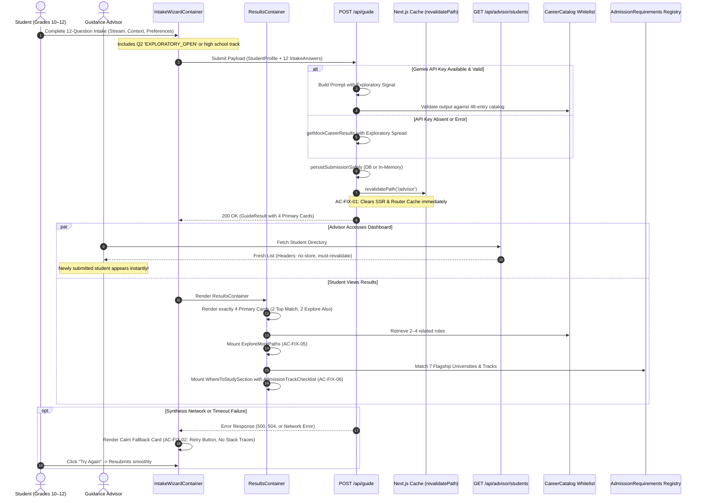

# Feature 15: Fixes, Questions Refinement, and Admissions Guidance — Technical Contract & Specification

## 1. Executive Summary & Objective

This specification establishes the technical, architectural, behavioral, and accessibility contract for **Feature 15: Fixes, Questions Refinement, and Admissions Guidance** of the **PathLess Framework v2** on branch `feature/15-fixes-questions-and-admissions`.

Feature 15 addresses verified runtime bug fixes, enriches intake questions for 10th-to-12th graders, and introduces static, human-curated admission track guidance for higher education in Thailand. While Features 8 through 14 established progressive disclosure, dual-tier rate limiting, the curated 48-entry career catalog whitelist, 3-stage milestone progression, and clean PDF exports, three critical runtime gaps and educational omissions were identified during pilot advisor reviews:
1. **Advisor Dashboard Stale Cache**: When a student completes their intake guide, the server does not immediately revalidate Next.js router cache or SSR segments for `/advisor`. Advisors viewing the dashboard are forced to perform hard browser refreshes to see new student submissions.
2. **Synthesis Error Presentation & Indecision Dead-Ends**: When an upstream network glitch or API timeout occurs, the UI needs a calmer, self-contained recovery state that reassures students without exposing technical stack traces. Furthermore, when students express uncertainty by choosing "not sure" or open-ended exploration options, the system previously defaulted arbitrarily to narrow technical majors rather than providing exploratory breadth across distinct domains.
3. **Upper High School Context & University Admission Track Gap**: Intake questions previously omitted critical 10th-to-12th grade context (such as high school study tracks like Science-Math or Arts-Language, practical collaboration environments, and real-world project preferences). Additionally, while university program listings exist, they lack track eligibility guidance (e.g., whether a program requires a Science-Math track or is open to all streams), leaving anxious students in the dark.

### The PathLess Feature 15 Evolution

```
┌──────────────────────────────────────────────────────────────────────────────────────────────────┐
│                                   FEATURE 14 vs FEATURE 15 COMPARISON                            │
├─────────────────────────────────────────────────┬────────────────────────────────────────────────┤
│           Feature 14 (Baseline)                 │               Feature 15 (Refined)             │
├─────────────────────────────────────────────────┼────────────────────────────────────────────────┤
│ • Submissions persist but do not trigger server │ • Server immediately calls                     │
│   revalidation on /advisor                      │   revalidatePath('/advisor') upon POST         │
│ • Synthesis error displays generic state        │ • Self-contained calm fallback card with retry │
│ • "Not sure" / undecided answers yield narrow   │   button, zero technical stack traces          │
│   or arbitrary single-field matches             │ • "Not sure" acts as openness signal yielding  │
│ • 10 intake questions lack upper-high-school    │   broad suggestions across >= 3 domains        │
│   track context (Grades 10–12)                  │ • 12 targeted questions capturing Thai high    │
│ • Only 4 primary cards displayed without wider  │   school streams (Science-Math, Arts-Language) │
│   exploratory suggestions                       │ • Exactly 4 primary cards preserved, plus      │
│ • Thai university programs lack track admission │   compact "Explore More Paths" section (2-4)   │
│   eligibility or student verification guidance  │ • Human-curated admission track guide for 7    │
│ • No actionable student verification checklist  │   flagship Thai universities with checklists   │
│ • No explicit annual admission disclaimer       │ • Explicit annual admissions round disclaimer; │
│                                                 │   0% GPA collection, 0% AI score prediction    │
└─────────────────────────────────────────────────┴────────────────────────────────────────────────┘
```

### Primary Objectives
1. **Advisor Cache Revalidation (`src/app/api/guide/route.ts`)**: Trigger server-side revalidation (`revalidatePath('/advisor')`) upon POST `/api/guide` completion so that advisor dashboards and directories update immediately without manual browser refreshes. Set `Cache-Control: no-store, must-revalidate` on `/api/advisor/students` responses.
2. **Calm Synthesis Failure Recovery (`src/components/intake/IntakeWizardContainer.tsx`)**: Harden the client-side synthesis failure view into a self-contained, comforting recovery card with a prominent retry button, an option to review answers, and absolute prohibition of technical error codes, stack traces, or diagnostic jargon.
3. **Exploratory "Not Sure" Openness Heuristic**: Treat "not sure" responses and open curiosity as positive signals of intellectual breadth. Synthesize pathways spanning at least 3 distinct catalog domains, and provide versatile foundational degree options.
4. **12-to-14 Question Intake Sequence (`src/content/intakeQuestions.ts`, `src/content/guideCopy.ts`)**: Expand the intake sequence from 10 to 12 targeted questions tailored for 10th-to-12th graders. Capture academic streams (Science-Math, Arts-Language, etc.), practical work contexts, and real-world project preferences while maintaining an accessible 8th-grade reading level, zero technical jargon, and clear progress counters (`Question X of 12`).
5. **"Explore More Paths" Results Section (`src/components/results/ExploreMorePaths.tsx`)**: Preserve exactly 4 primary recommendation cards (2 Top Match, 2 Explore Also) to protect print layouts, and append a compact section listing 2–4 related roles from the curated catalog with 1-sentence summaries.
6. **Curated University Admission Track Guide (`src/data/admissionRequirements.ts`, `src/components/results/AdmissionTrackChecklist.tsx`)**: Scaffold a human-curated static registry covering 7 flagship universities in Thailand (Chulalongkorn, KMUTT, Mahidol, Kasetsart, Thammasat, Chiang Mai, and Bangkok University). Define high school track eligibility, verified portal links, last checked dates, "needs checking" badges, and actionable student verification checklists. Strictly prohibit collecting student GPAs or test scores, and strictly prohibit AI generation of admission cutoffs.

---

## 2. Scope & Boundary Clarifications

Feature 15 focuses on advisor revalidation, calm error states, exploratory openness heuristics, 12-question intake expansion, the "Explore More Paths" component, and curated admission track guidance.

```
┌──────────────────────────────────────────────────────────────────────────────────────────────────┐
│                                     FEATURE 15 BOUNDARY MAP                                      │
├──────────────────────────────────────┬───────────────────────────────────────────────────────────┤
│          IN SCOPE (Feature 15)       │               EXPLICITLY OUT OF SCOPE                     │
├──────────────────────────────────────┼───────────────────────────────────────────────────────────┤
│ • Next.js cache revalidation via     │ • Collecting student academic GPAs, GPAX, or test scores  │
│   revalidatePath('/advisor')         │   (TGAT, TPAT, A-Level)                                   │
│ • Cache-Control headers on advisor   │ • Scraping or crawling live university admission portals  │
│   student directory API              │ • Altering PostgreSQL Prisma schemas or database models   │
│ • Calm, accessible fallback card for │ • Modifying Docker configurations, CI/CD pipelines, or    │
│   synthesis failures (no stack traces│   deployment manifests                                    │
│ • "Not sure" openness heuristic &    │ • Re-introducing percentage fit scores or jargon badges   │
│   multi-domain recommendation spread │ • AI generation or hallucination of TCAS admission        │
│ • Expansion to 12 intake questions   │   probabilities, quotas, or minimum score cutoffs         │
│   for Grades 10–12                   │ • Adding authentication layers to the student guide       │
│ • Progress counters (X of 12)        │                                                           │
│ • "Explore More Paths" component     │                                                           │
│   with 2–4 related catalog roles     │                                                           │
│ • Static admission track dataset for │                                                           │
│   7 flagship Thai universities       │                                                           │
│ • Student verification checklist &   │                                                           │
│   annual round advisory notice       │                                                           │
│ • Full keyboard & screen reader a11y │                                                           │
└──────────────────────────────────────┴───────────────────────────────────────────────────────────┘
```

### Explicitly In Scope
- **Advisor Cache Revalidation**: `src/app/api/guide/route.ts` invoking `revalidatePath('/advisor')` after saving submissions.
- **Advisor Directory Headers**: `src/app/api/advisor/students/route.ts` adding `Cache-Control: no-store, must-revalidate` headers.
- **Client Error Recovery**: `src/components/intake/IntakeWizardContainer.tsx` rendering calm, accessible retry cards with zero stack traces.
- **Exploratory "Not Sure" Heuristic**: Prompt instructions and mock fallback logic treating uncertainty as an openness signal across multiple broad fields.
- **12-Question Intake Sequence**: `src/content/intakeQuestions.ts`, `src/content/guideCopy.ts`, and `src/types/intake.ts` expanding steps to 12 questions with high school stream options.
- **Wizard Progress & Keyboard Navigation**: `src/components/intake/IntakeWizardContainer.tsx` and `QuestionCard.tsx` updating step counters, progress bar (`0 to 12`), and ARIA landmarks.
- **Explore More Paths Component**: `src/components/results/ExploreMorePaths.tsx` integrated into `ResultsContainer.tsx`, rendering 2–4 related catalog roles.
- **Static Admission Track Registry**: `src/data/admissionRequirements.ts` defining high school stream eligibility, verified portal links, last checked dates, and verification checklists for 7 flagship Thai universities.
- **Admission Track Component**: `src/components/results/AdmissionTrackChecklist.tsx` integrated into `WhereToStudySection.tsx`.
- **Unit & Integration Tests**:
  - `tests/unit/intakeQuestions.test.ts`
  - `tests/unit/admissionRequirements.test.ts`
  - `tests/integration/advisorRevalidation.test.ts`

### Explicitly Out of Scope
- **Student Grade / GPA Collection**: PathLess strictly prohibits asking for or storing GPAs, GPAX, TGAT, TPAT, A-Level marks, or high school rankings.
- **Automated Web Scraping**: Scraping university admissions portals or TCAS databases is strictly forbidden to protect data reliability and prevent IP blocking.
- **Prisma Schema Alterations**: No schema modifications or database migrations are permitted. Submissions use existing JSON payload persistence.
- **Docker & CI Rewrite**: Dockerfiles, docker-compose, and GitHub Actions workflows remain untouched.

---

## 3. Forbidden Terminology & Invariant Guardrails Matrix

Feature 15 enforces strict guardrails prohibiting competitive, diagnostic, and commercial terminology:

```
┌─────────────────────────────────┬─────────────────────────────┬────────────────────────────────────────────────────────┐
│ Prohibited Token / Concept      │ Feature 15 Replacement      │ Educational & Psychological Justification              │
├─────────────────────────────────┼─────────────────────────────┼────────────────────────────────────────────────────────┤
│ GPA / GPAX / Exam Cutoffs       │ High School Stream          │ Prevents test anxiety and exclusion; aligns guidance   │
│ (e.g., "Minimum GPAX 3.50")     │ Eligibility (e.g., Science- │ with academic curiosity and prerequisite readiness     │
│                                 │ Math or Open to all tracks) │ rather than past test scores.                          │
├─────────────────────────────────┼─────────────────────────────┼────────────────────────────────────────────────────────┤
│ Admission Probability / Chances │ Human Verification          │ Eradicates false certainty and speculative AI claims;  │
│ (e.g., "85% chance of entry")   │ Checklist & Official Portal │ directs students to official university registries.    │
├─────────────────────────────────┼─────────────────────────────┼────────────────────────────────────────────────────────┤
│ Technical Error Stack Traces    │ Calm Recovery Card          │ High school students experiencing vulnerability should │
│ (e.g., "FetchError 500 at...")  │ ("We hit a temporary bump") │ never see raw code stacks or confusing error codes.    │
├─────────────────────────────────┼─────────────────────────────┼────────────────────────────────────────────────────────┤
│ Arbitrary Single-Field Default  │ Exploratory Breadth         │ Students who are undecided should never be prematurely │
│ when student is "not sure"      │ (>= 3 distinct fields)      │ funneled into narrow specializations.                  │
├─────────────────────────────────┼─────────────────────────────┼────────────────────────────────────────────────────────┤
│ Clinical & Medical Tokens       │ Supportive Academic         │ Removes emergency room trauma imagery (triage,         │
│ (triage, deficit, pathology)    │ Guidance & Discovery        │ dossier, deficit) that causes acute stress.            │
├─────────────────────────────────┼─────────────────────────────┼────────────────────────────────────────────────────────┤
│ Commercial Ranking Claims       │ Human-Curated Regional      │ PathLess is an educational tool, not a commercial      │
│ (Top 100 QS, elite tier, etc.)  │ Institution Directory       │ marketing or ranking agency.                           │
└─────────────────────────────────┴─────────────────────────────┴────────────────────────────────────────────────────────┘
```

---

## 4. Architecture & Defensive Data Flow

The sequence diagram below details the end-to-end data flow for Feature 15:



---

## 5. Core Module Specifications

### 5.1 Module 1: Advisor Cache Revalidation Handler

#### 5.1.1 Problem Statement
When a student completes `/api/guide`, the submission is saved to the database (or in-memory mock store), but Next.js route cache and client router caches retain stale responses for `/advisor`. Guidance counselors reviewing student submissions during live advising sessions report having to force hard refreshes.

#### 5.1.2 Revalidation Implementation (`src/app/api/guide/route.ts`)
Upon successful persistence in `POST /api/guide`, the route immediately invokes `revalidatePath('/advisor')`. The invocation is wrapped defensively in a `try/catch` block to ensure non-fatal behavior in test runners or edge runtimes where `next/cache` functions might execute in isolation.

```typescript
// Location: src/app/api/guide/route.ts
import { revalidatePath } from 'next/cache';

// Immediately after persistence:
try {
  revalidatePath('/advisor');
} catch (revalidateError) {
  console.warn('[PathLess Guide Route] Cache revalidation for /advisor non-fatal warning:', revalidateError);
}
```

#### 5.1.3 Advisor API Route Cache Headers (`src/app/api/advisor/students/route.ts`)
To prevent intermediary or browser HTTP caching of student directory queries, all responses from `GET /api/advisor/students` explicitly include strict no-cache headers:

```typescript
// Location: src/app/api/advisor/students/route.ts
return NextResponse.json(
  { success: true, students: items },
  {
    status: 200,
    headers: {
      'Cache-Control': 'no-store, must-revalidate, max-age=0',
      'Pragma': 'no-cache',
    },
  }
);
```

---

### 5.2 Module 2: Exploratory "Not Sure" Heuristic Weighting

#### 5.2.1 Problem Statement
Previously, students who selected "Not Sure" or exhibited hesitation were arbitrarily channeled into a single default category (often `TECH_COMPUTING`). This increased student anxiety by suggesting false career certainty.

#### 5.2.2 Openness Signal Architecture
1. **Explicit Exploratory Choices**:
   - In Question 2 (Academic Curiosity):
     ```typescript
     {
       id: 'EXPLORATORY_OPEN',
       title: 'Not Sure Yet — Open to Exploring',
       badge: 'Interdisciplinary',
       description: 'You are curious about many subjects or haven’t found one that stands out yet. We will keep your pathways broad and versatile.',
     }
     ```
   - In Question 3 (High School Study Track):
     ```typescript
     {
       id: 'TRACK_EXPLORING',
       title: 'General, Flexible, or Still Exploring',
       badge: 'Open Stream',
       description: 'Flexible stream, general studies, or currently deciding on your high school concentration.',
     }
     ```
2. **AI Synthesis Prompt Directive (`src/lib/ai/prompts.ts`)**:
   When `q2SubjectId === 'EXPLORATORY_OPEN'` or `answers.q3HighSchoolTrack === 'TRACK_EXPLORING'`, the user prompt builder injects an explicit exploration boundary:
   ```text
   <student_exploration_signal>
   The student has expressed openness and uncertainty ('Not Sure Yet').
   DO NOT default arbitrarily to a single technical field.
   Treat uncertainty as an openness signal: synthesize pathways spanning at least 3 distinct broad fields across the 8-field catalog (e.g., Design, Humanities, Healthcare, Business). Highlight versatile degree majors that keep options flexible and foster cross-disciplinary skills.
   </student_exploration_signal>
   ```
3. **Mock Data Fallback (`src/data/mockCareerResults.ts`)**:
   When `q2SubjectId === 'EXPLORATORY_OPEN'`, the mock synthesis engine returns:
   - Card 1: UI/UX & Product Designer (`Design & Creative Arts`) — Top Match
   - Card 2: Data Analyst (`Engineering & Technology`) — Top Match
   - Card 3: Public Health Coordinator (`Healthcare & Life Sciences`) — Explore Also
   - Card 4: Technical Writer & Content Strategist (`Communication & Humanities`) — Explore Also
   - Archetype: `"The Interdisciplinary Explorer"`
   - Narrative: `"Because you are open to exploring multiple fields, your pathways bridge creative design, practical data analysis, and human-centered communication to keep your future flexible."`

---

### 5.3 Module 3: 12-to-14 Question Intake Sequence & Copy Registry

#### 5.3.1 Educational Rationale for Grades 10–12
Upper secondary students in Thailand (Matthayom 4–6, equivalent to Grades 10–12) face pivotal decisions regarding high school study plans (แผนการเรียน) and higher education faculties. The expanded 12-question sequence captures academic stream eligibility, practical team dynamics, and real-world project preferences while maintaining a calm, 8th-grade reading level.

#### 5.3.2 Complete 12-Question Sequence Registry (`src/content/intakeQuestions.ts`)

```
====================================================================================================
STEP 0: Welcome & Student Profile (WelcomeProfileStep)
  - Full Name (required, 1–100 chars)
  - Current Grade / Year: Grade 10, Grade 11, Grade 12, College Freshman, College Sophomore
  - Student ID (optional)

STEP 1: Q1 — Natural Daily Tasks & Energy (Multi-select, 1 or 2 options)
  - Title: "When you lose track of time, what kinds of tasks feel most natural?"
  - Options:
    1. BUILD_SYSTEMS: Building & Fixing Things
    2. ANALYZE_PATTERNS: Solving Puzzles & Exploring Questions
    3. HELP_HUMANS: Helping & Supporting Others
    4. CREATE_EXPRESS: Writing, Art & Creative Expression
    5. LEAD_ORGANIZING: Organizing & Bringing People Together

STEP 2: Q2 — Academic Curiosity & Subject Exploration (Single-select)
  - Title: "Which subject area makes you most curious to learn more?"
  - Options:
    1. TECH_COMPUTING: Technology & Computing
    2. HEALTH_MEDICINE: Health, Medicine & Biology
    3. BUSINESS_INNOVATION: Business & Social Enterprise
    4. ARTS_MEDIA: Arts, Design & Media
    5. CIVICS_SOCIETY: Law, Policy & Community Impact
    6. ENGINEERING_PHYSICAL: Engineering & Applied Sciences
    7. EXPLORATORY_OPEN: Not Sure Yet — Open to Exploring (Interdisciplinary)

STEP 3: Q3 — High School Academic Stream / Track (Single-select) [NEW]
  - Title: "Which high school study track or stream are you in or considering?"
  - Helper: "Thai universities often link faculty admissions to your high school track. Pick the stream closest to yours."
  - Options:
    1. SCIENCE_MATH: Science-Math Track (วิทย์-คณิต)
       - Badge: "STEM Track"
       - Description: Focuses on advanced biology, chemistry, physics, and calculus.
    2. ARTS_MATH: Arts-Math / Language-Math Track (ศิลป์-คำนวณ)
       - Badge: "Business & Social"
       - Description: Blends applied mathematics with foreign languages and business fundamentals.
    3. ARTS_LANGUAGE: Arts-Language Track (ศิลป์-ภาษา)
       - Badge: "Humanities & Languages"
       - Description: Focuses on foreign languages, literature, culture, and social sciences.
    4. VOCATIONAL_APPLIED: Vocational & Applied Technology Track (สายอาชีพ / เทคโนโลยี)
       - Badge: "Hands-On & Technical"
       - Description: Hands-on vocational diplomas, applied design, hospitality, or computer electronics.
    5. TRACK_EXPLORING: General, Flexible, or Still Deciding (เปิดกว้าง / ทั่วไป)
       - Badge: "Open Stream"
       - Description: General high school curriculum, flexible electives, or undecided.

STEP 4: Q4 — Academic Hesitation & Worry (Free Textarea, max 200 chars)
  - Title: "What feels most challenging or stressful when you think about college classes?"
  - Helper: "A sentence or two is plenty. We use this to make sure your pathways feel manageable and supportive."
  - Reassurance hint: "Take all the time you need."

STEP 5: Q5 — Day-to-Day Physical Work Setting (Single-select)
  - Title: "Where would you feel most comfortable working every day?"
  - Options:
    1. REMOTE_DIGITAL: Quiet Digital Desk
    2. COLLABORATIVE_STUDIO: Active Team Studio or Office
    3. ACTIVE_FIELD_LAB: Hands-On Lab, Workshop, or Outdoors
    4. HEALTHCARE_COMMUNITY: Community or Healthcare Setting

STEP 6: Q6 — Real-World Collaboration & Team Style (Single-select) [REFINED]
  - Title: "How do you like to collaborate with others on real-world projects?"
  - Helper: "Think about your natural social battery during group work and assignments."
  - Options:
    1. INDEPENDENT_DEEP_FOCUS: Mostly Independent Focus (Solo deep work, quiet time)
    2. BALANCED_TEAM: Small Project Team (Close-knit team with dedicated solo hours)
    3. HIGH_CONTACT_PEOPLE: People-First & Community-Facing (Constant collaboration, presentation, client work)

STEP 7: Q7 — Problem-Solving Modality (Single-select)
  - Title: "When you face a new, tricky problem, how do you like to start?"
  - Options:
    1. SYSTEMATIC_LOGIC: One Step at a Time (Methodical, structured breakdown)
    2. CREATIVE_EXPLORATION: Brainstorming Many Ideas (Unconventional angles, sketching)
    3. PEOPLE_RELATIONAL: Talking It Through with Others (Listening to perspectives)
    4. PRACTICAL_HANDS_ON: Trying It Out by Doing (Building quick prototypes)

STEP 8: Q8 — Daily Routine & Schedule Preference (Single-select)
  - Title: "What daily routine helps you do your best work?"
  - Options:
    1. HIGH_STRUCTURE_CLEAR_RULES: Clear Expectations & Reliable Routine
    2. BALANCED_MILESTONES: Clear Goals with Freedom in How You Work
    3. HIGH_AUTONOMY_AMBIGUITY: Flexible Freedom & Rapid Changes

STEP 9: Q9 — Practical Work Context & Real-World Impact (Single-select) [NEW]
  - Title: "Which real-world work context sounds most energizing to you?"
  - Helper: "Pick the practical setting where your energy naturally goes."
  - Options:
    1. DIGITAL_TECH_PRODUCTS: Building Software, Apps & Digital Tools
       - Badge: "Digital Systems"
       - Description: Designing websites, writing code, and keeping technology running reliably.
    2. HEALTH_WELLNESS_CARE: Improving Health & Personal Well-Being
       - Badge: "Life & Care"
       - Description: Helping people stay healthy, rehabilitating patients, and lab diagnostics.
    3. ENTERPRISE_GROWTH: Growing Businesses & Organizing Projects
       - Badge: "Strategy & Operations"
       - Description: Managing logistics, marketing brands, analyzing finances, and leading events.
    4. CREATIVE_MEDIA_STORYTELLING: Creating Visuals, Stories & Media
       - Badge: "Media & Arts"
       - Description: Designing graphics, producing videos, writing articles, and translating content.
    5. PUBLIC_GOOD_COMMUNITY: Strengthening Communities, Laws & Environment
       - Badge: "Society & Nature"
       - Description: Advocating for justice, preserving parks, and improving public services.

STEP 10: Q10 — Academic Friction Boundary to Minimize (Single-select)
  - Title: "Which type of schoolwork stresses you out the most?"
  - Options:
    1. ADVANCED_MATH: Heavy Theoretical Mathematics (Calculus proofs, abstract equations)
    2. PUBLIC_SPEAKING: High-Stakes Public Presentations (Stage anxiety, large crowds)
    3. HEAVY_MEMORIZATION: Massive Rote Memorization (Flashcards, recall under pressure)
    4. INTENSIVE_WRITING: Lengthy Abstract Research Papers (Long essays, citation rules)
    5. ISOLATED_THEORY: Pure Theory Without Real Examples (Textbooks with no labs)

STEP 11: Q11 — Core Personal Horizon & Peace of Mind Priority (Single-select)
  - Title: "Looking ahead, what matters most for your happiness and peace of mind?"
  - Options:
    1. FINANCIAL_STABILITY: Financial Stability & High Security
    2. PURPOSE_IMPACT: Purpose & Helping Others
    3. CREATIVE_AUTONOMY: Creative Freedom & Expression
    4. INTELLECTUAL_DEPTH: Mastery & Continuous Learning
    5. WORK_LIFE_BALANCE: Healthy Work-Life Harmony

STEP 12: Q12 — Post-College Immediate Next Chapter (Single-select)
  - Title: "When you finish college, what path sounds best for your next chapter?"
  - Options:
    1. WORKFORCE_DIRECT: Starting a Career Right Away (2 to 4 Years)
    2. GRADUATE_STUDY: Continuing into Graduate School
    3. FLEXIBLE_ENTREPRENEURSHIP: Launching a Project or Exploring
====================================================================================================
```

#### 5.3.3 Wizard Navigation & Progress Display
- Step Counter: `Question {currentStep} of 12`
- Percentage Calculation: `Math.round((currentStep / 12) * 100)`%
- Screen Reader Live Announcement: `Step {currentStep} of 12: {title}`
- Progress Bar Attributes:
  - `role="progressbar"`
  - `aria-valuenow={currentStep}`
  - `aria-valuemin={0}`
  - `aria-valuemax={12}`
  - `aria-valuetext="{currentStep} of 12 completed: {title}"`

---

### 5.4 Module 4: "Explore More Paths" Result Component (`ExploreMorePaths.tsx`)

#### 5.4.1 Layout & Print Preservation
The 4 primary recommendation cards (2 Top Match, 2 Explore Also) are preserved as the main centerpiece to protect printing boundaries, prevent card bloat, and maintain cognitive calm.

Beneath the 4 primary cards in `src/components/results/ResultsContainer.tsx`, PathLess appends `<ExploreMorePaths />`. This compact section displays **2 to 4 related roles** selected from `CAREER_CATALOG` that are **not** present in the primary 4 cards.

```
┌────────────────────────────────────────────────────────────────────────────────────────┐
│                        EXPLORE MORE PATHS (Compact Section)                            │
├────────────────────────────────────────────────────────────────────────────────────────┤
│  🧭 Curious About Other Directions?                                                   │
│     Here are 3 complementary pathways from our curated catalog that share similar     │
│     strengths, without any pressure to choose right now.                               │
│                                                                                        │
│  ┌───────────────────────────────────┐      ┌───────────────────────────────────┐     │
│  │ Web Developer                     │      │ Technical Writer & Strategist     │     │
│  │ [Engineering & Technology]        │      │ [Communication & Humanities]      │     │
│  │ Develops and styles interactive   │      │ Writes step-by-step guides and    │     │
│  │ websites for everyday users.      │      │ how-to manuals in plain language. │     │
│  │ Majors: IT, Computer Science      │      │ Majors: English, Linguistics      │     │
│  └───────────────────────────────────┘      └───────────────────────────────────┘     │
└────────────────────────────────────────────────────────────────────────────────────────┘
```

#### 5.4.2 Component Specification (`src/components/results/ExploreMorePaths.tsx`)

```typescript
export interface RelatedRoleItem {
  id: string;
  roleTitle: string;
  field: ApprovedField;
  summary: string; // 1-sentence day-in-the-life summary <= 30 words
  standardMajors: string[];
}

export interface ExploreMorePathsProps {
  relatedRoles: RelatedRoleItem[];
}
```

- Accessible Heading: `<h3 id="explore-more-heading">`
- Container Landmark: `<section aria-labelledby="explore-more-heading">`
- Typography & Card Styling: Compact cards with `min-h-[44px]` touch affordances, subtle borders, and high contrast.
- Print Behavior (`@media print`): Retains clean compact styling, avoids forced page breaks, and displays high-contrast typography.

---

### 5.5 Module 5: Curated University Admission Track Guide

#### 5.5.1 Flagship University Scope (Thailand)
The static data file `src/data/admissionRequirements.ts` provides human-curated high school track eligibility for **7 flagship institutions** in Thailand:
1. **Chulalongkorn University** (`chulalongkorn` - จุฬาลงกรณ์มหาวิทยาลัย)
2. **King Mongkut's University of Technology Thonburi** (`kmutt` - มหาวิทยาลัยเทคโนโลยีพระจอมเกล้าธนบุรี)
3. **Mahidol University** (`mahidol` - มหาวิทยาลัยมหิดล)
4. **Kasetsart University** (`kasetsart` - มหาวิทยาลัยเกษตรศาสตร์)
5. **Thammasat University** (`thammasat` - มหาวิทยาลัยธรรมศาสตร์)
6. **Chiang Mai University** (`cmu` - มหาวิทยาลัยเชียงใหม่)
7. **Bangkok University** (`bangkok-u` - มหาวิทยาลัยกรุงเทพ)

#### 5.5.2 Static Data Schema (`src/data/admissionRequirements.ts`)

```typescript
export type HighSchoolTrackEligibility =
  | 'Science-Math track'
  | 'Arts-Math or Science-Math track'
  | 'Arts-Language, Arts-Math, or Science-Math track'
  | 'Vocational or Applied Technology track'
  | 'Open to all tracks';

export type AdmissionVerificationStatus = 'NEEDS_CHECKING' | 'VERIFIED';

export interface AdmissionRequirementEntry {
  id: string;
  universityId: string;
  universityNameEn: string;
  universityNameTh: string;
  facultyNameEn: string;
  facultyNameTh: string;
  targetMajors: string[];
  trackEligibility: HighSchoolTrackEligibility;
  trackEligibilityTh: string;
  officialAdmissionsUrl: string;
  lastCheckedDate: string; // 'YYYY-MM-DD'
  verificationStatus: AdmissionVerificationStatus; // 'NEEDS_CHECKING'
  advisoryNote: string;
  studentVerificationChecklist: string[];
}
```

#### 5.5.3 Verification Status & Annual Disclaimer
- **Mandatory Status**: All initial entries are explicitly marked as `'NEEDS_CHECKING'`.
- **Mandatory Student Advisory**: Every admission section displays the prominent notice:
  > *"Admission criteria, required minimum science credits, and portfolio guidelines are determined independently by each university and change each TCAS round (Rounds 1–4). Always confirm current requirements directly on the university's official admissions portal."*
- **Checklist Items**:
  1. Confirm your high school track meets minimum science/mathematics credit hours on the faculty portal.
  2. Verify current TCAS round deadlines and document requirements (Portfolio, Quota, or Admission).
  3. Check if specific aptitude tests (e.g., TPAT2/3/4) or portfolio projects are required for this faculty.
  4. Schedule a discussion with your school guidance counselor before finalizing your applications.

#### 5.5.4 Prohibitions & AI Guardrails
- **Zero Grade Collection**: The intake questionnaire NEVER asks for GPA, GPAX, or test scores.
- **Zero Cutoff Hallucination**: Neither Gemini nor mock synthesis engines predict entrance probabilities or fabricate score cutoffs.

---

### 5.6 Module 6: Calmer Client-Side Synthesis Error & Fallback Card

#### 5.6.1 Synthesis Error State (`src/components/intake/IntakeWizardContainer.tsx`)
When synthesis encounters a network drop, timeout, or upstream failure:
1. The container renders a calm, centered, accessible alert card.
2. Icon: Gentle calm alert symbol (amber/slate tone, no alarming red badges).
3. Title: `"We hit a temporary bump"` (from `RESULTS_COPY.error.title`).
4. Message: `"We were unable to assemble your pathways right now. Your answers are completely safe. Please try again in a few moments, or review your answers."`
5. Primary Action: `Try Again` button (`min-h-[44px] min-w-[44px]`) triggering `handleTriggerSynthesis`.
6. Secondary Action: `Review My Answers` button (`min-h-[44px] min-w-[44px]`) calling `previousStep()` or `goToStep(1)`.
7. Zero technical jargon: Absolutely no HTTP status codes (`500`, `504`), JSON parsing dumps, or file line traces.
8. Accessibility: Rendered with `role="alert"` and `aria-live="polite"`.

---

## 6. Data Contracts & TypeScript Schemas

### 6.1 Updated Intake Types (`src/types/intake.ts`)

```typescript
// Additions to src/types/intake.ts

export type HighSchoolTrack =
  | 'SCIENCE_MATH'
  | 'ARTS_MATH'
  | 'ARTS_LANGUAGE'
  | 'VOCATIONAL_APPLIED'
  | 'TRACK_EXPLORING';

export type PracticalWorkContext =
  | 'DIGITAL_TECH_PRODUCTS'
  | 'HEALTH_WELLNESS_CARE'
  | 'ENTERPRISE_GROWTH'
  | 'CREATIVE_MEDIA_STORYTELLING'
  | 'PUBLIC_GOOD_COMMUNITY';

export type CollaborationStyle =
  | 'INDEPENDENT_DEEP_FOCUS'
  | 'BALANCED_TEAM'
  | 'HIGH_CONTACT_PEOPLE';

export interface IntakeAnswers {
  q1TaskIds: string[];                        // 1 to 2 task identifiers
  q2SubjectId: string;                        // Primary academic curiosity (or EXPLORATORY_OPEN)
  q3HighSchoolTrack: HighSchoolTrack;         // High school study track [NEW]
  q4AcademicHesitation: string;               // Academic hesitation thought (1–200 chars)
  q5Environment: WorkEnvironment;             // Physical work setting
  q6CollaborationStyle: CollaborationStyle;   // Team collaboration & social battery
  q7ProblemSolving: ProblemSolvingStyle;      // Problem-solving modality
  q8StructureTolerance: StructureTolerance;    // Routine vs. autonomy
  q9WorkContext: PracticalWorkContext;        // Practical work context & impact [NEW]
  q10AcademicFriction: FrictionTolerance;      // Stress trigger to minimize
  q11HorizonPriority: HorizonPriority;        // Life & career driver
  q12PostCollegeAmbition: AmbitionTimeline;    // Immediate post-graduation horizon
}

export type WizardStep = 0 | 1 | 2 | 3 | 4 | 5 | 6 | 7 | 8 | 9 | 10 | 11 | 12;
```

### 6.2 Updated Zod Validation Schemas (`src/schemas/intake.schema.ts`)

```typescript
// Additions to src/schemas/intake.schema.ts

export const highSchoolTrackSchema = z.enum([
  'SCIENCE_MATH',
  'ARTS_MATH',
  'ARTS_LANGUAGE',
  'VOCATIONAL_APPLIED',
  'TRACK_EXPLORING',
]);

export const practicalWorkContextSchema = z.enum([
  'DIGITAL_TECH_PRODUCTS',
  'HEALTH_WELLNESS_CARE',
  'ENTERPRISE_GROWTH',
  'CREATIVE_MEDIA_STORYTELLING',
  'PUBLIC_GOOD_COMMUNITY',
]);

export const intakeAnswersSchema = z.object({
  q1TaskIds: z
    .array(z.string().trim().min(1))
    .min(1, 'Please select 1 or 2 task interests')
    .max(2, 'Please select up to 2 task interests'),
  q2SubjectId: z.string().trim().min(1, 'Please select a primary subject area or exploration option'),
  q3HighSchoolTrack: highSchoolTrackSchema,
  q4AcademicHesitation: z
    .string()
    .trim()
    .min(1, 'Please share your thoughts on academic hesitations')
    .max(200, 'Please keep thoughts within 200 characters')
    .transform((val) => sanitizePromptText(val, 200)),
  q5Environment: z.string().trim().min(1, 'Please select a work environment'),
  q6CollaborationStyle: z.string().trim().min(1, 'Please select a collaboration style'),
  q7ProblemSolving: z.string().trim().min(1, 'Please select a problem-solving approach'),
  q8StructureTolerance: z.string().trim().min(1, 'Please select a structure preference'),
  q9WorkContext: practicalWorkContextSchema,
  q10AcademicFriction: z.string().trim().min(1, 'Please select an academic friction area'),
  q11HorizonPriority: z.string().trim().min(1, 'Please select a horizon priority'),
  q12PostCollegeAmbition: z.string().trim().min(1, 'Please select a post-college ambition'),
}).strict();
```

---

## 7. UI Component Specifications & Accessibility Rules

### 7.1 WCAG 2.1 AA Compliance Checklist
- **Touch Target Sizes**: All buttons, radio cards, checklist toggles, and retry affordances must have minimum dimensions of **44x44px** (`min-h-[44px] min-w-[44px]`).
- **Focus Indicators**: Every interactive control must display visible focus rings: `focus-visible:ring-2 focus-visible:ring-edu-interactive focus-visible:outline-none`.
- **Contrast Ratios**: All text must achieve at least 4.5:1 contrast against its background. Badge text in `AdmissionTrackChecklist` and `ExploreMorePaths` must exceed 4.8:1.
- **Screen Reader Navigation**:
  - Wizard step transitions announced via an `aria-live="polite"` landmark.
  - Step progress clearly reported in the `progressbar` with `aria-valuenow` (0 to 12) and `aria-valuetext`.
  - Checklists utilize semantic `<fieldset>`, `<legend>`, and checkbox or checklist list items.

---

## 8. Acceptance Criteria & Test Verification Plan

### 8.1 Acceptance Criteria Definitions

| Criterion ID | Objective | Verification Method |
|:---|:---|:---|
| **AC-FIX-01** | `POST /api/guide` triggers server revalidation for `/advisor`, ensuring new student submissions appear without manual browser refresh | `tests/integration/advisorRevalidation.test.ts` |
| **AC-FIX-02** | Synthesis failures render a calm, accessible fallback card with a retry option, answer review option, and zero technical stack traces | `tests/unit/intakeQuestions.test.ts` & component snapshot tests |
| **AC-FIX-03** | Intake flow advances cleanly across 12 targeted questions tailored for Grades 10–12 with progress indicators (`Question X of 12`) and full keyboard navigation | `tests/unit/intakeQuestions.test.ts` |
| **AC-FIX-04** | "Not sure" / exploratory selections trigger broad multi-domain synthesis spanning at least 3 distinct broad fields across the catalog whitelist | `tests/integration/guideSynthesis.test.ts` & `tests/unit/intakeQuestions.test.ts` |
| **AC-FIX-05** | ResultsContainer displays exactly 4 primary cards (2 Top Match, 2 Explore Also) followed by a compact "Explore More Paths" section with 2–4 related catalog roles | `tests/unit/resultsComponents.test.ts` |
| **AC-FIX-06** | Where to Study displays static high school track eligibility, official portal links, last-checked dates, and verification checklists for 7 flagship Thai universities without collecting student GPAs | `tests/unit/admissionRequirements.test.ts` |

---

## 9. Implementation Sequence & File Manifest

### 9.1 Files to Touch
1. `src/app/api/guide/route.ts` — Add `revalidatePath('/advisor')` handler and 12-question payload parsing.
2. `src/app/api/advisor/students/route.ts` — Add `Cache-Control: no-store, must-revalidate` headers.
3. `src/content/intakeQuestions.ts` — Expand question sequence to 12 questions with high school stream options.
4. `src/content/guideCopy.ts` — Update step counters, progress labels (12 total), and admission copy.
5. `src/types/intake.ts` — Add `HighSchoolTrack`, `PracticalWorkContext`, and update `IntakeAnswers` / `WizardStep`.
6. `src/types/career.ts` — Ensure support for related catalog entries in results meta.
7. `src/data/admissionRequirements.ts` — Create static human-curated registry for 7 flagship universities.
8. `src/components/intake/IntakeWizardContainer.tsx` — Update step bounds (12 steps), calm error card, and synthesis triggers.
9. `src/components/intake/QuestionCard.tsx` — Ensure 44x44px touch targets and accessible label associations.
10. `src/components/results/ResultsContainer.tsx` — Render 4 primary cards + mount `ExploreMorePaths`.
11. `src/components/results/ExploreMorePaths.tsx` — Create compact related pathways component.
12. `src/components/results/WhereToStudySection.tsx` — Integrate `AdmissionTrackChecklist`.
13. `src/components/results/AdmissionTrackChecklist.tsx` — Create accessible admission requirements and checklist component.
14. `tests/unit/intakeQuestions.test.ts` — Unit test suite for 12 questions and "not sure" heuristics.
15. `tests/unit/admissionRequirements.test.ts` — Unit test suite for 7 flagship universities and checklist invariants.
16. `tests/integration/advisorRevalidation.test.ts` — Integration test suite verifying revalidation on `/advisor`.
