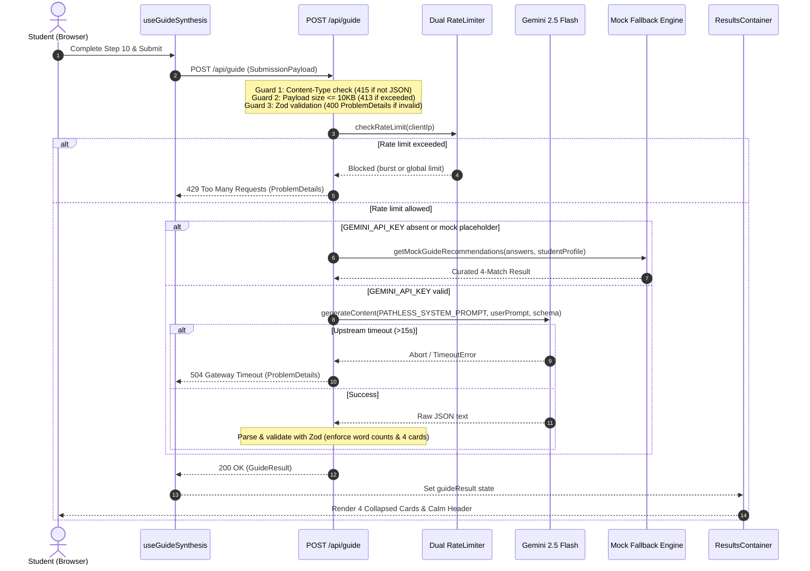

# Feature 8: Synthesis Service and Results UI Rework — Technical Contract & Specification

## 1. Executive Summary & Objective

This specification establishes the technical, architectural, behavioral, and accessibility contract for **Feature 8: Synthesis Service and Results UI Rework** of the **PathLess Framework v2** on branch `feature/8-rework-synthesis-and-results`.

Feature 8 builds directly on the foundations established in Branches 1 through 7 (most notably Feature 7's 10-question intake wizard and sanitized student profile contracts). It executes the forward modernization of the backend AI synthesis service and the client-side results presentation layer, replacing the legacy v1 PathwayAI prototype with the calm, empowering, and progressive disclosure architecture of **PathLess Guide v2**.

The legacy v1 implementation relied on an uncalibrated synthesis route (`/api/triage`), high-stress clinical terminology ("triage", "counselor", "dossier"), and a static 4-card grid that overwhelmed anxious 16–20-year-old students with immediate blocks of text.

PathLess v2 replaces this with:
1. **Intake-Grounded AI Synthesis Service (`/api/guide`)**: Migrated from `/api/triage`, accepting the complete 10-question intake payload and student profile, and prompting Gemini 2.5 Flash with structured JSON schemas to yield specific, non-cliché career concentrations.
2. **Resilient Curated Mock Fallback**: Ensures 100% demo uptime and offline development reliability when `GEMINI_API_KEY` is omitted, invalid, or rate-limited.
3. **Progressive Disclosure Results Interface (`ResultsContainer`)**: Renders 4 ranked career match cards that load in a calm, collapsed state (showing role title, broad field, and a single-sentence overview of 30 words or fewer) and expand on tap or keyboard interaction to reveal concrete daily tasks, foundational study topics of 65 words or fewer, exactly 2 free search-safe trial courses, and the "Where to Study" groundwork shell.
4. **Actionable Student Utility Controls**: Incorporates a clean **Print / Save as PDF** action (`window.print()`) with print-optimized CSS, and a **Student Self-Clearing ("Start Over")** reset flow.
5. **Absolute Purge of Forbidden Terminology**: Eradicates 100% of legacy tokens (`dossier`, `PathwayAI`, `Triage`, `Counselor`) across all routes, code symbols, filenames, and user-facing copy.

```
┌──────────────────────────────────────────────────────────────────────────────────────────────────┐
│                                   PATHLESS FRAMEWORK v2 EVOLUTION                                │
├─────────────────────────────────────────────────┬────────────────────────────────────────────────┤
│           Legacy PathwayAI (v1)                 │               PathLess Guide (v2)              │
├─────────────────────────────────────────────────┼────────────────────────────────────────────────┤
│ • Route: /api/triage                            │ • Route: /api/guide                            │
│ • Prompt: 4 basic questions, generic roles      │ • Prompt: 10-question rich intake grounding    │
│ • Client presentation: DossierContainer         │ • Client presentation: ResultsContainer        │
│ • 4 static, uncollapsed heavy cards             │ • 4-card progressive disclosure layout         │
│ • Overwhelming dense text blocks on load        │ • Collapsed overview: <= 30 words              │
│ • Unbounded course hurdle explanations          │ • Foundational study topics: <= 65 words       │
│ • No regional university groundwork shell       │ • Where to Study groundwork shell (no AI fake) │
│ • No print / PDF export action                  │ • Print / Save as PDF with @media print        │
│ • Legacy clinical terms: triage, counselor,     │ • Student self-clearing ("Start Over") button  │
│   dossier, PathwayAI                            │ • Calming terms: Guide, Pathways, Matches      │
│ • Exposed technical error details to client     │ • RFC 7807 Problem Details with zero jargon    │
└─────────────────────────────────────────────────┴────────────────────────────────────────────────┘
```

### Primary Objectives
1. **Guide Synthesis API Route Handler (`src/app/api/guide/route.ts`)**: Migrate from legacy `/api/triage` with strict RFC 7807 Problem Details error responses containing zero internal technical jargon (no raw Zod error stacks or upstream GoogleGenAI errors reflected to the client).
2. **Gemini Structured JSON Prompt & Schema Overhaul**: Redesign system and user prompt templates to ground synthesis in the 10-question intake (task preferences, curiosity subject, anxiety hesitation, work environment, problem-solving style, social battery, structure tolerance, academic friction, horizon priority, and ambition timeline). Enforce strict JSON output with word limit constraints: $\le 30$ words overview, $\le 65$ words study path.
3. **Resilient Mock Fallback**: Provide high-fidelity curated mock recommendations when `GEMINI_API_KEY` is empty, unset, or placeholder, guaranteeing seamless local testing and demonstration.
4. **Progressive Results Container (`src/components/results/ResultsContainer.tsx`)**: Replace `DossierContainer` with a responsive 4-card progressive disclosure layout where all cards initialize in a collapsed state and expand independently.
5. **Career Match Card (`src/components/results/CareerMatchCard.tsx`)**: Implement collapsed state displaying role title, broad field, match tier, alignment score, and overview ($\le 30$ words); implement expanded state revealing daily operational tasks (3–4 bullets), foundational study topics ($\le 65$ words), academic hurdle reassurance, 2 free trial courses, and the "Where to Study" shell.
6. **Where to Study Groundwork Shell (`src/components/results/WhereToStudySection.tsx`)**: Establish an empty regional university groundwork shell with an informational placeholder stating regional university pathways are coming soon, with **zero AI hallucinations of unverified university programs**.
7. **Print / Save as PDF & Student Self-Clearing**: Provide print stylesheet rules and accessible buttons with minimum $44 \times 44$ pixel touch targets.
8. **Forbidden Terminology Eradication**: Complete removal of `dossier`, `PathwayAI`, `Triage`, and `Counselor` from routes, files, interfaces, and copy.
9. **Centralized Results Copy (`src/content/guideCopy.ts`)**: Define 100% of user-facing strings at an 8th-to-12th grade reading level with zero system architecture or AI engineering jargon.

---

## 2. Scope & Boundary Clarifications

Feature 8 focuses on the backend synthesis service rework, the results presentation layer, progressive disclosure interaction, print optimization, and comprehensive testing.

```
┌──────────────────────────────────────────────────────────────────────────────────────────────────┐
│                                     FEATURE 8 BOUNDARY MAP                                       │
├──────────────────────────────────────┬───────────────────────────────────────────────────────────┤
│          IN SCOPE (Feature 8)        │               DEFERRED (Downstream Features)              │
├──────────────────────────────────────┼───────────────────────────────────────────────────────────┤
│ • Route: /api/guide handler          │ • Populating verified Thai university records into        │
│ • Overhaul Gemini system & user      │   "Where to study" (Deferred to Feature 9:                │
│   prompts grounded in 10 questions   │   feature/9-thai-university-scaffold)                     │
│ • Resilient mock fallback synthesis  │ • PostgreSQL persistence with Prisma ORM                  │
│ • ResultsContainer & ResultsHeader   │   (Deferred to Feature 10:                                │
│ • CareerMatchCard (progressive       │   feature/10-advisor-dashboard-db)                        │
│   disclosure: collapsed & expanded)  │ • Advisor search, filter, and review views                │
│ • Word count bounds (<=30 overview,  │   (Deferred to Feature 10:                                │
│   <=65 foundational study path)      │   feature/10-advisor-dashboard-db)                        │
│ • WhereToStudySection shell (zero AI │ • Global plain-language copy polishing and comprehensive  │
│   hallucinations of universities)    │   Flesch-Kincaid readability audits                       │
│ • ResultsFooter (Print/PDF & Clear)  │   (Deferred to Feature 11:                                │
│ • useGuideSynthesis client hook      │   feature/11-ux-copy-and-simplification)                  │
│ • Complete terminology purge         │                                                           │
│ • Unit & integration test suites     │                                                           │
└──────────────────────────────────────┴───────────────────────────────────────────────────────────┘
```

### Explicitly In Scope
- **Backend Guide API Route**: `src/app/api/guide/route.ts` handling POST requests with RFC 7807 responses.
- **AI Synthesis Engine & Prompts**: `src/lib/gemini.ts`, `src/lib/ai/prompts.ts`, and `src/lib/ai/mockFallback.ts` updated to ground synthesis in `IntakeAnswers` and `StudentProfile`.
- **Response Schema Definition**: `src/ai/response-schema.json` and Zod validation schemas in `src/schemas/career.schema.ts`.
- **Progressive Results Container**: `src/components/results/ResultsContainer.tsx`.
- **Career Match Card Component**: `src/components/results/CareerMatchCard.tsx` with collapsed and expanded views.
- **Where to Study Shell**: `src/components/results/WhereToStudySection.tsx` with regional data coming-soon placeholder.
- **Header & Footer Modules**: `src/components/results/ResultsHeader.tsx` and `src/components/results/ResultsFooter.tsx`.
- **Client Synthesis Hook**: `src/hooks/useGuideSynthesis.ts`.
- **Centralized Results Copy**: Expanded `RESULTS_COPY` in `src/content/guideCopy.ts`.
- **Unit & Integration Test Suites**: `tests/unit/resultsCopy.test.ts`, `tests/unit/resultsComponents.test.ts`, and `tests/integration/guideSynthesis.test.ts`.

### Explicitly Out of Scope
- **Populating Verified Thai University Records**: Integrating Thai university databases (TCAS programs, Chulalongkorn, Mahidol, CMU, KMUTT) is deferred to `feature/9-thai-university-scaffold`.
- **Database Persistence**: Storing student submissions, advisor reviews, and generated pathways in PostgreSQL via Prisma is deferred to `feature/10-advisor-dashboard-db`.
- **Advisor Dashboard**: Student listing, filtering, search, and advisor review workflows are deferred to `feature/10-advisor-dashboard-db`.
- **Global Plain-Language Polishing**: System-wide microcopy harmonization across the landing page, navigation header, and legal disclaimers is deferred to `feature/11-ux-copy-and-simplification`.

---

## 3. Forbidden Terminology Removal & Terminology Mapping Matrix

PathLess v2 strictly prohibits all clinical, emergency-triage, and proprietary legacy terms across all code artifacts:

```
┌──────────────────┬─────────────────────────────┬────────────────────────────────────────────────────────┐
│ Legacy Token     │ PathLess v2 Replacement     │ Educational & Psychological Justification              │
├──────────────────┼─────────────────────────────┼────────────────────────────────────────────────────────┤
│ PathwayAI        │ PathLess / PathLess Guide   │ Removes cold algorithmic branding; emphasizes stress-   │
│                  │                             │ free exploration without forced destinations.          │
├──────────────────┼─────────────────────────────┼────────────────────────────────────────────────────────┤
│ Triage / triage  │ Guide / Synthesis /         │ Eradicates medical emergency room sorting imagery that │
│                  │ Assessment / Recommendations│ heightens panic in anxious high schoolers.             │
├──────────────────┼─────────────────────────────┼────────────────────────────────────────────────────────┤
│ Counselor        │ Advisor / Educational Guide │ Professionalizes academic guidance while removing      │
│                  │                             │ clinical counseling stigma for self-directed students. │
├──────────────────┼─────────────────────────────┼────────────────────────────────────────────────────────┤
│ dossier / Dossier│ Results / Pathways /        │ Eliminates bureaucratic intelligence-file language.    │
│                  │ Recommendations             │ Replaces with encouraging, clear educational pathways. │
└──────────────────┴─────────────────────────────┴────────────────────────────────────────────────────────┘
```

### Verification Rule
All unit test suites (`tests/unit/resultsCopy.test.ts`, `tests/unit/resultsComponents.test.ts`) and static scanners will enforce zero occurrences of `dossier`, `PathwayAI`, `Triage`, and `Counselor` in user-facing copy, component names, exported identifiers, and API endpoints.

---

## 4. Architecture & Data Flow

The following sequence details how student intake data moves from the client session through `/api/guide`, into Gemini 2.5 Flash (or mock fallback), returns validated JSON, and populates the progressive disclosure UI:



---

## 5. Core TypeScript Contracts & Schemas

### 5.1 Career & Recommendation Contracts (`src/types/career.ts`)

```typescript
// src/types/career.ts
import { StudentProfile, IntakeAnswers } from './intake';

export type MatchTier =
  | 'Primary Direct Match'
  | 'High-Growth Pathway'
  | 'Interdisciplinary Pivot'
  | 'Moonshot Trajectory';

export interface TrialCourse {
  title: string;              // e.g., "Introduction to Cloud Systems"
  provider: string;           // e.g., "freeCodeCamp", "Coursera (Free Audit)", "Khan Academy"
  description: string;        // 1-2 plain-language sentences
  estimatedHours: number;     // 2 to 10 hours (low stakes weekend exploration)
  searchQuery?: string;       // Search query string (safe, direct topic search)
}

export interface PathwayCard {
  id: string;                 // e.g., "match_1", "match_2"
  roleTitle: string;          // Specific career title (e.g. "Cloud Security & Reliability Analyst")
  broadField: string;         // Broad academic/professional field (e.g. "Information Technology & Systems")
  matchTier: MatchTier;       // 1 of 4 designated tiers
  fitScore: number;           // Alignment percentage between 50 and 100
  overview: string;           // Exactly 1 sentence, strictly 30 words or fewer
  dailyTasks: string[];       // 3 to 4 concrete operational tasks on a typical workday
  studyPath: string;          // Foundational study topics/courses, strictly 65 words or fewer
  reassurance: string;        // Empathetic reassurance addressing student's stated friction/hesitation
  majors: string[];           // 2 to 3 related college majors
  minors?: string[];          // 1 to 2 complementary minors/specializations
  trialCourses: [TrialCourse, TrialCourse]; // Exactly 2 free search-safe trial courses
  whereToStudyReady?: boolean; // Groundwork indicator for regional university scaffold
}

export interface GuideSummary {
  studentArchetype: string;   // 3 to 5 word encouraging archetype (e.g. "Practical Systems Architect")
  narrativeSummary: string;   // 2 to 3 sentences connecting their answers to these pathways
}

export interface GuideMeta {
  engine: string;             // e.g., "gemini-2.5-flash" or "curated-mock-fallback"
  generationLatencyMs: number;// Synthesis duration in milliseconds
  fallbackUsed: boolean;      // True if mock fallback was activated
}

export interface GuideResult {
  success: boolean;
  submissionId: string;       // Unique submission ID (e.g., "sub_1728000000_abc123")
  studentProfile: StudentProfile;
  summary: GuideSummary;
  pathways: [PathwayCard, PathwayCard, PathwayCard, PathwayCard]; // Exactly 4 cards
  meta: GuideMeta;
}
```

### 5.2 API & RFC 7807 Contracts (`src/types/api.ts`)

```typescript
// src/types/api.ts
import { StudentProfile, IntakeAnswers } from './intake';
import { GuideResult } from './career';

export type ProblemErrorCode =
  | 'VALIDATION_FAILED'
  | 'PAYLOAD_TOO_LARGE'
  | 'UNSUPPORTED_MEDIA_TYPE'
  | 'RATE_LIMITED'
  | 'AI_SYNTHESIS_FAILED'
  | 'GATEWAY_TIMEOUT';

/**
 * Strict RFC 7807 Problem Details representation.
 * All client-facing error details must contain zero internal architecture jargon.
 */
export interface ProblemDetails {
  type: string;
  title: string;
  status: number;
  detail: string;             // Calm, non-technical explanation for students
  instance: string;           // Endpoint instance (e.g., "/api/guide")
  code: ProblemErrorCode;
  requestId: string;
  invalidParams?: Array<{
    name: string;
    reason: string;
  }>;
  retryAfter?: number;        // Supplied when code === 'RATE_LIMITED'
}

export interface SubmissionPayload {
  studentProfile: StudentProfile;
  intakeAnswers: IntakeAnswers;
  metadata?: {
    clientTimestamp: string;
    schemaVersion: number;
  };
}

export type GuideApiResponse = GuideResult | ProblemDetails;
```

---

## 6. Backend AI Synthesis Service Specification

### 6.1 Route Migration & Pipeline (`src/app/api/guide/route.ts`)

The route handler `src/app/api/guide/route.ts` replaces the legacy `/api/triage` route. It enforces a strict, defense-in-depth pipeline:

```
[Incoming Request]
       │
       ▼
1. Content-Type Check ──(Not application/json)──► 415 Unsupported Media Type
       │
       ▼
2. Size Check (Content-Length / rawText > 10KB) ──► 413 Payload Too Large
       │
       ▼
3. Safe JSON Parsing ──(Syntax Error)───────────► 400 Bad Request (Non-technical message)
       │
       ▼
4. Zod Schema Validation ──(Invalid Fields)──────► 400 Bad Request (Calm field guidance)
       │
       ▼
5. Rate Limiting Check ──(Limit Exceeded)────────► 429 Too Many Requests (with Retry-After)
       │
       ▼
6. API Key Check
       ├── (Key missing/placeholder) ───────────► Curated Mock Fallback (200 OK)
       │
       ▼
7. Gemini 2.5 Flash Synthesis (15s Timeout Race)
       ├── (Timeout > 15s) ─────────────────────► 504 Gateway Timeout
       ├── (Gemini 429 / Resource Exhausted) ───► 429 Too Many Requests
       ├── (Upstream Error / Malformed Output) ─► 500 AI Synthesis Failed (Sanitized)
       │
       ▼
[200 OK: Validated GuideResult Payload]
```

### 6.2 Client-Safe Problem Details Mapping Table

To satisfy the requirement of **zero technical terms in client errors**, technical internal failures must be translated into calm, student-centered explanations:

```
┌────────────────────────┬────────┬────────────────────────┬────────────────────────────────────────────────────────┐
│ Error Condition        │ Status │ RFC 7807 Title         │ Client-Safe Detail Message                             │
├────────────────────────┼────────┼────────────────────────┼────────────────────────────────────────────────────────┤
│ Content-Type != JSON   │ 415    │ Unsupported Request    │ We could not process your answers. Please ensure your  │
│                        │        │                        │ browser sends a valid request format.                  │
├────────────────────────┼────────┼────────────────────────┼────────────────────────────────────────────────────────┤
│ Payload > 10 KB        │ 413    │ Submission Too Large   │ Your answers contain more information than expected.   │
│                        │        │                        │ Please keep your written thoughts brief.               │
├────────────────────────┼────────┼────────────────────────┼────────────────────────────────────────────────────────┤
│ JSON Syntax Error      │ 400    │ Incomplete Submission  │ We could not read the answers submitted. Please try    │
│                        │        │                        │ completing the questions again.                        │
├────────────────────────┼────────┼────────────────────────┼────────────────────────────────────────────────────────┤
│ Zod Validation Failure │ 400    │ Missing Answers        │ A few questions need your attention before we can build│
│                        │        │                        │ your pathways. Please review highlighted steps.        │
├────────────────────────┼────────┼────────────────────────┼────────────────────────────────────────────────────────┤
│ Client Rate Limit (3)  │ 429    │ Please Wait a Moment   │ We are preparing your pathways. Please wait a moment   │
│                        │        │                        │ before submitting another guide request.               │
├────────────────────────┼────────┼────────────────────────┼────────────────────────────────────────────────────────┤
│ Upstream Timeout (>15s)│ 504    │ Preparing Pathways     │ Exploring career paths is taking a little longer than  │
│                        │        │ Took Too Long          │ usual. Your answers are safe; please try again.        │
├────────────────────────┼────────┼────────────────────────┼────────────────────────────────────────────────────────┤
│ Upstream AI Error      │ 500    │ Guide Service Busy     │ Our pathway guide is currently experiencing high       │
│                        │        │                        │ volume. Please try exploring again in a few moments.   │
└────────────────────────┴────────┴────────────────────────┴────────────────────────────────────────────────────────┘
```

### 6.3 Grounded Gemini Prompt Engineering

#### System Prompt (`PATHLESS_SYSTEM_PROMPT` in `src/lib/ai/prompts.ts`)
The system prompt instructs Gemini 2.5 Flash to act as an encouraging, pragmatic educational guide grounded in the PathLess philosophy:
1. **Empathetic & Calming Tone**: Validate that choosing a major is a flexible springboard, not a permanent life decision.
2. **Specific, Modern Career Concentrations**: Strict prohibition against generic umbrella titles (e.g. "Engineer", "Doctor", "Manager"). Demands specific concentrations grounded in task preferences (e.g., "Health Informatics Data Specialist", "Renewable Energy Grid Analyst", "Assistive Technology Designer").
3. **Strict Length Bounds**:
   - `overview`: Exactly 1 sentence, strictly **30 words or fewer**.
   - `studyPath`: Foundational coursework and concepts, strictly **65 words or fewer**.
4. **Concrete Daily Operational Tasks**: 3 to 4 bullet points explaining what a professional actually touches and does at 10:00 AM on a Tuesday.
5. **Direct Academic Anxiety & Friction Mitigation**: Directly address the student's stated worry in Q3 and friction in Q8 in the `reassurance` field.
6. **Zero-Cost, Search-Safe Trial Courses**: Exactly 2 free exploratory learning resources (e.g., Coursera free audit, edX, Khan Academy, freeCodeCamp) that students can try with zero financial risk.
7. **Zero University Hallucinations**: The model must **NOT** invent specific university degree program names or regional university rankings. Institutional mappings are handled deterministically downstream.
8. **Prompt Injection Boundary**: All user inputs (especially Q3 hesitation) are enclosed in `<student_thoughts>` tags and treated strictly as untrusted data.

#### Injection-Safe User Prompt Builder (`buildGuideUserPrompt`)

```typescript
export function buildGuideUserPrompt(payload: SubmissionPayload): string {
  const { studentProfile, intakeAnswers } = payload;
  const name = studentProfile.fullName.trim() || 'Student';

  return `
STUDENT PROFILE:
- Name: ${name}
- Educational Level: ${studentProfile.gradeLevel}
- Student ID: ${studentProfile.studentId || 'None provided'}

INTAKE PREFERENCES (10-QUESTION DISCOVERY):
- Q1 (Natural Tasks): ${intakeAnswers.q1TaskIds.join(', ')}
- Q2 (Curiosity Subject): ${intakeAnswers.q2SubjectId}
- Q3 (Academic Hesitation & Worry):
<student_thoughts>
${intakeAnswers.q3AcademicHesitation}
</student_thoughts>
- Q4 (Physical Work Environment): ${intakeAnswers.q4Environment}
- Q5 (Problem-Solving Instinct): ${intakeAnswers.q5ProblemSolving}
- Q6 (Social Energy & Battery): ${intakeAnswers.q6SocialEnergy}
- Q7 (Structure Comfort): ${intakeAnswers.q7StructureTolerance}
- Q8 (Academic Demand Friction): ${intakeAnswers.q8AcademicFriction}
- Q9 (Future Horizon Priority): ${intakeAnswers.q9HorizonPriority}
- Q10 (Immediate Ambition Timeline): ${intakeAnswers.q10PostCollegeAmbition}

DIRECTIVE:
Synthesize this profile into an encouraging archetype, narrative summary, and exactly 4 distinct career match cards (Primary Direct Match, High-Growth Pathway, Interdisciplinary Pivot, Moonshot Trajectory).
Enforce strict length limits:
- Each card overview must be 30 words or fewer.
- Each card studyPath must be 65 words or fewer.
- Provide exactly 2 free search-safe trial courses per card.
- Do NOT generate university names or institutional programs.
Return strictly valid JSON conforming to the schema.
`.trim();
}
```

### 6.4 Structured Response Schema (`src/ai/response-schema.json`)

```json
{
  "$schema": "https://json-schema.org/draft/2020-12/schema",
  "title": "PathLessGuideSynthesisResponse",
  "type": "object",
  "properties": {
    "summary": {
      "type": "object",
      "properties": {
        "studentArchetype": {
          "type": "string",
          "description": "An encouraging 3 to 5 word archetype capturing natural strengths."
        },
        "narrativeSummary": {
          "type": "string",
          "description": "A calm 2 to 3 sentence synthesis connecting preferences to pathways."
        }
      },
      "required": ["studentArchetype", "narrativeSummary"]
    },
    "pathways": {
      "type": "array",
      "minItems": 4,
      "maxItems": 4,
      "description": "Exactly 4 distinct career match cards conforming to the designated tiers.",
      "items": {
        "type": "object",
        "properties": {
          "id": { "type": "string" },
          "roleTitle": { "type": "string" },
          "broadField": { "type": "string" },
          "matchTier": {
            "type": "string",
            "enum": [
              "Primary Direct Match",
              "High-Growth Pathway",
              "Interdisciplinary Pivot",
              "Moonshot Trajectory"
            ]
          },
          "fitScore": {
            "type": "integer",
            "minimum": 50,
            "maximum": 100
          },
          "overview": {
            "type": "string",
            "description": "Single sentence summary of 30 words or fewer."
          },
          "dailyTasks": {
            "type": "array",
            "minItems": 3,
            "maxItems": 4,
            "items": { "type": "string" }
          },
          "studyPath": {
            "type": "string",
            "description": "Foundational study topics and courses of 65 words or fewer."
          },
          "reassurance": {
            "type": "string",
            "description": "Empathetic reassurance addressing academic hesitation and friction."
          },
          "majors": {
            "type": "array",
            "minItems": 2,
            "items": { "type": "string" }
          },
          "minors": {
            "type": "array",
            "items": { "type": "string" }
          },
          "trialCourses": {
            "type": "array",
            "minItems": 2,
            "maxItems": 2,
            "items": {
              "type": "object",
              "properties": {
                "title": { "type": "string" },
                "provider": { "type": "string" },
                "description": { "type": "string" },
                "estimatedHours": { "type": "integer" },
                "searchQuery": { "type": "string" }
              },
              "required": ["title", "provider", "description", "estimatedHours"]
            }
          }
        },
        "required": [
          "id",
          "roleTitle",
          "broadField",
          "matchTier",
          "fitScore",
          "overview",
          "dailyTasks",
          "studyPath",
          "reassurance",
          "majors",
          "trialCourses"
        ]
      }
    }
  },
  "required": ["summary", "pathways"]
}
```

---

## 7. Client Results Presentation Layer Specifications

### 7.1 Progressive Results Container (`src/components/results/ResultsContainer.tsx`)

The `ResultsContainer` coordinates the results view:
1. Renders the calm page header (`ResultsHeader`) with archetype and exploratory advisory disclaimer.
2. Manages an expansion state set: `expandedCardIds: Set<string>`.
3. Initial load invariant: **All 4 cards are collapsed by default** (`expandedCardIds.size === 0`).
4. Tapping a card trigger toggles its ID in the set, allowing students to inspect cards individually or simultaneously.
5. Renders the footer (`ResultsFooter`) with **Print / Save as PDF** and **Start Over** actions.

```
┌────────────────────────────────────────────────────────────────────────────────────────┐
│                              ResultsContainer.tsx Wireframe                            │
├────────────────────────────────────────────────────────────────────────────────────────┤
│ <header> [ResultsHeader]                                                               │
│   [Badge: Personalized Discovery]                                                      │
│   <h1> Your Recommended Pathways </h1>                                                 │
│   <p> Exploratory guide based on your natural task preferences and comfort... </p>      │
│   ┌──────────────────────────────────────────────────────────────────────────────────┐ │
│   │ 💡 Exploratory Advisory Note: These pathways are starting points for exploration │ │
│   │ not final life decisions. Share them with your school advisor or mentor.         │ │
│   └──────────────────────────────────────────────────────────────────────────────────┘ │
│   [Archetype Banner: The Practical Systems Architect • Alex Morgan]                    │
│ </header>                                                                              │
│                                                                                        │
│ <main> (Progressive 4-Card Stack / Grid)                                               │
│   ┌──────────────────────────────────────────────────────────────────────────────────┐ │
│   │ [Card 1: Collapsed] Cloud Security & Reliability Analyst        [96% Match] [ ⯆ ]│ │
│   │ Field: Information Technology & Systems • 1-Sentence Overview (<= 30 words)     │ │
│   └──────────────────────────────────────────────────────────────────────────────────┘ │
│   ┌──────────────────────────────────────────────────────────────────────────────────┐ │
│   │ [Card 2: Expanded] Health Informatics Data Specialist           [88% Match] [ ⯅ ]│ │
│   │ Field: Healthcare & Applied Computing • Overview (<= 30 words)                   │ │
│   │ ──────────────────────────────────────────────────────────────────────────────── │ │
│   │ • Daily Operational Tasks (3-4 bullets)                                          │ │
│   │ • Foundational Study Path (<= 65 words)                                          │ │
│   │ • Academic Reassurance & Navigation (mitigating hesitation/friction)             │ │
│   │ • Related Majors & Minors                                                        │ │
│   │ • 2 Zero-Cost Trial Courses (e.g., Coursera Free Audit, Khan Academy)            │ │
│   │ • [Where to Study Groundwork Shell] (Regional pathways coming soon)              │ │
│   └──────────────────────────────────────────────────────────────────────────────────┘ │
│   ┌──────────────────────────────────────────────────────────────────────────────────┐ │
│   │ [Card 3: Collapsed] Assistive Technology Coordinator            [82% Match] [ ⯆ ]│ │
│   └──────────────────────────────────────────────────────────────────────────────────┘ │
│   ┌──────────────────────────────────────────────────────────────────────────────────┐ │
│   │ [Card 4: Collapsed] Environmental Policy & Sensor Modeler       [76% Match] [ ⯆ ]│ │
│   └──────────────────────────────────────────────────────────────────────────────────┘ │
│ </main>                                                                                │
│                                                                                        │
│ <footer> [ResultsFooter]                                                               │
│   [ 🖨️ Print or Save as PDF ] (min 44x44px)        [ ⟲ Start Fresh / Clear ] (44x44px) │
│ </footer>                                                                              │
└────────────────────────────────────────────────────────────────────────────────────────┘
```

---

### 7.2 Results Header (`src/components/results/ResultsHeader.tsx`)

#### Responsibilities:
- **Strict Heading Hierarchy**: Renders the singular page `<h1>` ("Your Recommended Pathways" or personalized with student first name).
- **Exploratory Advisory Disclaimer**: A calm, prominent callout emphasizing that these recommendations are exploratory conversation starters, not rigid career prescriptions.
- **Archetype & Narrative Summary**: Visual badge displaying the 3–5 word student archetype and supportive narrative summary generated by synthesis.

---

### 7.3 Progressive Career Match Card (`src/components/results/CareerMatchCard.tsx`)

#### Collapsed State (Default on Load):
- **Semantic Button Trigger**: The entire card header or expander control is an accessible `<button>` with `aria-expanded={isExpanded}` and `aria-controls={`card-details-${card.id}`}`.
- **Role Title**: Level `<h2>` heading with plain, modern career concentration.
- **Broad Discipline**: Subtitle badge identifying the academic or industry discipline (e.g., "Digital Health & Applied Analytics").
- **Tier & Alignment Badges**: Visual indicator of match tier and fit score percentage with descriptive `aria-label`.
- **Overview Paragraph**: Single-sentence summary strictly adhering to **30 words or fewer**.

#### Expanded State (Revealed on Click/Tap):
- **Daily Operational Tasks**: 3 to 4 concrete bullet points highlighting tangible activities.
- **Foundational Study Topics**: Paragraph explaining core college study topics strictly adhering to **65 words or fewer**.
- **Supportive Academic Reassurance**: Empathetic callout reframing difficult coursework in light of student hesitations.
- **Related College Majors**: Tag chips showing connected undergraduate degrees.
- **Two Free Trial Courses**: Exactly 2 zero-cost, exploratory course suggestions with provider name, hours estimate, and search badge.
- **Where to Study Shell**: Renders the `WhereToStudySection` component.

---

### 7.4 Where to Study Groundwork Shell (`src/components/results/WhereToStudySection.tsx`)

#### Architectural Constraints:
- **Informational Placeholder**: Renders a dedicated regional study container with a badge: `Regional University Pathways Coming Soon`.
- **Zero AI Hallucinations**: Under no circumstances will this component display AI-generated university programs, unaccredited institutions, or hallucinated degree titles.
- **Preparation for Feature 9**: Structured with an extensible container ready to receive deterministic regional university mappings (such as verified Thai university TCAS programs) in `feature/9-thai-university-scaffold`.

```
┌────────────────────────────────────────────────────────────────────────────────────────┐
│                              WhereToStudySection.tsx Wireframe                         │
├────────────────────────────────────────────────────────────────────────────────────────┤
│ ┌────────────────────────────────────────────────────────────────────────────────────┐ │
│ │ 🏛️ Where to Study                                                                  │ │
│ │ [Badge: Regional Pathways Coming Soon]                                             │ │
│ │                                                                                    │ │
│ │ Verified university curriculum pathways and regional degree programs for this      │ │
│ │ career concentration are currently being reviewed by academic advisors.             │ │
│ │ Regional institutional mappings (including Thai universities) will appear here.    │ │
│ └────────────────────────────────────────────────────────────────────────────────────┘ │
└────────────────────────────────────────────────────────────────────────────────────────┘
```

---

### 7.5 Results Footer (`src/components/results/ResultsFooter.tsx`)

#### Responsibilities:
- **Print / Save as PDF Action**:
  - Triggers `window.print()`.
  - Minimum touch target: $44 \times 44$ pixels (`min-h-[44px] min-w-[44px]`).
  - Visible focus ring: `focus-visible:ring-2 focus-visible:ring-edu-interactive`.
  - Accessible label: `aria-label="Print or save career pathways as PDF"`.
- **Student Self-Clearing ("Start Over") Action**:
  - Clears student answers and profile from session state.
  - Resets state machine to Step 0.
  - Accessible confirmation dialog to prevent accidental erasure.
  - Minimum touch target: $44 \times 44$ pixels.

#### Print Stylesheet (`@media print` in CSS):
When printing or saving as PDF:
1. All 4 career cards automatically expand and force details visibility (`display: block !important`).
2. Interactive buttons (chevron expanders, Start Over, Print button) are hidden (`display: none !important`).
3. Page break rules (`break-inside: avoid; page-break-inside: avoid`) are applied to cards to prevent ugly half-card splits across pages.

---

## 8. Client Hook Specification (`src/hooks/useGuideSynthesis.ts`)

Replaces the legacy `useTriageSynthesis.ts` hook. Completely free of `dossier` and `triage` naming:

```typescript
// src/hooks/useGuideSynthesis.ts
'use client';

import { useState, useCallback, useRef, useEffect } from 'react';
import type { SubmissionPayload, GuideResult, ProblemDetails } from '@/types';

export interface UseGuideSynthesisReturn {
  isLoading: boolean;
  guideResult: GuideResult | null;
  error: ProblemDetails | Error | null;
  fetchGuide: (payload: SubmissionPayload) => Promise<void>;
  resetGuide: () => void;
}

export function useGuideSynthesis(): UseGuideSynthesisReturn {
  const [isLoading, setIsLoading] = useState(false);
  const [guideResult, setGuideResult] = useState<GuideResult | null>(null);
  const [error, setError] = useState<ProblemDetails | Error | null>(null);
  const abortControllerRef = useRef<AbortController | null>(null);

  useEffect(() => {
    return () => {
      abortControllerRef.current?.abort();
    };
  }, []);

  const fetchGuide = useCallback(async (payload: SubmissionPayload) => {
    abortControllerRef.current?.abort();
    const controller = new AbortController();
    abortControllerRef.current = controller;

    setIsLoading(true);
    setError(null);

    try {
      const response = await fetch('/api/guide', {
        method: 'POST',
        headers: { 'Content-Type': 'application/json' },
        body: JSON.stringify(payload),
        signal: controller.signal,
      });

      const data = await response.json();

      if (!response.ok) {
        setError(data as ProblemDetails);
        setIsLoading(false);
        return;
      }

      setGuideResult(data as GuideResult);
      setError(null);
    } catch (err: unknown) {
      if ((err as Error)?.name === 'AbortError') return;
      setError(err instanceof Error ? err : new Error('Failed to generate career pathways'));
    } finally {
      setIsLoading(false);
    }
  }, []);

  const resetGuide = useCallback(() => {
    abortControllerRef.current?.abort();
    setIsLoading(false);
    setGuideResult(null);
    setError(null);
  }, []);

  return {
    isLoading,
    guideResult,
    error,
    fetchGuide,
    resetGuide,
  };
}
```

---

## 9. Centralized Results Copy Specification (`src/content/guideCopy.ts`)

All user-facing copy for the results view must reside inside `src/content/guideCopy.ts` under a dedicated `results` namespace.

```typescript
// Additions to src/content/guideCopy.ts

export const RESULTS_COPY = {
  header: {
    badge: 'Personalized Exploration Pathways',
    defaultTitle: 'Your Recommended Pathways',
    personalizedTitle: (name: string) => `${name}'s Recommended Pathways`,
    subtitle:
      'These 4 career concentrations connect what you enjoy doing day-to-day with realistic college study paths. There is no single "right" choice—explore them at your own pace.',
    disclaimerTitle: 'Advisory Guide Notice',
    disclaimerBody:
      'These recommendations are starting points for conversation and discovery, not permanent life decisions. We encourage you to share and discuss these pathways with your school advisor, mentor, or trusted guide.',
    archetypeLabel: 'Your Discovery Profile',
    demoModeNotice: 'Sample pathways are shown for demonstration. Take your time exploring each option.',
  },

  card: {
    expandAriaLabel: (title: string) => `Show detailed study path and daily tasks for ${title}`,
    collapseAriaLabel: (title: string) => `Hide details for ${title}`,
    expandButtonLabel: 'View Details',
    collapseButtonLabel: 'Hide Details',
    fitScoreLabel: (score: number) => `${score}% Alignment`,
    fitScoreAria: (score: number) => `${score} percent profile alignment`,
    dailyTasksTitle: 'What You Would Do on a Typical Day',
    studyPathTitle: 'Foundational College Study Path',
    academicsTitle: 'Navigating Challenging Subjects',
    majorsTitle: 'Related College Majors',
    minorsTitle: 'Complementary Minors',
    trialCoursesTitle: 'Zero-Cost Weekend Trial Courses',
    trialCoursesSubtitle: 'Test the waters over a weekend with free courses and tutorials—no tuition required.',
  },

  tiers: {
    primary: {
      label: 'Primary Direct Match',
      tagline: 'Strongest day-to-day alignment with your preferred tasks and comfortable work environment.',
    },
    highGrowth: {
      label: 'High-Growth Pathway',
      tagline: 'High job stability and expanding career opportunities across emerging industries.',
    },
    interdisciplinary: {
      label: 'Interdisciplinary Pivot',
      tagline: 'A creative bridge linking your core interests with low exposure to subjects you dislike.',
    },
    moonshot: {
      label: 'Moonshot Trajectory',
      tagline: 'An exciting, forward-looking career that expands your horizons and future potential.',
    },
  },

  whereToStudy: {
    title: 'Where to Study',
    badge: 'Regional Pathways Coming Soon',
    description:
      'Verified college majors and regional university programs for this career concentration are being prepared by university advisors. Verified institution listings (including Thai university programs) will appear here.',
    zeroHallucinationNote: 'PathLess only lists verified institutional programs reviewed by regional advisors.',
  },

  actions: {
    printButton: 'Print or Save as PDF',
    printAriaLabel: 'Print or save these career pathways as a PDF document',
    clearButton: 'Start Over',
    clearAriaLabel: 'Clear all responses and restart the questionnaire',
    clearDialogTitle: 'Start fresh with a clean slate?',
    clearDialogBody: 'This will reset your answers and return you to the beginning of the guide.',
    confirmClear: 'Yes, start over',
    cancelClear: 'Keep my pathways',
  },

  loading: {
    title: (name?: string) =>
      name ? `Building personalized pathways for ${name}...` : 'Building your personalized pathways...',
    subtitles: [
      'Connecting your daily task preferences with modern careers...',
      'Mapping out supportive college study paths...',
      'Finding zero-cost exploratory courses...',
      'Calibrating pathways to respect your academic comfort...',
    ],
    calmNote: 'Take a slow, deep breath. Exploring your future should never feel rushed.',
  },

  error: {
    title: 'We Need a Brief Moment',
    fallbackMessage: 'Our pathway guide could not complete this request. Your answers are saved; please try again.',
    retryButton: 'Try Again',
    editAnswersButton: 'Review My Answers',
  },

  a11y: {
    resultsLandmark: 'Personalized Career and Major Pathway Recommendations',
    matchCardSection: 'Four Recommended Career Matches',
    expandedNotification: (title: string) => `${title} expanded. Showing daily tasks and study path.`,
    collapsedNotification: (title: string) => `${title} collapsed.`,
  },
} as const;
```

---

## 10. Accessibility (WCAG 2.1 AA) & Print Rules

| Criterion | Implementation Specification | Verification Method |
| :--- | :--- | :--- |
| **Semantic Button Triggers** | Every card toggle uses a native `<button>` element with `aria-expanded="true\|false"` and `aria-controls`. | Unit test inspection & screen reader verification |
| **Touch Target Dimensions** | All buttons (expand triggers, Print, Start Over, dialog controls) enforce `min-h-[44px] min-w-[44px]`. | Automated DOM element bounding box inspection |
| **Visible Focus Rings** | All interactive controls apply `focus-visible:ring-2 focus-visible:ring-edu-interactive focus-visible:outline-none`. | Keyboard navigation testing |
| **Strict Heading Hierarchy** | Single `<h1>` in `ResultsHeader`, `<h2>` for role titles in `CareerMatchCard`, `<h3>` for card sections. | Automated axe / heading hierarchy scanner |
| **Polite ARIA Live Region** | Expanding/collapsing cards or loading state cycler updates polite live regions (`aria-live="polite"`). | Unit test assertion on live region content |
| **Print & PDF Optimization** | `@media print` CSS overrides card collapse states to force full visibility and hide UI action buttons. | Print stylesheet inspection & static markup audit |

---

## 11. Verification & Testing Strategy

### 11.1 Unit Test Suite: Results Copy (`tests/unit/resultsCopy.test.ts`)
- **Structure Verification**: Asserts that `RESULTS_COPY` exists with all required namespaces (`header`, `card`, `tiers`, `whereToStudy`, `actions`, `loading`, `error`, `a11y`).
- **Forbidden Terminology Scanner**: Inspects all string values in `RESULTS_COPY`. Fails if any string contains `dossier`, `PathwayAI`, `Triage`, or `Counselor` (case-insensitive).
- **Zero AI/Technical Jargon Scanner**: Inspects all strings in `RESULTS_COPY` and error copy for forbidden technical terms (`LLM`, `model`, `prompt`, `tokens`, `schema`, `JSON`, `RFC`, `endpoint`).
- **Word Count Utility Tests**: Verifies helper functions calculating word counts for overview ($\le 30$) and study paths ($\le 65$).

### 11.2 Unit Test Suite: Results Components (`tests/unit/resultsComponents.test.ts`)
- **`ResultsHeader`**: Verifies rendering of `<h1>`, personalized student name, archetype badge, and advisory disclaimer.
- **`CareerMatchCard` (Collapsed)**: Verifies card renders collapsed by default with role title, broad field, overview ($\le 30$ words), tier badge, alignment score, and `aria-expanded="false"`.
- **`CareerMatchCard` (Expanded)**: Verifies expanded state renders daily tasks, study path ($\le 65$ words), academic reassurance, trial courses, and Where to Study shell with `aria-expanded="true"`.
- **`WhereToStudySection`**: Verifies presence of placeholder badge and advisory text, and verifies absence of hallucinated universities.
- **`ResultsFooter`**: Verifies Print and Start Over buttons meet $44 \times 44$ px target and focus ring requirements.
- **`ResultsContainer`**: Verifies that 4 cards render in the container, all initialized as collapsed.

### 11.3 Integration Test Suite: Guide Synthesis (`tests/integration/guideSynthesis.test.ts`)
- **IT-GUIDE-01 (Happy Path)**: Sends valid `SubmissionPayload` with mocked Gemini 2.5 Flash client; asserts 200 OK, 4 cards returned with matching schema, latency metadata, and `fallbackUsed: false`.
- **IT-GUIDE-02 (Media Type)**: Sends request with `Content-Type: text/plain`; asserts 415 with RFC 7807 problem details and zero technical jargon.
- **IT-GUIDE-03 (Payload Size)**: Sends $> 10$ KB payload; asserts 413 Payload Too Large.
- **IT-GUIDE-04 (Validation)**: Sends missing or invalid intake fields; asserts 400 Bad Request with calm student guidance and zero raw Zod stack traces.
- **IT-GUIDE-05 (Rate Limiting)**: Exceeds 3 requests per minute from same IP; asserts 429 Too Many Requests with `Retry-After` header.
- **IT-GUIDE-06 (Upstream Timeout)**: Simulates Gemini timeout; asserts 504 Gateway Timeout.
- **IT-GUIDE-07 (Upstream Error Sanitization)**: Simulates upstream exception leaking secrets; asserts 500 without leaking vendor API keys or stack traces.
- **IT-GUIDE-08 (Mock Fallback)**: Runs with empty `GEMINI_API_KEY`; asserts 200 OK with `fallbackUsed: true` and 4 distinct, grounded match cards.
- **IT-GUIDE-09 (Word Count Enforcement)**: Verifies that synthesized cards satisfy $\le 30$ words overview and $\le 65$ words study path.

---

## 12. Acceptance Criteria & Traceability Matrix

| ID | Criterion Statement | Implementing Components & Files | Verification Test |
| :--- | :--- | :--- | :--- |
| **AC-RESULTS-01** | Synthesis service accepts the expanded intake payload and returns 4 distinct career matches with specific sub-field concentrations grounded in task preferences, with resilient mock fallback handling when the API key is absent. | `src/app/api/guide/route.ts`, `src/lib/gemini.ts`, `src/lib/ai/prompts.ts`, `src/lib/ai/mockFallback.ts` | `tests/integration/guideSynthesis.test.ts` (IT-GUIDE-01, IT-GUIDE-08) |
| **AC-RESULTS-02** | Results view renders a calm header, exploratory advisory disclaimer, exactly 4 career match cards collapsed on initial load, a print or save as PDF button, and a clear submission button. | `src/components/results/ResultsContainer.tsx`, `src/components/results/ResultsHeader.tsx`, `src/components/results/ResultsFooter.tsx` | `tests/unit/resultsComponents.test.ts` (`describe('ResultsContainer')`) |
| **AC-RESULTS-03** | Each collapsed card displays role title, broad discipline, and an overview of 30 words or fewer, expanding upon tap or keyboard click to reveal daily tasks, study paths under 65 words, 2 free trial course suggestions, and the Where to Study shell. | `src/components/results/CareerMatchCard.tsx`, `src/schemas/career.schema.ts` | `tests/unit/resultsComponents.test.ts` (`describe('CareerMatchCard')`), `tests/integration/guideSynthesis.test.ts` (IT-GUIDE-09) |
| **AC-RESULTS-04** | The Where to Study section renders a clean container with an informational placeholder stating regional university pathways are coming soon, with zero AI hallucinations of university programs. | `src/components/results/WhereToStudySection.tsx` | `tests/unit/resultsComponents.test.ts` (`describe('WhereToStudySection')`) |
| **AC-RESULTS-05** | 100% of user-facing text resides in `src/content/guideCopy.ts` at an 8th-to-12th grade reading level, containing zero architecture or AI system terms and eliminating legacy naming. | `src/content/guideCopy.ts` | `tests/unit/resultsCopy.test.ts` (`describe('Results Copy & Terminology Purge')`) |

---

## 13. Summary of Files to Touch During Implementation

When proceeding to code implementation on branch `feature/8-rework-synthesis-and-results`, the following files will be created or updated:

1. `src/types/career.ts`: Update `PathwayCard` (with `broadField`, `overview` $\le 30$ words, `studyPath` $\le 65$ words, `trialCourses`), `GuideResult`, `GuideSummary`, `GuideMeta`.
2. `src/types/api.ts`: Update `SubmissionPayload`, `ProblemDetails`, `GuideApiResponse`, purging obsolete triage types.
3. `src/content/guideCopy.ts`: Expand with `RESULTS_COPY` covering headers, cards, where to study, print/clear actions, and loading/error states.
4. `src/app/api/guide/route.ts`: Implement new guide route handler with strict RFC 7807 non-technical error responses, rate limiting, and timeout race.
5. `src/lib/gemini.ts`: Update synthesis logic to call Gemini 2.5 Flash with `PATHLESS_SYSTEM_PROMPT` and `buildGuideUserPrompt`.
6. `src/lib/ai/prompts.ts`: Define `PATHLESS_SYSTEM_PROMPT` and `buildGuideUserPrompt` grounding all 10 intake questions.
7. `src/lib/ai/mockFallback.ts`: Implement `getMockGuideRecommendations` returning 4 distinct cards meeting length limits.
8. `src/ai/response-schema.json`: Update JSON schema to reflect `PathwayCard` structure with length constraints.
9. `src/components/results/ResultsContainer.tsx`: Implement progressive results container managing 4 collapsed cards.
10. `src/components/results/CareerMatchCard.tsx`: Implement expandable career match card with collapsed and expanded states.
11. `src/components/results/WhereToStudySection.tsx`: Implement regional university groundwork shell with placeholder badge.
12. `src/components/results/ResultsHeader.tsx`: Implement calm header with advisory disclaimer.
13. `src/components/results/ResultsFooter.tsx`: Implement print/save as PDF and student self-clearing actions.
14. `src/hooks/useGuideSynthesis.ts`: Implement client synthesis hook.
15. `tests/unit/resultsCopy.test.ts`: Implement unit test suite for centralized results copy and forbidden terminology scan.
16. `tests/unit/resultsComponents.test.ts`: Implement unit test suite for all results presentation components and a11y attributes.
17. `tests/integration/guideSynthesis.test.ts`: Implement integration test suite for `/api/guide` route handler.
