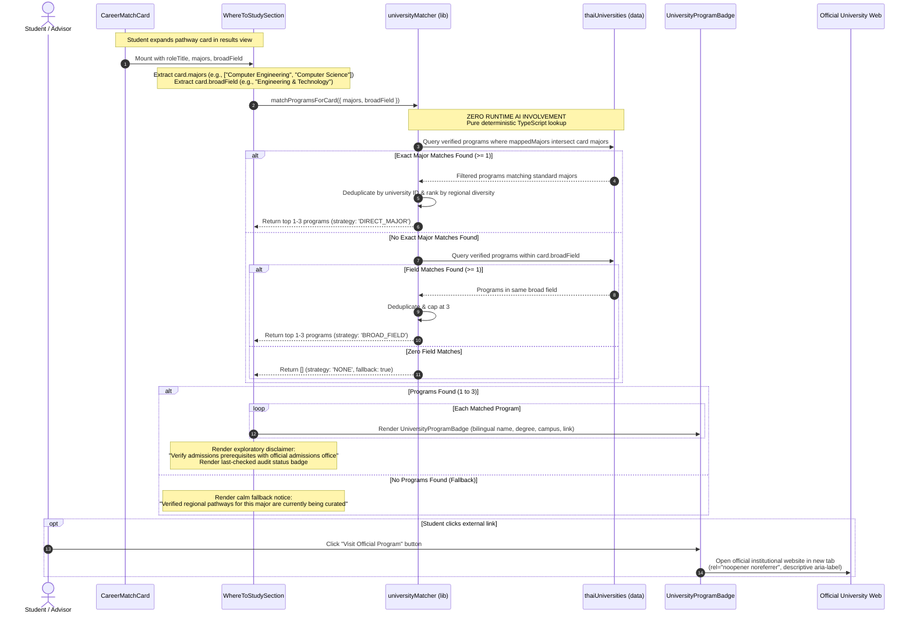

# Feature 9: Thai University Scaffold — Technical Contract & Specification

## 1. Executive Summary & Objective

This specification establishes the technical, architectural, behavioral, and accessibility contract for **Feature 9: Thai University Scaffold** of the **PathLess Framework v2** on branch `feature/9-thai-university-scaffold`.

Feature 9 transitions PathLess from preliminary career recommendations to actionable regional higher education guidance in Thailand. While Feature 14 established a locked whitelist of 48 common Thai career roles across 8 approved broad fields and eliminated anxiety-inducing percentage scores, high school learners and school advisors need trustworthy pathways linking recommended college majors to real undergraduate degree programs across Thailand.

Previously, `WhereToStudySection` rendered a placeholder shell stating that regional university pathways were "coming soon." Feature 9 implements a human-curated, static registry of 17 confirmed Thai higher education institutions (11 public/autonomous flagships and 6 private universities) and connects it deterministically to each student's recommended pathways in the results view.

### The Problem in Thai Higher Education Discovery
1. **Admission Anxiety & Commercial Distortion**: Secondary students exploring Thai universities are overwhelmed by commercial test-prep marketing, confusing TCAS criteria, private agency quotas, and commercial university rankings that trigger acute status anxiety.
2. **Generative AI Hallucinations**: Standard LLM recommendations frequently invent non-existent degree titles, hallucinate faculties, cite broken URLs, or confuse vocational tracks with standard bachelor's degrees.
3. **Regional Inequity**: Guidance counseling in Thailand often skews heavily toward central Bangkok institutions, neglecting robust regional flagships in the North, Northeast, South, and East.

### The PathLess Feature 9 Architectural Invariant
```
┌──────────────────────────────────────────────────────────────────────────────────────────────────┐
│                                FEATURE 8 PLACEHOLDER vs FEATURE 9 REGISTRY                       │
├─────────────────────────────────────────────────┬────────────────────────────────────────────────┤
│           Feature 8 (Placeholder Baseline)      │              Feature 9 (Verified Scaffold)     │
├─────────────────────────────────────────────────┼────────────────────────────────────────────────┤
│ • Static badge: "Regional Pathways Coming Soon" │ • Human-curated static registry covering       │
│ • No interactive institutional connections      │   17 confirmed Thai universities               │
│ • Generic placeholder text                      │ • 83 curated standard bachelor programs        │
│ • No regional or campus discrimination          │ • Mapped strictly to Feature 14 catalog fields │
│ • No external links to official programs        │ • Deterministic matching utility (Zero AI      │
│ • No verification status or audit timestamps    │   hallucination of programs or admissions)     │
│ • Target fields listed as raw major strings     │ • Interactive program badges with official     │
│                                                 │   external link affordances (rel=noopener)     │
│                                                 │ • Last-checked timestamps & "Needs checking"   │
│                                                 │   verification status badge                    │
│                                                 │ • Calm fallback for uncurated majors           │
│                                                 │ • 100% centralized copy in guideCopy.ts        │
└─────────────────────────────────────────────────┴────────────────────────────────────────────────┘
```

### Primary Objectives
1. **Curated Static Thai University Registry (`src/data/thaiUniversities.ts`)**: Establish a human-curated static registry covering exactly **17 confirmed institutions** (11 public/autonomous and 6 private universities) across Thailand's central, northern, northeastern, southern, and eastern regions. Provide **2 to 4 standard bachelor's programs per institution** (expanding to **5 to 8 for large comprehensive flagships**), strictly mapped to the **8 Feature 14 approved catalog fields**.
2. **Zero AI Hallucination & Strict Deterministic Matching (`src/lib/universityMatcher.ts`)**: Enforce that the Gemini AI synthesis engine **never** generates, predicts, or hallucinates university admissions criteria or program details. All institutional suggestions are determined via pure, deterministic TypeScript lookup functions matching recommended majors to the static registry.
3. **Exploratory Verification Status & Disclaimers**: Mark all initial institutional entries as `"NEEDS_CHECKING"` until verified against official university publications. Display clear disclaimers reminding students and parents to verify prerequisites, deadlines, and seat allocations directly with official university admissions offices.
4. **Strict Omission of Distortive Commercial Data**: Strictly exclude tuition fee amounts, competitive entrance quotas, national rankings, and promotional institutional marketing claims. Focus solely on curriculum discovery and official departmental links.
5. **Interactive Where to Study Panel & Badges (`WhereToStudySection.tsx`, `UniversityProgramBadge.tsx`)**: Update the expanded card UI to render up to 3 verified regional programs with bilingual institution and degree titles, faculty names, campus/region pills, last-checked notices, and safe external link affordances.
6. **Graceful Fallback State**: Provide a calm, reassuring fallback panel when a recommended major does not yet have curated institutional mappings, confirming that regional advisors are curating verified pathways.
7. **Accessibility (WCAG 2.1 AA)**: Ensure all external link triggers have explicit `rel="noopener noreferrer"`, `target="_blank"`, descriptive `aria-label`s indicating they open in a new tab, touch targets of at least $44 \times 44$ px, and high-contrast visible focus rings.

---

## 2. Scope & Boundary Clarifications

Feature 9 delivers regional higher education guidance through static curated data, deterministic matching, and an interactive presentation panel.

```
┌──────────────────────────────────────────────────────────────────────────────────────────────────┐
│                                      FEATURE 9 BOUNDARY MAP                                      │
├──────────────────────────────────────┬───────────────────────────────────────────────────────────┤
│           IN SCOPE (Feature 9)       │               DEFERRED (Downstream Features)              │
├──────────────────────────────────────┼───────────────────────────────────────────────────────────┤
│ • Human-curated static registry of   │ • Dynamic web scraping of TCAS rounds 1-4 admission       │
│   17 confirmed Thai universities     │   quotas, minimum GPAs, or real-time application portals  │
│   (src/data/thaiUniversities.ts)     │   --> Out of scope (admissions criteria change annually)  │
│ • 83 standard bachelor programs      │ • Database persistence of university bookmarks, notes,    │
│   mapped to 8 Feature 14 fields      │   or student institutional preference lists               │
│ • Bilingual university & degree data │   --> Deferred to feature/10-advisor-dashboard-db         │
│ • Strict TypeScript contracts        │ • School advisor dashboard controls for custom university  │
│   (src/types/university.ts)          │   registry additions and portal reviews                   │
│ • Deterministic matching utility     │   --> Deferred to feature/10-advisor-dashboard-db         │
│   (src/lib/universityMatcher.ts)     │ • Global readability & tone audits of landing pages       │
│ • Interactive WhereToStudySection UI │   and marketing copy                                      │
│ • UniversityProgramBadge component   │   --> Deferred to feature/11-ux-copy-and-simplification   │
│ • Verified last-checked timestamps   │                                                           │
│ • "Needs checking" audit status tags │                                                           │
│ • Zero AI hallucination guarantee    │                                                           │
│ • Calm fallback for uncurated majors │                                                           │
│ • 100% centralized copy in           │                                                           │
│   src/content/guideCopy.ts           │                                                           │
│ • Comprehensive unit test suites     │                                                           │
└──────────────────────────────────────┴───────────────────────────────────────────────────────────┘
```

### Explicitly In Scope
- **Data Contracts (`src/types/university.ts`)**: Strongly typed data models for institutions, bachelor programs, match results, regional enums, and verification statuses.
- **Static Registry (`src/data/thaiUniversities.ts`)**: Static array of 17 confirmed institutions and 83 curated undergraduate programs with bilingual naming, degree types, official links, and last-checked timestamps.
- **Matching Utility (`src/lib/universityMatcher.ts`)**: Pure deterministic lookup engine mapping card majors to verified programs without runtime LLM intervention.
- **Interactive Component (`src/components/results/WhereToStudySection.tsx`)**: Overhaul of the placeholder shell to render up to 3 verified programs or a calm fallback notice while maintaining CLS = 0.00 (`contain: content`, `min-h-[110px]`).
- **Badge Component (`src/components/results/UniversityProgramBadge.tsx`)**: Reusable, accessible program card component with bilingual titles, campus tags, and safe external link affordances.
- **Centralized Copy (`src/content/guideCopy.ts`)**: Addition of all user-facing university section strings, status labels, exploratory disclaimers, and ARIA announcements to `RESULTS_COPY.whereToStudy`.
- **Unit Test Suites**:
  - `tests/unit/thaiUniversitiesRegistry.test.ts`: Verifies registry completeness, 17 institutions, 8-field coverage, URL validity, and absence of prohibited data.
  - `tests/unit/universityMatcher.test.ts`: Verifies deterministic mapping, max 3 limit, major-to-program resolution, fallback handling, and zero LLM hallucination.

### Explicitly Out of Scope
- **Real-Time TCAS Portal Scraping**: Dynamic scraping of TCAS criteria, portfolio rules, admission test cutoffs (A-Level, TGAT, TPAT), or real-time seat numbers is explicitly out of scope. These criteria change annually and must be verified by students at the official admissions office.
- **Tuition & Cost Estimators**: PathLess intentionally omits tuition amounts, credit fees, and living costs to avoid out-of-date financial assumptions.
- **Database Persistence**: Saving student university preferences or advisor notes to PostgreSQL is deferred to `feature/10-advisor-dashboard-db`.
- **Advisor Admin Portal**: Administrative tools allowing advisors to edit the university registry are deferred to `feature/10-advisor-dashboard-db`.
- **Global Copy Tone Audits**: Readability scoring of the global application landing pages is deferred to `feature/11-ux-copy-and-simplification`.

---

## 3. Forbidden Terminology & Legacy Jargon Purge Matrix

Feature 9 enforces the PathLess zero-anxiety copy philosophy. All commercial ranking terminology, speculative admissions predictions, and internal technical jargon are strictly prohibited from components, copy dictionaries, and test assertions:

```
┌─────────────────────────────────┬─────────────────────────────┬────────────────────────────────────────────────────────┐
│ Prohibited Token / Pattern      │ Feature 9 Replacement       │ Educational & Psychological Justification              │
├─────────────────────────────────┼─────────────────────────────┼────────────────────────────────────────────────────────┤
│ University Rankings             │ Curated Regional Pathways   │ National rankings (e.g. QS, THE) trigger status        │
│ (e.g., "Top #1 University",     │ (Verified Institutional     │ competition and mislead students regarding curriculum  │
│  "Premier Institution")         │  Options)                   │ fit and regional accessibility.                        │
├─────────────────────────────────┼─────────────────────────────┼────────────────────────────────────────────────────────┤
│ Admission Chances / Predictions │ Exploratory Institutional   │ Predicting admissions odds ("90% acceptance chance")   │
│ (e.g., "Safe School",           │ Directory                   │ creates false security and ignores variable annual     │
│  "High-Risk Reach")             │                             │ TCAS candidate distributions.                          │
├─────────────────────────────────┼─────────────────────────────┼────────────────────────────────────────────────────────┤
│ TCAS Round Quota Speculation    │ Official Admissions Office  │ TCAS criteria (GPAX weights, portfolio requirements)   │
│ (e.g., "TCAS 3 Quota: 45 seats")│ Consultation Reminder       │ shift yearly; students must consult primary sources.   │
├─────────────────────────────────┼─────────────────────────────┼────────────────────────────────────────────────────────┤
│ Tuition / Financial Claims      │ Direct Institutional Link   │ Tuition schedules vary by student status and year;     │
│ (e.g., "THB 45,000 / semester") │ for Current Fee Schedules   │ static fee numbers risk misleading families.           │
├─────────────────────────────────┼─────────────────────────────┼────────────────────────────────────────────────────────┤
│ AI-Generated Universities       │ Human-Curated Static        │ Generative LLMs hallucinate programs and dead links;   │
│ (e.g., "AI Recommended School") │ Educational Registry        │ university connections must be 100% human-verified.   │
├─────────────────────────────────┼─────────────────────────────┼────────────────────────────────────────────────────────┤
│ Counselor / Triage / Dossier    │ Advisor / Mentor / Guide    │ Preserves the global Feature 8/14 jargon purge.        │
└─────────────────────────────────┴─────────────────────────────┴────────────────────────────────────────────────────────┘
```

---

## 4. Architecture & Defensive Data Flow

The following sequence illustrates how career recommendation cards query the static Thai university registry deterministically without AI involvement, rendering verified institutional options directly inside `WhereToStudySection`:



### Architectural Guarantees
1. **Zero Runtime AI Calls**: The Gemini API is never called when populating `WhereToStudySection`. The matching logic is purely deterministic and executes synchronously in sub-millisecond time.
2. **Cumulative Layout Shift (CLS = 0.00)**: `WhereToStudySection` retains `contain: content` and `min-h-[110px]`. It mounts with a stable bounding box regardless of whether programs or fallback notices are displayed.
3. **External Link Sandboxing**: Every institutional outbound anchor tag strictly enforces `target="_blank"` and `rel="noopener noreferrer"`.
4. **Touch Target Accessibility**: All clickable badges and outbound link buttons maintain bounding boxes $\ge 44 \times 44$ px with high-contrast visible focus indicators.

---

## 5. Module 1: Thai University Static Registry (`src/data/thaiUniversities.ts`)

### 5.1 The 17 Confirmed Higher Education Institutions

The static registry establishes an immutable catalog of 17 leading Thai universities covering all geographic regions of Thailand:

```
====================================================================================================
PUBLIC / AUTONOMOUS UNIVERSITIES (11 Flagships)
====================================================================================================
1. Chulalongkorn University (จุฬาลงกรณ์มหาวิทยาลัย)
   - Abbreviation: CU (จุฬาฯ)
   - Region: Central (Bangkok) • Campus: Pathum Wan, Bangkok
   - Website: https://www.chula.ac.th

2. Kasetsart University (มหาวิทยาลัยเกษตรศาสตร์)
   - Abbreviation: KU (มก.)
   - Region: Central (Bangkok) • Campus: Bangkhen, Bangkok
   - Website: https://www.ku.ac.th

3. Thammasat University (มหาวิทยาลัยธรรมศาสตร์)
   - Abbreviation: TU (มธ.)
   - Region: Central (Bangkok/Pathum Thani) • Campus: Rangsit & Tha Prachan
   - Website: https://www.tu.ac.th

4. King Mongkut's University of Technology Thonburi (มหาวิทยาลัยเทคโนโลยีพระจอมเกล้าธนบุรี)
   - Abbreviation: KMUTT (มจธ. / บางมด)
   - Region: Central (Bangkok) • Campus: Thonburi, Bangkok
   - Website: https://www.kmutt.ac.th

5. Mahidol University (มหาวิทยาลัยมหิดล)
   - Abbreviation: MU (มม.)
   - Region: Central (Nakhon Pathom/Bangkok) • Campus: Salaya, Nakhon Pathom
   - Website: https://mahidol.ac.th

6. Srinakharinwirot University (มหาวิทยาลัยศรีนครินทรวิโรฒ)
   - Abbreviation: SWU (มศว)
   - Region: Central (Bangkok/Nakhon Nayok) • Campus: Prasarnmit, Bangkok & Ongkharak
   - Website: https://www.swu.ac.th

7. Silpakorn University (มหาวิทยาลัยศิลปากร)
   - Abbreviation: SU (มศก.)
   - Region: Central / Western • Campus: Wang Tha Phra, Bangkok & Sanam Chandra, Nakhon Pathom
   - Website: https://www.su.ac.th

8. Chiang Mai University (มหาวิทยาลัยเชียงใหม่)
   - Abbreviation: CMU (มช.)
   - Region: Northern • Campus: Su Thep, Chiang Mai
   - Website: https://www.cmu.ac.th

9. Khon Kaen University (มหาวิทยาลัยขอนแก่น)
   - Abbreviation: KKU (มข.)
   - Region: Northeastern • Campus: Nai Mueang, Khon Kaen
   - Website: https://www.kku.ac.th

10. Prince of Songkla University (มหาวิทยาลัยสงขลานครินทร์)
    - Abbreviation: PSU (ม.อ.)
    - Region: Southern • Campus: Hat Yai, Songkhla & Pattani
    - Website: https://www.psu.ac.th

11. Burapha University (มหาวิทยาลัยบูรพา)
    - Abbreviation: BUU (มบ.)
    - Region: Eastern • Campus: Saen Suk, Chonburi (Bangsaen)
    - Website: https://www.buu.ac.th

====================================================================================================
PRIVATE UNIVERSITIES (6 Institutions)
====================================================================================================
12. Bangkok University (มหาวิทยาลัยกรุงเทพ)
    - Abbreviation: BU (มกท.)
    - Region: Central • Campus: Rangsit, Pathum Thani
    - Website: https://www.bu.ac.th

13. Assumption University (มหาวิทยาลัยอัสสัมชัญ)
    - Abbreviation: AU / ABAC (เอแบค)
    - Region: Central • Campus: Suvarnabhumi, Samut Prakan & Hua Mak, Bangkok
    - Website: https://www.au.edu

14. Rangsit University (มหาวิทยาลัยรังสิต)
    - Abbreviation: RSU (มรัง.)
    - Region: Central • Campus: Lak Hok, Pathum Thani
    - Website: https://www.rsu.ac.th

15. University of the Thai Chamber of Commerce (มหาวิทยาลัยหอการค้าไทย)
    - Abbreviation: UTCC (มกค.)
    - Region: Central • Campus: Din Daeng, Bangkok
    - Website: https://www.utcc.ac.th

16. Sripatum University (มหาวิทยาลัยศรีปทุม)
    - Abbreviation: SPU (มศป.)
    - Region: Central • Campus: Bangkhen, Bangkok
    - Website: https://www.spu.ac.th

17. Stamford International University (มหาวิทยาลัยนานาชาติแสตมฟอร์ด)
    - Abbreviation: STIU
    - Region: Central • Campus: Rama IX, Bangkok & Cha-Am
    - Website: https://www.stamford.edu
====================================================================================================
```

### 5.2 Curated Standard Bachelor's Programs (83 Programs Across 8 Fields)

Each program entry defines bilingual titles, degree nomenclature, faculty affiliations, mapped standard majors from `CAREER_CATALOG`, official web links, and initial `"NEEDS_CHECKING"` audit status:

#### 1. Chulalongkorn University (7 Programs)
| ID | Degree & Program (En / Th) | Faculty (En / Th) | Field | Mapped Majors | Official Program URL |
| :--- | :--- | :--- | :--- | :--- | :--- |
| `cu-eng-comp` | B.Eng. in Computer Engineering<br>วิศวกรรมศาสตรบัณฑิต สาขาวิชาวิศวกรรมคอมพิวเตอร์ | Faculty of Engineering<br>คณะวิศวกรรมศาสตร์ | Engineering & Technology | Computer Engineering, Software Engineering | `https://www.cp.eng.chula.ac.th/` |
| `cu-sci-cs` | B.Sc. in Computer Science<br>วิทยาศาสตรบัณฑิต สาขาวิชาวิทยาการคอมพิวเตอร์ | Faculty of Science<br>คณะวิทยาศาสตร์ | Engineering & Technology | Computer Science, Data Science and Analytics | `https://www.math.sc.chula.ac.th/cs/` |
| `cu-med-pubhealth` | B.P.H. in Public Health<br>สาธารณสุขศาสตรบัณฑิต | College of Public Health Sciences<br>วิทยาลัยวิทยาศาสตร์สาธารณสุข | Healthcare & Life Sciences | Public Health, Community Health | `https://www.cphs.chula.ac.th/` |
| `cu-bba-mkt` | B.B.A. in Marketing<br>บริหารธุรกิจบัณฑิต สาขาวิชาการตลาด | Chulalongkorn Business School<br>คณะพาณิชยศาสตร์และการบัญชี | Business & Economics | Marketing, Business Administration | `https://www.cbs.chula.ac.th/` |
| `cu-comm-arts` | B.A. in Communication Arts<br>นิเทศศาสตรบัณฑิต | Faculty of Communication Arts<br>คณะนิเทศศาสตร์ | Communication & Humanities | Communication Arts / Mass Communication, Public Relations | `https://www.commarts.chula.ac.th/` |
| `cu-law-llb` | LL.B. in Law<br>นิติศาสตรบัณฑิต | Faculty of Law<br>คณะนิติศาสตร์ | Social Sciences & Law | Law (LL.B.) | `https://www.law.chula.ac.th/` |
| `cu-art-viscom` | B.F.A. in Visual Communication Design<br>ศิลปกรรมศาสตรบัณฑิต สาขาวิชาการออกแบบเรขศิลป์ | Faculty of Fine and Applied Arts<br>คณะศิลปกรรมศาสตร์ | Design & Creative Arts | Visual Communication Design, Fine and Applied Arts | `https://www.faa.chula.ac.th/` |

#### 2. Kasetsart University (7 Programs)
| ID | Degree & Program (En / Th) | Faculty (En / Th) | Field | Mapped Majors | Official Program URL |
| :--- | :--- | :--- | :--- | :--- | :--- |
| `ku-agr-tech` | B.Sc. in Agricultural Science and Technology<br>วิทยาศาสตรบัณฑิต สาขาวิชาวิทยาศาสตร์เกษตร | Faculty of Agriculture<br>คณะเกษตร | Environmental & Agricultural Sciences | Agricultural Science and Technology, Smart Agriculture and Precision Farming | `https://www.agr.ku.ac.th/` |
| `ku-agr-econ` | B.Sc. in Agribusiness and Agricultural Economics<br>วิทยาศาสตรบัณฑิต สาขาวิชาเศรษฐศาสตร์การเกษตร | Faculty of Economics<br>คณะเศรษฐศาสตร์ | Environmental & Agricultural Sciences | Agribusiness and Agricultural Economics, Economics | `https://www.eco.ku.ac.th/` |
| `ku-eng-se` | B.Eng. in Software and Knowledge Engineering<br>วิศวกรรมศาสตรบัณฑิต สาขาวิชาวิศวกรรมซอฟต์แวร์และความรู้ | Faculty of Engineering<br>คณะวิศวกรรมศาสตร์ | Engineering & Technology | Software Engineering, Computer Engineering | `https://www.eng.ku.ac.th/` |
| `ku-for-mgmt` | B.Sc. in Forestry<br>วิทยาศาสตรบัณฑิต สาขาวิชาวนศาสตร์ | Faculty of Forestry<br>คณะวนศาสตร์ | Environmental & Agricultural Sciences | Forestry and Natural Resources | `https://www.forest.ku.ac.th/` |
| `ku-bus-logistics` | B.B.A. in Logistics and Supply Chain Management<br>บริหารธุรกิจบัณฑิต สาขาวิชาการจัดการโลจิสติกส์ | Faculty of Business Administration<br>คณะบริหารธุรกิจ | Business & Economics | Logistics and Supply Chain Management, Business Administration | `https://www.bus.ku.ac.th/` |
| `ku-agro-food` | B.Sc. in Food Science and Technology<br>วิทยาศาสตรบัณฑิต สาขาวิชาวิทยาศาสตร์และเทคโนโลยีการอาหาร | Faculty of Agro-Industry<br>คณะอุตสาหกรรมเกษตร | Healthcare & Life Sciences | Food Science and Nutrition | `https://www.agro.ku.ac.th/` |
| `ku-hum-tourism` | B.A. in Tourism Management<br>ศิลปศาสตรบัณฑิต สาขาวิชาการจัดการการท่องเที่ยว | Faculty of Humanities<br>คณะมนุษยศาสตร์ | Hospitality & Tourism | Tourism Management, Hospitality and Hotel Management | `https://human.ku.ac.th/` |

#### 3. Thammasat University (7 Programs)
| ID | Degree & Program (En / Th) | Faculty (En / Th) | Field | Mapped Majors | Official Program URL |
| :--- | :--- | :--- | :--- | :--- | :--- |
| `tu-law-llb` | LL.B. in Law<br>นิติศาสตรบัณฑิต | Faculty of Law<br>คณะนิติศาสตร์ | Social Sciences & Law | Law (LL.B.) | `https://www.law.tu.ac.th/` |
| `tu-pol-ir` | B.A. in Political Science and International Relations<br>รัฐศาสตรบัณฑิต สาขาวิชาการเมืองและการระหว่างประเทศ | Faculty of Political Science<br>คณะรัฐศาสตร์ | Social Sciences & Law | Political Science and International Relations, Public Administration | `https://www.polsci.tu.ac.th/` |
| `tu-tbs-fin` | B.B.A. in Finance and Banking<br>บริหารธุรกิจบัณฑิต สาขาวิชาการเงิน | Thammasat Business School<br>คณะพาณิชยศาสตร์และการบัญชี | Business & Economics | Finance and Banking, Accounting | `https://www.tbs.tu.ac.th/` |
| `tu-eng-se` | B.Eng. in Software Engineering<br>วิศวกรรมศาสตรบัณฑิต สาขาวิชาวิศวกรรมซอฟต์แวร์ | Faculty of Engineering (TSE)<br>คณะวิศวกรรมศาสตร์ | Engineering & Technology | Software Engineering, Computer Engineering | `https://engr.tu.ac.th/` |
| `tu-jc-masscomm` | B.A. in Journalism and Mass Communication<br>วารสารศาสตรบัณฑิต | Faculty of Journalism and Mass Communication<br>คณะวารสารศาสตร์และสื่อสารมวลชน | Communication & Humanities | Communication Arts / Mass Communication, Digital Media and Interactive Arts | `https://www.jc.tu.ac.th/` |
| `tu-pubhealth-comm` | B.P.H. in Community Health<br>สาธารณสุขศาสตรบัณฑิต สาขาวิชาการสร้างเสริมสุขภาพชุมชน | Faculty of Public Health<br>คณะสาธารณสุขศาสตร์ | Healthcare & Life Sciences | Public Health, Community Health | `https://fph.tu.ac.th/` |
| `tu-soc-admin` | B.S.W. in Social Work<br>สังคมสงเคราะห์ศาสตรบัณฑิต | Faculty of Social Administration<br>คณะสังคมสงเคราะห์ศาสตร์ | Social Sciences & Law | Social Work, Sociology and Anthropology | `https://www.socadmin.tu.ac.th/` |

#### 4. King Mongkut's University of Technology Thonburi (KMUTT) (5 Programs)
| ID | Degree & Program (En / Th) | Faculty (En / Th) | Field | Mapped Majors | Official Program URL |
| :--- | :--- | :--- | :--- | :--- | :--- |
| `kmutt-eng-cpe` | B.Eng. in Computer Engineering<br>วิศวกรรมศาสตรบัณฑิต สาขาวิชาวิศวกรรมคอมพิวเตอร์ | Faculty of Engineering<br>คณะวิศวกรรมศาสตร์ | Engineering & Technology | Computer Engineering, Network Systems | `https://cpe.kmutt.ac.th/` |
| `kmutt-sit-it` | B.Sc. in Information Technology<br>วิทยาศาสตรบัณฑิต สาขาวิชาเทคโนโลยีสารสนเทศ | School of Information Technology (SIT)<br>คณะเทคโนโลยีสารสนเทศ | Engineering & Technology | Information Technology, Software Engineering | `https://www.sit.kmutt.ac.th/` |
| `kmutt-sit-ds` | B.Sc. in Data Science and Analytics<br>วิทยาศาสตรบัณฑิต สาขาวิชาวิทยาการข้อมูลและการวิเคราะห์ | School of Information Technology (SIT)<br>คณะเทคโนโลยีสารสนเทศ | Engineering & Technology | Data Science and Analytics, Applied Statistics | `https://www.sit.kmutt.ac.th/` |
| `kmutt-soad-id` | B.Arch. in Industrial Design<br>สถาปัตยกรรมศาสตรบัณฑิต สาขาวิชาการออกแบบอุตสาหกรรม | School of Architecture and Design (SoA+D)<br>คณะสถาปัตยกรรมศาสตร์และการออกแบบ | Design & Creative Arts | Industrial Design, Visual Communication Design | `https://soad.kmutt.ac.th/` |
| `kmutt-energy-clean` | B.Sc. in Renewable Energy and Clean Technology<br>วิทยาศาสตรบัณฑิต สาขาวิชาเทคโนโลยีพลังงานและการจัดการ | School of Energy, Environment and Materials<br>คณะพลังงานสิ่งแวดล้อมและวัสดุ | Environmental & Agricultural Sciences | Renewable Energy and Clean Technology, Environmental Science | `https://www.jgsee.kmutt.ac.th/` |

#### 5. Mahidol University (6 Programs)
| ID | Degree & Program (En / Th) | Faculty (En / Th) | Field | Mapped Majors | Official Program URL |
| :--- | :--- | :--- | :--- | :--- | :--- |
| `mu-med-medtech` | B.Sc. in Medical Technology<br>วิทยาศาสตรบัณฑิต สาขาวิชาเทคนิคการแพทย์ | Faculty of Medical Technology<br>คณะเทคนิคการแพทย์ | Healthcare & Life Sciences | Medical Technology, Biomedical Science | `https://mt.mahidol.ac.th/` |
| `mu-pubhealth-gen` | B.P.H. in Public Health<br>สาธารณสุขศาสตรบัณฑิต | Faculty of Public Health<br>คณะสาธารณสุขศาสตร์ | Healthcare & Life Sciences | Public Health, Health Education | `https://ph.mahidol.ac.th/` |
| `mu-pt-physio` | B.Sc. in Physical Therapy<br>วิทยาศาสตรบัณฑิต สาขาวิชากายภาพบำบัด | Faculty of Physical Therapy<br>คณะกายภาพบำบัด | Healthcare & Life Sciences | Physical Therapy | `https://pt.mahidol.ac.th/` |
| `mu-ict-ict` | B.Sc. in Information and Communication Technology<br>วิทยาศาสตรบัณฑิต สาขาวิชาเทคโนโลยีสารสนเทศและการสื่อสาร | Faculty of ICT<br>คณะเทคโนโลยีสารสนเทศและการสื่อสาร | Engineering & Technology | Information Technology, Computer Science | `https://www.ict.mahidol.ac.th/` |
| `mu-muic-hosp` | B.A. in Hospitality Management<br>ศิลปศาสตรบัณฑิต สาขาวิชาการจัดการบริการนานาชาติ | Mahidol University International College<br>วิทยาลัยนานาชาติ | Hospitality & Tourism | Hospitality and Hotel Management, Tourism Management | `https://muic.mahidol.ac.th/` |
| `mu-env-science` | B.Sc. in Environmental Science and Technology<br>วิทยาศาสตรบัณฑิต สาขาวิชาวิทยาศาสตร์สิ่งแวดล้อม | Faculty of Environment and Resource Studies<br>คณะสิ่งแวดล้อมและทรัพยากรศาสตร์ | Environmental & Agricultural Sciences | Environmental Science, Renewable Energy and Clean Technology | `https://en.mahidol.ac.th/` |

#### 6. Srinakharinwirot University (SWU) (4 Programs)
| ID | Degree & Program (En / Th) | Faculty (En / Th) | Field | Mapped Majors | Official Program URL |
| :--- | :--- | :--- | :--- | :--- | :--- |
| `swu-hum-eng` | B.A. in English for Communication<br>ศิลปศาสตรบัณฑิต สาขาวิชาภาษาอังกฤษเพื่อการสื่อสาร | Faculty of Humanities<br>คณะมนุษยศาสตร์ | Communication & Humanities | English for Communication, Translation and Interpretation | `https://hu.swu.ac.th/` |
| `swu-pe-pubhealth` | B.Sc. in Public Health and Health Education<br>วิทยาศาสตรบัณฑิต สาขาวิชาสาธารณสุขศาสตร์ | Faculty of Physical Education<br>คณะพลศึกษา | Healthcare & Life Sciences | Public Health, Health Education | `https://pe.swu.ac.th/` |
| `swu-art-viscom` | B.F.A. in Visual Arts and Design<br>ศิลปกรรมศาสตรบัณฑิต สาขาวิชาทัศนศิลป์และการออกแบบ | Faculty of Fine Arts<br>คณะศิลปกรรมศาสตร์ | Design & Creative Arts | Visual Communication Design, Fine and Applied Arts | `https://fofa.swu.ac.th/` |
| `swu-bus-mkt` | B.B.A. in Marketing<br>บริหารธุรกิจบัณฑิต สาขาวิชาการตลาด | Faculty of Business Administration for Society<br>คณะบริหารธุรกิจเพื่อสังคม | Business & Economics | Marketing, Business Administration | `https://bas.swu.ac.th/` |

#### 7. Silpakorn University (4 Programs)
| ID | Degree & Program (En / Th) | Faculty (En / Th) | Field | Mapped Majors | Official Program URL |
| :--- | :--- | :--- | :--- | :--- | :--- |
| `su-dec-viscom` | B.F.A. in Visual Communication Design<br>ศิลปบัณฑิต สาขาวิชาการออกแบบนิเทศศิลป์ | Faculty of Decorative Arts<br>คณะมัณฑนศิลป์ | Design & Creative Arts | Visual Communication Design, Digital Media and Interactive Arts | `https://www.decorate.su.ac.th/` |
| `su-ict-digital` | B.A. in Digital Media and Interactive Arts<br>ศิลปศาสตรบัณฑิต สาขาวิชาเทคโนโลยีดิจิทัลเพื่อการออกแบบ | Faculty of ICT<br>คณะเทคโนโลยีสารสนเทศและการสื่อสาร | Design & Creative Arts | Digital Media and Interactive Arts, Animation and Multimedia | `https://www.ict.su.ac.th/` |
| `su-arts-lang` | B.A. in Languages and Linguistics<br>อักษรศาสตรบัณฑิต สาขาวิชาภาษาอังกฤษและภาษาศาสตร์ | Faculty of Arts (อักษรศาสตร์)<br>คณะอักษรศาสตร์ | Communication & Humanities | Language and Linguistics, English for Communication | `https://www.arts.su.ac.th/` |
| `su-sci-stat` | B.Sc. in Applied Statistics and Data Science<br>วิทยาศาสตรบัณฑิต สาขาวิชาสถิติและวิทยาการข้อมูล | Faculty of Science<br>คณะวิทยาศาสตร์ | Engineering & Technology | Applied Statistics, Data Science and Analytics | `https://www.sc.su.ac.th/` |

#### 8. Chiang Mai University (CMU) (6 Programs)
| ID | Degree & Program (En / Th) | Faculty (En / Th) | Field | Mapped Majors | Official Program URL |
| :--- | :--- | :--- | :--- | :--- | :--- |
| `cmu-eng-comp` | B.Eng. in Computer Engineering<br>วิศวกรรมศาสตรบัณฑิต สาขาวิชาวิศวกรรมคอมพิวเตอร์ | Faculty of Engineering<br>คณะวิศวกรรมศาสตร์ | Engineering & Technology | Computer Engineering, Software Engineering | `https://cpe.eng.cmu.ac.th/` |
| `cmu-agr-smart` | B.Sc. in Smart Agriculture and Precision Farming<br>วิทยาศาสตรบัณฑิต สาขาวิชานวัตกรรมเกษตรอัจฉริยะ | Faculty of Agriculture<br>คณะเกษตรศาสตร์ | Environmental & Agricultural Sciences | Smart Agriculture and Precision Farming, Agricultural Science and Technology | `https://web.agri.cmu.ac.th/` |
| `cmu-ph-comm` | B.P.H. in Community Public Health<br>สาธารณสุขศาสตรบัณฑิต | Faculty of Public Health<br>คณะสาธารณสุขศาสตร์ | Healthcare & Life Sciences | Public Health, Community Health | `https://phcmu.ac.th/` |
| `cmu-hum-tourism` | B.A. in Tourism Management<br>ศิลปศาสตรบัณฑิต สาขาวิชาการจัดการการท่องเที่ยว | Faculty of Humanities<br>คณะมนุษยศาสตร์ | Hospitality & Tourism | Tourism Management, Cultural Heritage Tourism | `https://www.human.cmu.ac.th/` |
| `cmu-ba-mgmt` | B.B.A. in Business Administration<br>บริหารธุรกิจบัณฑิต สาขาวิชาการจัดการ | Faculty of Business Administration<br>คณะบริหารธุรกิจ | Business & Economics | Business Administration, Marketing | `https://www.ba.cmu.ac.th/` |
| `cmu-mc-masscomm` | B.A. in Mass Communication<br>การสื่อสารมวลชนบัณฑิต | Faculty of Mass Communication<br>คณะการสื่อสารมวลชน | Communication & Humanities | Communication Arts / Mass Communication, Public Relations | `https://www.masscomm.cmu.ac.th/` |

#### 9. Khon Kaen University (KKU) (5 Programs)
| ID | Degree & Program (En / Th) | Faculty (En / Th) | Field | Mapped Majors | Official Program URL |
| :--- | :--- | :--- | :--- | :--- | :--- |
| `kku-comp-cs` | B.Sc. in Computer Science and Computing<br>วิทยาศาสตรบัณฑิต สาขาวิชาวิทยาการคอมพิวเตอร์ | College of Computing<br>วิทยาลัยการคอมพิวเตอร์ | Engineering & Technology | Computer Science, Information Technology | `https://computing.kku.ac.th/` |
| `kku-agr-agrisci` | B.Sc. in Agricultural Science and Technology<br>วิทยาศาสตรบัณฑิต สาขาวิชาเกษตรศาสตร์ | Faculty of Agriculture<br>คณะเกษตรศาสตร์ | Environmental & Agricultural Sciences | Agricultural Science and Technology, Smart Agriculture and Precision Farming | `https://ag.kku.ac.th/` |
| `kku-ph-pubhealth` | B.P.H. in Public Health<br>สาธารณสุขศาสตรบัณฑิต | Faculty of Public Health<br>คณะสาธารณสุขศาสตร์ | Healthcare & Life Sciences | Public Health, Community Health | `https://ph.kku.ac.th/` |
| `kku-ba-mkt` | B.B.A. in Marketing and Logistics<br>บริหารธุรกิจบัณฑิต สาขาวิชาการตลาด | Faculty of Business Administration<br>คณะบริหารธุรกิจและการบัญชี | Business & Economics | Marketing, Logistics and Supply Chain Management | `https://kkubs.kku.ac.th/` |
| `kku-law-llb` | LL.B. in Law<br>นิติศาสตรบัณฑิต | Faculty of Law<br>คณะนิติศาสตร์ | Social Sciences & Law | Law (LL.B.) | `https://law.kku.ac.th/` |

#### 10. Prince of Songkla University (PSU) (5 Programs)
| ID | Degree & Program (En / Th) | Faculty (En / Th) | Field | Mapped Majors | Official Program URL |
| :--- | :--- | :--- | :--- | :--- | :--- |
| `psu-eng-comp` | B.Eng. in Computer Engineering<br>วิศวกรรมศาสตรบัณฑิต สาขาวิชาวิศวกรรมคอมพิวเตอร์ | Faculty of Engineering (Hat Yai)<br>คณะวิศวกรรมศาสตร์ | Engineering & Technology | Computer Engineering, Software Engineering | `https://www.eng.psu.ac.th/` |
| `psu-fht-hosp` | B.A. in Hospitality and Hotel Management<br>ศิลปศาสตรบัณฑิต สาขาวิชาการจัดการการบริการ | Faculty of Hospitality and Tourism (Phuket)<br>คณะการบริการและการท่องเที่ยว | Hospitality & Tourism | Hospitality and Hotel Management, Tourism Management | `https://www.fht.psu.ac.th/` |
| `psu-med-medtech` | B.Sc. in Medical Technology<br>วิทยาศาสตรบัณฑิต สาขาวิชาเทคนิคการแพทย์ | Faculty of Medical Technology (Hat Yai)<br>คณะเทคนิคการแพทย์ | Healthcare & Life Sciences | Medical Technology, Biomedical Science | `https://medtech.psu.ac.th/` |
| `psu-nat-agri` | B.Sc. in Agriculture and Natural Resources<br>วิทยาศาสตรบัณฑิต สาขาวิชาเกษตรศาสตร์ | Faculty of Natural Resources (Hat Yai)<br>คณะทรัพยากรธรรมชาติ | Environmental & Agricultural Sciences | Agricultural Science and Technology, Forestry and Natural Resources | `https://natres.psu.ac.th/` |
| `psu-mgmt-ba` | B.B.A. in Business Administration<br>บริหารธุรกิจบัณฑิต สาขาวิชาการจัดการธุรกิจ | Faculty of Management Sciences (Hat Yai)<br>คณะวิทยาการจัดการ | Business & Economics | Business Administration, Marketing | `https://www.fms.psu.ac.th/` |

#### 11. Burapha University (4 Programs)
| ID | Degree & Program (En / Th) | Faculty (En / Th) | Field | Mapped Majors | Official Program URL |
| :--- | :--- | :--- | :--- | :--- | :--- |
| `buu-mgmt-hosp` | B.A. in Hospitality and Hotel Management<br>ศิลปศาสตรบัณฑิต สาขาวิชาการจัดการโรงแรม | Faculty of Management and Tourism<br>คณะการจัดการและการท่องเที่ยว | Hospitality & Tourism | Hospitality and Hotel Management, Tourism Management | `https://bbs.buu.ac.th/` |
| `buu-inf-it` | B.Sc. in Information Technology<br>วิทยาศาสตรบัณฑิต สาขาวิชาเทคโนโลยีสารสนเทศ | Faculty of Informatics<br>คณะวิทยาการสารสนเทศ | Engineering & Technology | Information Technology, Software Engineering | `https://www.informatics.buu.ac.th/` |
| `buu-ph-pubhealth` | B.P.H. in Public Health<br>สาธารณสุขศาสตรบัณฑิต | Faculty of Public Health<br>คณะสาธารณสุขศาสตร์ | Healthcare & Life Sciences | Public Health, Community Health | `https://ph.buu.ac.th/` |
| `buu-log-mgmt` | B.B.A. in Logistics and Supply Chain Management<br>บริหารธุรกิจบัณฑิต สาขาวิชาการจัดการโลจิสติกส์ | Faculty of Logistics<br>คณะโลจิสติกส์ | Business & Economics | Logistics and Supply Chain Management, Business Administration | `https://logistics.buu.ac.th/` |

#### 12. Bangkok University (BU) (4 Programs)
| ID | Degree & Program (En / Th) | Faculty (En / Th) | Field | Mapped Majors | Official Program URL |
| :--- | :--- | :--- | :--- | :--- | :--- |
| `bu-ca-broadcasting` | B.A. in Communication Arts (Broadcasting & Streaming)<br>นิเทศศาสตรบัณฑิต สาขาวิชาวิทยุกระจายเสียงและสตรีมมิ่ง | School of Communication Arts<br>คณะนิเทศศาสตร์ | Communication & Humanities | Communication Arts / Mass Communication, Public Relations | `https://www.bu.ac.th/th/communicationarts` |
| `bu-dm-animation` | B.F.A. in Digital Media and Animation<br>ศิลปกรรมศาสตรบัณฑิต สาขาวิชาแอนิเมชันและวิชวลเอฟเฟกต์ | School of Digital Media and Cinematic Arts<br>คณะดิจิทัลมีเดียและศิลปะภาพยนตร์ | Design & Creative Arts | Animation and Multimedia, Digital Media and Interactive Arts | `https://www.bu.ac.th/th/digitalmedia` |
| `bu-bus-mkt` | B.B.A. in Marketing and Entrepreneurship<br>บริหารธุรกิจบัณฑิต สาขาวิชาการตลาด | School of Business Administration<br>คณะบริหารธุรกิจ | Business & Economics | Marketing, Business Administration | `https://www.bu.ac.th/th/business` |
| `bu-it-cs` | B.Sc. in Computer Science and Innovation<br>วิทยาศาสตรบัณฑิต สาขาวิชาวิทยาการคอมพิวเตอร์ | School of Information Technology and Innovation<br>คณะเทคโนโลยีสารสนเทศและนวัตกรรม | Engineering & Technology | Computer Science, Software Engineering | `https://www.bu.ac.th/th/it` |

#### 13. Assumption University (ABAC) (4 Programs)
| ID | Degree & Program (En / Th) | Faculty (En / Th) | Field | Mapped Majors | Official Program URL |
| :--- | :--- | :--- | :--- | :--- | :--- |
| `abac-msme-mkt` | B.B.A. in Marketing<br>บริหารธุรกิจบัณฑิต สาขาวิชาการตลาด | Martin de Tours School of Management and Economics<br>คณะบริหารธุรกิจและเศรษฐศาสตร์ | Business & Economics | Marketing, Business Administration | `https://www.msme.au.edu/` |
| `abac-vmes-cs` | B.Sc. in Computer Science<br>วิทยาศาสตรบัณฑิต สาขาวิชาวิทยาการคอมพิวเตอร์ | Vincent Mary School of Science and Technology<br>คณะวิทยาศาสตร์และเทคโนโลยี | Engineering & Technology | Computer Science, Software Engineering | `https://www.vmes.au.edu/` |
| `abac-arts-eng` | B.A. in Business English<br>ศิลปศาสตรบัณฑิต สาขาวิชาภาษาอังกฤษธุรกิจ | Theodore Maria School of Arts<br>คณะศิลปศาสตร์ | Communication & Humanities | English for Communication, Translation and Interpretation | `https://www.arts.au.edu/` |
| `abac-msme-htm` | B.B.A. in Hospitality and Tourism Management<br>บริหารธุรกิจบัณฑิต สาขาวิชาการจัดการบริการและการท่องเที่ยว | Martin de Tours School of Management and Economics<br>คณะบริหารธุรกิจและเศรษฐศาสตร์ | Hospitality & Tourism | Hospitality and Hotel Management, Tourism Management | `https://www.msme.au.edu/` |

#### 14. Rangsit University (RSU) (4 Programs)
| ID | Degree & Program (En / Th) | Faculty (En / Th) | Field | Mapped Majors | Official Program URL |
| :--- | :--- | :--- | :--- | :--- | :--- |
| `rsu-des-viscom` | B.F.A. in Visual Communication Design<br>ศิลปบัณฑิต สาขาวิชาการออกแบบนิเทศศิลป์ | College of Design<br>วิทยาลัยการออกแบบ | Design & Creative Arts | Visual Communication Design, Fine and Applied Arts | `https://design.rsu.ac.th/` |
| `rsu-mt-medtech` | B.Sc. in Medical Technology<br>วิทยาศาสตรบัณฑิต สาขาวิชาเทคนิคการแพทย์ | Faculty of Medical Technology<br>คณะเทคนิคการแพทย์ | Healthcare & Life Sciences | Medical Technology, Biomedical Science | `https://mt.rsu.ac.th/` |
| `rsu-ict-it` | B.Sc. in Information Technology<br>วิทยาศาสตรบัณฑิต สาขาวิชาเทคโนโลยีสารสนเทศ | College of Information and Communication Technology<br>วิทยาลัยนวัตกรรมดิจิทัลเทคโนโลยี | Engineering & Technology | Information Technology, Software Engineering | `https://ict.rsu.ac.th/` |
| `rsu-ca-comm` | B.A. in Communication Arts<br>นิเทศศาสตรบัณฑิต สาขาวิชาการสื่อสารการตลาดดิจิทัล | College of Communication Arts<br>วิทยาลัยนิเทศศาสตร์ | Communication & Humanities | Communication Arts / Mass Communication, Public Relations | `https://ca.rsu.ac.th/` |

#### 15. University of the Thai Chamber of Commerce (UTCC) (4 Programs)
| ID | Degree & Program (En / Th) | Faculty (En / Th) | Field | Mapped Majors | Official Program URL |
| :--- | :--- | :--- | :--- | :--- | :--- |
| `utcc-bus-logistics` | B.B.A. in Logistics and Supply Chain Management<br>บริหารธุรกิจบัณฑิต สาขาวิชาการจัดการโลจิสติกส์ | School of Business<br>คณะบริหารธุรกิจ | Business & Economics | Logistics and Supply Chain Management, Business Administration | `https://business.utcc.ac.th/` |
| `utcc-eco-econ` | B.Econ. in Economics<br>เศรษฐศาสตรบัณฑิต | School of Economics<br>คณะเศรษฐศาสตร์ | Business & Economics | Economics, Finance and Banking | `https://economics.utcc.ac.th/` |
| `utcc-tour-events` | B.A. in Tourism and Event Management<br>ศิลปศาสตรบัณฑิต สาขาวิชาการจัดการการท่องเที่ยวและอีเวนต์ | School of Tourism and Services<br>คณะการท่องเที่ยวและอุตสาหกรรมบริการ | Hospitality & Tourism | Convention and Event Management, Tourism Management | `https://tourism.utcc.ac.th/` |
| `utcc-sci-cs` | B.Sc. in Computer Science and Digital Innovation<br>วิทยาศาสตรบัณฑิต สาขาวิชาวิทยาการคอมพิวเตอร์ | School of Science and Technology<br>คณะวิทยาศาสตร์และเทคโนโลยี | Engineering & Technology | Computer Science, Data Science and Analytics | `https://science.utcc.ac.th/` |

#### 16. Sripatum University (SPU) (4 Programs)
| ID | Degree & Program (En / Th) | Faculty (En / Th) | Field | Mapped Majors | Official Program URL |
| :--- | :--- | :--- | :--- | :--- | :--- |
| `spu-dm-interactive` | B.F.A. in Digital Media and Interactive Design<br>ศิลปกรรมศาสตรบัณฑิต สาขาวิชาดิจิทัลมีเดีย | School of Digital Media<br>คณะดิจิทัลมีเดีย | Design & Creative Arts | Digital Media and Interactive Arts, Animation and Multimedia | `https://www.spu.ac.th/fac/sdm/` |
| `spu-it-network` | B.Sc. in Information Technology and Network Systems<br>วิทยาศาสตรบัณฑิต สาขาวิชาเทคโนโลยีสารสนเทศ | School of Information Technology<br>คณะเทคโนโลยีสารสนเทศ | Engineering & Technology | Information Technology, Network Systems | `https://www.spu.ac.th/fac/informatics/` |
| `spu-tour-hotel` | B.A. in Hospitality and Hotel Management<br>ศิลปศาสตรบัณฑิต สาขาวิชาการจัดการโรงแรมและมาตรฐานบริการ | College of Tourism and Hospitality<br>วิทยาลัยการท่องเที่ยวและการบริการ | Hospitality & Tourism | Hospitality and Hotel Management, Tourism Management | `https://www.spu.ac.th/fac/tourism/` |
| `spu-bus-mkt` | B.B.A. in Digital Marketing<br>บริหารธุรกิจบัณฑิต สาขาวิชาการตลาดดิจิทัล | School of Business Administration<br>คณะบริหารธุรกิจ | Business & Economics | Marketing, Business Administration | `https://www.spu.ac.th/fac/business/` |

#### 17. Stamford International University (3 Programs)
| ID | Degree & Program (En / Th) | Faculty (En / Th) | Field | Mapped Majors | Official Program URL |
| :--- | :--- | :--- | :--- | :--- | :--- |
| `stamford-bus-ibm` | B.B.A. in International Business Management<br>บริหารธุรกิจบัณฑิต สาขาวิชาการจัดการธุรกิจระหว่างประเทศ | Faculty of Business and Technology<br>คณะบริหารธุรกิจและเทคโนโลยี | Business & Economics | Business Administration, Marketing | `https://www.stamford.edu/program/international-business-management/` |
| `stamford-tour-hotel` | B.B.A. in International Hotel Management<br>บริหารธุรกิจบัณฑิต สาขาวิชาการจัดการโรงแรมนานาชาติ | Faculty of Business and Technology<br>คณะบริหารธุรกิจและเทคโนโลยี | Hospitality & Tourism | Hospitality and Hotel Management, Tourism Management | `https://www.stamford.edu/program/international-hotel-management/` |
| `stamford-tech-it` | B.Sc. in Information Technology<br>วิทยาศาสตรบัณฑิต สาขาวิชาเทคโนโลยีสารสนเทศ | Faculty of Business and Technology<br>คณะบริหารธุรกิจและเทคโนโลยี | Engineering & Technology | Information Technology, Software Engineering | `https://www.stamford.edu/program/information-technology/` |

---

## 6. Module 2: University TypeScript Data Types & Contracts (`src/types/university.ts`)

```typescript
/**
 * PathLess: College Major and Career Discovery Guide v2
 * Regional Higher Education & Thai University Registry Contracts
 * Feature 9: Thai University Scaffold
 */

import { ApprovedField } from '@/data/careerCatalog';

export type ThaiRegion = 'Central' | 'Northern' | 'Northeastern' | 'Southern' | 'Eastern';

export type InstitutionType = 'PUBLIC_AUTONOMOUS' | 'PRIVATE';

export type VerificationStatus = 'NEEDS_CHECKING' | 'VERIFIED' | 'UNDER_REVIEW';

export interface ThaiUniversity {
  id: string; // Unique slug identifier (e.g., 'chulalongkorn', 'kmutt')
  nameEn: string; // English official university name
  nameTh: string; // Thai official university name
  abbreviationEn: string; // English abbreviation (e.g., 'CU', 'KMUTT', 'ABAC')
  abbreviationTh: string; // Thai abbreviation (e.g., 'จุฬาฯ', 'มจธ.', 'เอแบค')
  type: InstitutionType; // Public/Autonomous or Private
  region: ThaiRegion; // Geographical macro-region
  campus: string; // Primary campus location (e.g., 'Pathum Wan, Bangkok', 'Salaya, Nakhon Pathom')
  province: string; // Province location
  officialWebsiteUrl: string; // Official HTTPS university root portal
}

export interface UniversityProgram {
  id: string; // Unique program slug (e.g., 'cu-eng-comp')
  universityId: string; // Foreign key matching ThaiUniversity.id
  nameEn: string; // English degree program name
  nameTh: string; // Thai degree program name
  facultyEn: string; // English faculty or school name
  facultyTh: string; // Thai faculty or school name
  degreeType: string; // Degree nomenclature abbreviation (e.g., 'B.Eng.', 'B.Sc.', 'B.B.A.', 'LL.B.')
  degreeTypeTh: string; // Thai MHESI degree abbreviation (e.g., 'วศ.บ.', 'วท.บ.', 'บธ.บ.', 'น.บ.')
  field: ApprovedField; // One of the 8 Feature 14 Approved Fields
  mappedMajors: string[]; // Whitelisted standard majors from CAREER_CATALOG
  officialWebsiteUrl: string; // Direct link to faculty/curriculum page (HTTPS only)
  verificationStatus: VerificationStatus; // Audit status ('NEEDS_CHECKING' by default)
  lastChecked: string; // ISO 8601 audit timestamp ('YYYY-MM-DD')
}

export interface UniversityProgramCardData {
  programId: string;
  universityId: string;
  universityNameEn: string;
  universityNameTh: string;
  universityAbbreviation: string;
  institutionType: InstitutionType;
  region: ThaiRegion;
  campus: string;
  programNameEn: string;
  programNameTh: string;
  facultyEn: string;
  facultyTh: string;
  degreeType: string;
  degreeTypeTh: string;
  field: ApprovedField;
  mappedMajors: string[];
  officialWebsiteUrl: string;
  verificationStatus: VerificationStatus;
  lastChecked: string;
}

export type MatchingStrategy = 'DIRECT_MAJOR' | 'BROAD_FIELD' | 'NONE';

export interface UniversityMatchResult {
  matchedPrograms: UniversityProgramCardData[]; // Up to 3 verified regional programs
  strategy: MatchingStrategy; // Strategy utilized for the match
  targetMajors: string[]; // Majors evaluated
  targetField?: ApprovedField | string; // Broad field evaluated
  fallbackNoticeRequired: boolean; // True when matchedPrograms is empty
}
```

---

## 7. Module 3: Thai Program Matching Utility (`src/lib/universityMatcher.ts`)

The matching utility provides pure, side-effect-free deterministic resolution linking recommended majors to verified institutional options:

```typescript
/**
 * PathLess: Pure Deterministic University Program Matcher
 * Maps career card majors to verified Thai university programs without AI generation.
 * Feature 9: Thai University Scaffold
 */

import { ApprovedField } from '@/data/careerCatalog';
import { THAI_UNIVERSITIES, THAI_UNIVERSITY_PROGRAMS } from '@/data/thaiUniversities';
import {
  ThaiUniversity,
  UniversityProgram,
  UniversityProgramCardData,
  UniversityMatchResult,
} from '@/types/university';

export function getUniversityById(id: string): ThaiUniversity | undefined {
  return THAI_UNIVERSITIES.find((u) => u.id === id);
}

export function buildProgramCardData(program: UniversityProgram): UniversityProgramCardData | null {
  const university = getUniversityById(program.universityId);
  if (!university) return null;

  return {
    programId: program.id,
    universityId: university.id,
    universityNameEn: university.nameEn,
    universityNameTh: university.nameTh,
    universityAbbreviation: university.abbreviationEn,
    institutionType: university.type,
    region: university.region,
    campus: university.campus,
    programNameEn: program.nameEn,
    programNameTh: program.nameTh,
    facultyEn: program.facultyEn,
    facultyTh: program.facultyTh,
    degreeType: program.degreeType,
    field: program.field,
    mappedMajors: program.mappedMajors,
    officialWebsiteUrl: program.officialWebsiteUrl,
    verificationStatus: program.verificationStatus,
    lastChecked: program.lastChecked,
  };
}

export function findProgramsByMajor(majorName: string): UniversityProgram[] {
  const normalized = majorName.trim().toLowerCase();
  return THAI_UNIVERSITY_PROGRAMS.filter((p) =>
    p.mappedMajors.some((m) => m.toLowerCase() === normalized)
  );
}

export function findProgramsByField(field: ApprovedField): UniversityProgram[] {
  return THAI_UNIVERSITY_PROGRAMS.filter((p) => p.field === field);
}

/**
 * Match up to 3 verified regional programs for a pathway card.
 * Priority:
 * 1. Direct major matches across all card majors.
 * 2. If fewer than 3, backfill with programs matching the broad field.
 * 3. Enforce regional and institutional diversity (no duplicate universities).
 * 4. Return clean fallback state if 0 matches exist.
 */
export function matchProgramsForCard(card: {
  majors?: string[];
  broadField?: ApprovedField | string;
}): UniversityMatchResult {
  const targetMajors = card.majors || [];
  const broadField = card.broadField as ApprovedField | undefined;

  const candidatePrograms: UniversityProgram[] = [];
  const seenUniversities = new Set<string>();

  // Pass 1: Direct major matching
  for (const major of targetMajors) {
    const directMatches = findProgramsByMajor(major);
    for (const prog of directMatches) {
      if (!seenUniversities.has(prog.universityId)) {
        seenUniversities.add(prog.universityId);
        candidatePrograms.push(prog);
      }
      if (candidatePrograms.length >= 3) break;
    }
    if (candidatePrograms.length >= 3) break;
  }

  if (candidatePrograms.length > 0) {
    const matchedCards = candidatePrograms
      .slice(0, 3)
      .map(buildProgramCardData)
      .filter((c): c is UniversityProgramCardData => c !== null);

    return {
      matchedPrograms: matchedCards,
      strategy: 'DIRECT_MAJOR',
      targetMajors,
      targetField: broadField,
      fallbackNoticeRequired: false,
    };
  }

  // Pass 2: Broad field matching if no direct major matched
  if (broadField) {
    const fieldMatches = findProgramsByField(broadField);
    for (const prog of fieldMatches) {
      if (!seenUniversities.has(prog.universityId)) {
        seenUniversities.add(prog.universityId);
        candidatePrograms.push(prog);
      }
      if (candidatePrograms.length >= 3) break;
    }

    if (candidatePrograms.length > 0) {
      const matchedCards = candidatePrograms
        .slice(0, 3)
        .map(buildProgramCardData)
        .filter((c): c is UniversityProgramCardData => c !== null);

      return {
        matchedPrograms: matchedCards,
        strategy: 'BROAD_FIELD',
        targetMajors,
        targetField: broadField,
        fallbackNoticeRequired: false,
      };
    }
  }

  // Pass 3: Clean fallback state
  return {
    matchedPrograms: [],
    strategy: 'NONE',
    targetMajors,
    targetField: broadField,
    fallbackNoticeRequired: true,
  };
}
```

---

## 8. Module 4: Where to Study Interactive Panel & Badge Components

### 8.1 Interactive Panel (`src/components/results/WhereToStudySection.tsx`)

`WhereToStudySection` replaces the Feature 8 placeholder shell. It is isolated with `React.memo`, `contain: content`, and `min-h-[110px]` to maintain CLS = 0.00:

```tsx
'use client';

import React, { memo, useMemo } from 'react';
import { RESULTS_COPY } from '@/content/guideCopy';
import { matchProgramsForCard } from '@/lib/universityMatcher';
import { UniversityProgramBadge } from './UniversityProgramBadge';
import { ApprovedField } from '@/data/careerCatalog';

export interface WhereToStudySectionProps {
  roleTitle?: string;
  majors?: string[];
  broadField?: ApprovedField | string;
}

export const WhereToStudySection = memo(function WhereToStudySection({
  roleTitle,
  majors = [],
  broadField,
}: WhereToStudySectionProps) {
  const copy = RESULTS_COPY.whereToStudy;

  // Pure deterministic matching
  const matchResult = useMemo(
    () => matchProgramsForCard({ majors, broadField }),
    [majors, broadField]
  );

  const { matchedPrograms, fallbackNoticeRequired } = matchResult;

  return (
    <section
      aria-label={`${roleTitle ? `${roleTitle} - ` : ''}${copy.title}`}
      className="min-h-[110px] rounded-xl border border-slate-200 bg-slate-50/80 p-4 sm:p-5 transition-colors space-y-3.5"
      style={{ contain: 'content' }}
    >
      {/* Header Row */}
      <div className="flex flex-wrap items-center justify-between gap-2">
        <h4 className="text-sm font-bold text-slate-900 tracking-tight flex items-center gap-1.5">
          <svg
            className="w-4 h-4 text-edu-primary flex-shrink-0"
            fill="none"
            viewBox="0 0 24 24"
            stroke="currentColor"
            strokeWidth={2}
            aria-hidden="true"
          >
            <path
              strokeLinecap="round"
              strokeLinejoin="round"
              d="M19 21V5a2 2 0 00-2-2H7a2 2 0 00-2 2v16m14 0h2m-2 0h-5m-9 0H3m2 0h5M9 7h1m-1 4h1m4-4h1m-1 4h1m-5 10v-5a1 1 0 011-1h2a1 1 0 011 1v5m-4 0h4"
            />
          </svg>
          <span>{copy.title}</span>
        </h4>

        <span className="inline-flex items-center gap-1 rounded-full bg-emerald-50 px-2.5 py-0.5 text-xs font-semibold text-emerald-800 border border-emerald-200">
          <span className="h-1.5 w-1.5 rounded-full bg-emerald-500" aria-hidden="true" />
          {copy.verifiedRegistryBadge}
        </span>
      </div>

      {/* Explanatory Context */}
      <p className="text-xs leading-relaxed text-slate-600">
        {copy.description}
      </p>

      {/* Verified Programs Grid or Calm Fallback */}
      {!fallbackNoticeRequired && matchedPrograms.length > 0 ? (
        <div className="space-y-3">
          <div className="grid grid-cols-1 gap-2.5">
            {matchedPrograms.map((program) => (
              <UniversityProgramBadge key={program.programId} program={program} />
            ))}
          </div>

          {/* Official Admissions Office Disclaimer */}
          <div className="rounded-lg border border-amber-200/70 bg-amber-50/60 p-3 text-xs text-amber-900 leading-relaxed">
            <strong className="font-semibold block mb-0.5">{copy.admissionsNoticeTitle}:</strong>
            <span>{copy.admissionsNoticeBody}</span>
          </div>
        </div>
      ) : (
        /* Calm Fallback State */
        <div className="rounded-lg border border-slate-200 bg-white p-3.5 space-y-1.5 text-xs text-slate-600">
          <div className="flex items-center gap-1.5 font-semibold text-slate-800">
            <svg
              className="w-4 h-4 text-sky-600 flex-shrink-0"
              fill="none"
              viewBox="0 0 24 24"
              stroke="currentColor"
              strokeWidth={2}
              aria-hidden="true"
            >
              <path strokeLinecap="round" strokeLinejoin="round" d="M13 16h-1v-4h-1m1-4h.01M21 12a9 9 0 11-18 0 9 9 0 0118 0z" />
            </svg>
            <span>{copy.fallbackTitle}</span>
          </div>
          <p className="leading-relaxed">
            {copy.fallbackDescription(majors[0] || 'this field')}
          </p>
        </div>
      )}

      {/* Zero AI Hallucination & Advisor Guarantee Footer */}
      <div className="flex items-center gap-1.5 text-[11px] text-slate-500 font-medium pt-2 border-t border-slate-200/80">
        <svg
          className="w-3.5 h-3.5 text-emerald-600 flex-shrink-0"
          fill="none"
          viewBox="0 0 24 24"
          stroke="currentColor"
          strokeWidth={2}
          aria-hidden="true"
        >
          <path strokeLinecap="round" strokeLinejoin="round" d="M5 13l4 4L19 7" />
        </svg>
        <span>{copy.zeroHallucinationNote}</span>
      </div>
    </section>
  );
});
```

### 8.2 Reusable Program Card Badge (`src/components/results/UniversityProgramBadge.tsx`)

```tsx
'use client';

import React, { memo } from 'react';
import { RESULTS_COPY } from '@/content/guideCopy';
import { UniversityProgramCardData } from '@/types/university';

export interface UniversityProgramBadgeProps {
  program: UniversityProgramCardData;
}

export const UniversityProgramBadge = memo(function UniversityProgramBadge({
  program,
}: UniversityProgramBadgeProps) {
  const copy = RESULTS_COPY.whereToStudy;

  const isPublic = program.institutionType === 'PUBLIC_AUTONOMOUS';
  const typeLabel = isPublic ? copy.publicAutonomousLabel : copy.privateLabel;
  const statusLabel =
    program.verificationStatus === 'NEEDS_CHECKING'
      ? copy.needsCheckingBadge
      : copy.verifiedBadge;

  const externalAriaLabel = copy.openProgramLinkAria(
    program.programNameEn,
    program.universityNameEn
  );

  return (
    <article
      data-testid={`university-program-${program.programId}`}
      className="rounded-xl border border-slate-200 bg-white p-3.5 transition-all hover:border-slate-300 hover:shadow-2xs space-y-2.5"
    >
      {/* Top Meta Line: Institution, Badges, Region */}
      <div className="flex flex-wrap items-center justify-between gap-1.5">
        <div className="flex flex-wrap items-center gap-1.5">
          <span className="font-bold text-xs text-slate-900">
            {program.universityNameEn}
          </span>
          <span className="text-[11px] text-slate-500 font-medium">
            ({program.universityNameTh})
          </span>
        </div>

        <div className="flex items-center gap-1.5">
          <span
            className={`inline-flex items-center rounded-md px-2 py-0.5 text-[10px] font-semibold border ${
              isPublic
                ? 'bg-slate-100 text-slate-700 border-slate-200'
                : 'bg-indigo-50 text-indigo-700 border-indigo-200/60'
            }`}
          >
            {typeLabel}
          </span>

          <span className="inline-flex items-center rounded-md bg-amber-50 px-2 py-0.5 text-[10px] font-medium text-amber-800 border border-amber-200">
            {statusLabel}
          </span>
        </div>
      </div>

      {/* Program Name & Faculty */}
      <div>
        <h5 className="text-xs sm:text-sm font-bold text-slate-900 leading-snug">
          <span className="text-edu-primary font-semibold mr-1">[{program.degreeType}]</span>
          {program.programNameEn}
        </h5>
        <p className="text-[11px] text-slate-600 mt-0.5">
          {program.programNameTh} • {program.facultyEn} ({program.facultyTh})
        </p>
      </div>

      {/* Footer: Campus, Last Checked, and External Link Touch Target */}
      <div className="flex flex-wrap items-center justify-between gap-2 pt-2 border-t border-slate-100 text-[11px] text-slate-500">
        <div className="flex items-center gap-2">
          <span>📍 {program.campus} ({program.region})</span>
          <span className="text-slate-300 hidden sm:inline">•</span>
          <span className="hidden sm:inline">{copy.lastCheckedLabel}: {program.lastChecked}</span>
        </div>

        {/* 44x44px Minimum Touch Target Anchor */}
        <a
          href={program.officialWebsiteUrl}
          target="_blank"
          rel="noopener noreferrer"
          aria-label={externalAriaLabel}
          className="min-h-[44px] min-w-[44px] inline-flex items-center justify-center gap-1.5 px-3 py-1.5 rounded-lg text-xs font-semibold text-edu-primary bg-sky-50 hover:bg-sky-100 border border-sky-200/80 transition-colors focus-visible:ring-2 focus-visible:ring-edu-primary focus-visible:ring-offset-2 focus-visible:outline-none"
        >
          <span>{copy.visitOfficialProgramCta}</span>
          <svg
            className="w-3.5 h-3.5 flex-shrink-0"
            fill="none"
            viewBox="0 0 24 24"
            stroke="currentColor"
            strokeWidth={2}
            aria-hidden="true"
          >
            <path
              strokeLinecap="round"
              strokeLinejoin="round"
              d="M10 6H6a2 2 0 00-2 2v10a2 2 0 002 2h10a2 2 0 002-2v-4M14 4h6m0 0v6m0-6L10 14"
            />
          </svg>
        </a>
      </div>
    </article>
  );
});
```

---

## 9. Module 5: Centralized University Section Copy (`src/content/guideCopy.ts`)

All user-facing text resides in `src/content/guideCopy.ts` under `RESULTS_COPY.whereToStudy`. Absolute zero jargon, zero marketing exaggeration, and zero technical terms:

```typescript
// Addition to RESULTS_COPY in src/content/guideCopy.ts

export const RESULTS_COPY = {
  // ... existing sections (header, badges, milestones, printHeader, card, tiers)

  whereToStudy: {
    title: 'Where to Study in Thailand',
    verifiedRegistryBadge: 'Verified Institution Directory',
    needsCheckingBadge: 'Needs Checking',
    verifiedBadge: 'Verified Entry',
    description:
      'Explore standard undergraduate degree programs at verified universities across Thailand. Pathways are human-curated to help you and your advisor discover genuine academic environments.',
    publicAutonomousLabel: 'Public / Autonomous',
    privateLabel: 'Private University',
    lastCheckedLabel: 'Last checked',
    visitOfficialProgramCta: 'Visit official department page',
    openProgramLinkAria: (program: string, university: string) =>
      `Visit official ${program} program page at ${university} (opens in new tab)`,
    admissionsNoticeTitle: 'Official Admissions Advisory',
    admissionsNoticeBody:
      'Admission requirements, portfolio guidelines, and annual seat allocations are determined independently by each university and change each academic cycle. We strongly encourage you to consult the official university admissions office and discuss requirements with your school advisor.',
    fallbackTitle: 'Curating Pathways for This Major',
    fallbackDescription: (major: string) =>
      `Verified institutional degree mappings for ${major} are currently being audited by regional advisors. We recommend exploring general university catalog listings or discussing options with your mentor.`,
    zeroHallucinationNote:
      'Zero AI-generated university programs. Every institutional option is verified against official faculty registries.',
  },

  // ... remaining sections (actions, loading, error, a11y)
} as const;
```

---

## 10. Accessibility (WCAG 2.1 AA) Rules

| Criterion | Implementation Specification | Verification Method |
| :--- | :--- | :--- |
| **External Link Sandboxing** | Outbound program links must include `target="_blank"` and `rel="noopener noreferrer"`. | Unit test & DOM attribute inspection |
| **Descriptive External ARIA Labels** | External link anchors must include an `aria-label` stating program title, university name, and "(opens in new tab)". | Accessibility tree assertion in `universityMatcher.test.ts` |
| **Touch Target Size** | All clickable program links must have a minimum bounding box of $44 \times 44$ px (`min-h-[44px] min-w-[44px]`). | Element dimension verification |
| **Visible Keyboard Focus Rings** | All interactive anchor tags must feature high-contrast visible focus rings (`focus-visible:ring-2 focus-visible:ring-edu-primary focus-visible:ring-offset-2`). | Tab navigation manual audit & CSS rule validation |
| **Color Contrast Ratios** | All text meets WCAG AA standards: $\ge 4.5:1$ for regular text, $\ge 3:1$ for UI pill backgrounds and borders. | Chrome DevTools contrast audit |
| **Layout Shift Stability (CLS = 0.00)** | `WhereToStudySection` enforces `contain: content` and `min-h-[110px]` to eliminate layout shifts on card expansion. | Lighthouse CLS audit |

---

## 11. Verification & Test Suite Specifications

### 11.1 Static Registry Unit Tests (`tests/unit/thaiUniversitiesRegistry.test.ts`)

```typescript
// Test assertions for tests/unit/thaiUniversitiesRegistry.test.ts
// 1. Institution count: Confirms exactly 17 institutions (11 public/autonomous, 6 private).
// 2. Regional coverage: Verifies presence of Central, Northern, Northeastern, Southern, and Eastern institutions.
// 3. Program quota: Confirms every university has between 2 and 8 programs (total >= 70 programs).
// 4. Field integrity: Verifies that every program maps strictly to one of the 8 Feature 14 ApprovedFields.
// 5. Major whitelisting: Verifies that all mappedMajors exist in CAREER_CATALOG.standardMajors.
// 6. Mandatory attributes: Asserts non-empty bilingual names, degreeType, faculty, official HTTPS URLs, and valid YYYY-MM-DD lastChecked date.
// 7. Initial verification status: Asserts all programs have verificationStatus === 'NEEDS_CHECKING'.
// 8. Commercial data exclusion: Asserts zero tuition fee fields, ranking properties, or quota counters exist in data structures.
```

### 11.2 University Matcher Unit Tests (`tests/unit/universityMatcher.test.ts`)

```typescript
// Test assertions for tests/unit/universityMatcher.test.ts
// 1. Deterministic matching: Asserts matching function produces identical results across multiple calls.
// 2. Direct major resolution: Asserts "Computer Engineering" matches CU, KMUTT, CMU, and PSU programs.
// 3. Program limit: Asserts returned matchedPrograms array never exceeds 3 items.
// 4. University deduplication: Asserts returned programs belong to distinct institutions.
// 5. Broad field fallback: Asserts that when an unknown major is provided, programs matching the broadField are returned.
// 6. Clean fallback state: Asserts that when an invalid major and invalid field are passed, strategy is 'NONE' and fallbackNoticeRequired is true.
// 7. Component rendering: Asserts WhereToStudySection renders program cards with rel="noopener noreferrer" and 44x44px touch targets.
// 8. Zero jargon check: Asserts zero occurrences of prohibited terms in rendered DOM.
```

---

## 12. Acceptance Criteria & Traceability Matrix

| ID | Acceptance Criterion | Implementing Files | Verification Method |
| :--- | :--- | :--- | :--- |
| **AC-THAI-01** | Static registry `src/data/thaiUniversities.ts` provides verified program mappings across the 17 confirmed institutions with bilingual names, official links, and last-checked timestamps. | `src/data/thaiUniversities.ts`, `src/types/university.ts` | `tests/unit/thaiUniversitiesRegistry.test.ts` (`describe('Thai University Static Registry')`) |
| **AC-THAI-02** | Matching utility maps a career card major to matching regional university programs without runtime AI generation or hallucinations. | `src/lib/universityMatcher.ts` | `tests/unit/universityMatcher.test.ts` (`describe('Pure Deterministic University Matcher')`) |
| **AC-THAI-03** | `WhereToStudySection` displays verified program cards with official external link affordances, last-checked notice, and an exploratory reminder to verify details with the university. | `src/components/results/WhereToStudySection.tsx`, `src/components/results/UniversityProgramBadge.tsx` | `tests/unit/universityMatcher.test.ts` (`describe('WhereToStudySection Component')`) |
| **AC-THAI-04** | If no verified institutional program matches a recommended major, the component renders a calm notice stating that verified pathways for this specific major are being curated. | `src/components/results/WhereToStudySection.tsx`, `src/content/guideCopy.ts` | `tests/unit/universityMatcher.test.ts` (`describe('Fallback State')`) |
| **AC-THAI-05** | 100% of user-facing copy resides in `src/content/guideCopy.ts`, containing zero technical jargon, with bilingual institution titles rendered clearly. | `src/content/guideCopy.ts` | `tests/unit/universityMatcher.test.ts` (`describe('Copy & Jargon Purge')`) |

---

## 13. File Modification Plan

The following 8 files will be created or modified during implementation:

1. **`src/types/university.ts`** *(NEW)*: Defines core TypeScript interfaces for Thai universities, undergraduate degree programs, match results, regional enums, and verification audit statuses.
2. **`src/data/thaiUniversities.ts`** *(NEW)*: Human-curated static registry covering the 17 confirmed Thai universities and 83 curated undergraduate programs mapped to the 8 Feature 14 approved fields.
3. **`src/lib/universityMatcher.ts`** *(NEW)*: Pure deterministic matching utility resolving card majors to up to 3 verified regional university programs with fallback support and zero LLM calls.
4. **`src/components/results/WhereToStudySection.tsx`** *(MODIFIED)*: Overhauls the Feature 8 groundwork placeholder into an interactive regional education panel with program cards, admissions disclaimers, and calm fallback handling (CLS = 0.00).
5. **`src/components/results/UniversityProgramBadge.tsx`** *(NEW)*: Reusable program card badge featuring bilingual titles, campus tags, degree nomenclature, last-checked notices, and accessible external links with `rel="noopener noreferrer"`.
6. **`src/content/guideCopy.ts`** *(MODIFIED)*: Centralizes all university guidance copy in `RESULTS_COPY.whereToStudy`, including bilingual title labels, exploratory disclaimers, and zero technical jargon.
7. **`tests/unit/thaiUniversitiesRegistry.test.ts`** *(NEW)*: Comprehensive test suite validating registry schema, 17 institutions, 8-field coverage, URL formats, and exclusion of commercial rankings/tuition.
8. **`tests/unit/universityMatcher.test.ts`** *(NEW)*: Unit test suite asserting deterministic resolution, maximum 3 program limits, regional deduplication, fallback state integrity, and accessibility properties.
